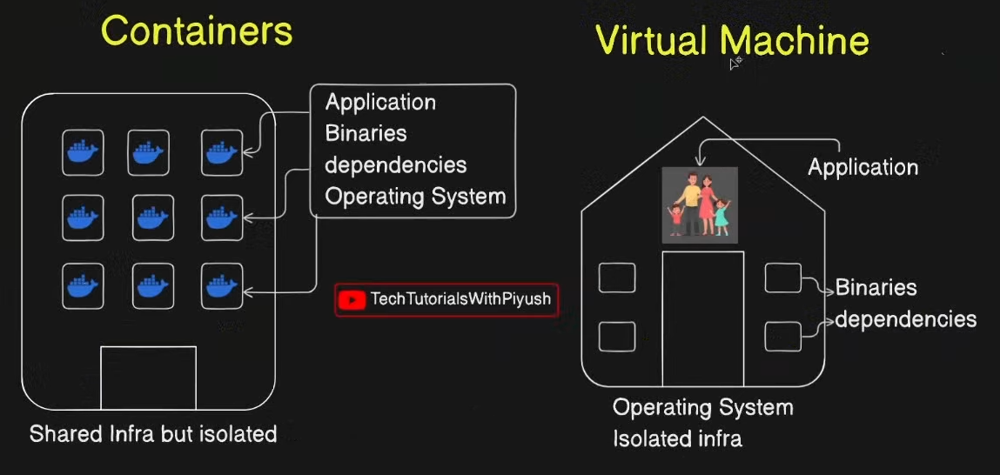
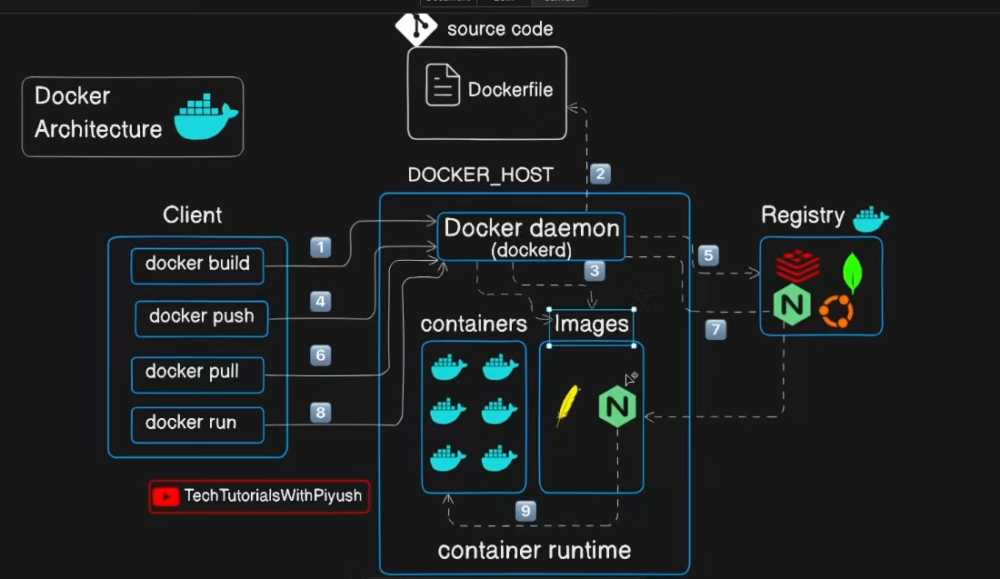

#### Container : build ship and execute






Hands on docker :  play with docker

# [[bind mount volume]]

## Docker Installation


```
sudo apt install -y apt-transport-https ca-certificates curl software-properties-common
```

```
curl -fsSL https://download.docker.com/linux/ubuntu/gpg | sudo gpg --dearmor -o /usr/share/keyrings/docker-archive-keyring.gpg
```

```
echo "deb [arch=$(dpkg --print-architecture) signed-by=/usr/share/keyrings/docker-archive-keyring.gpg] https://download.docker.com/linux/ubuntu $(lsb_release -cs) stable" | sudo tee /etc/apt/sources.list.d/docker.list > /dev/null
```

```
sudo apt update
sudo apt install -y docker-ce docker-ce-cli containerd.io
```

## Docker compose installation

```
sudo curl -L "https://github.com/docker/compose/releases/download/v2.24.0/docker-compose-$(uname -s)-$(uname -m)" -o /usr/local/bin/docker-compose
```

```
sudo chmod +x /usr/local/bin/docker-compose
```


## Docker build any image
 
 ```
docker build -t myimage . 
```


docker run -d -p 5173:5173 -v /home/yash/Desktop/obsidiangraph/graphnotes:/app --name oopsidian oopsidian


to run docker container in specific port and allocate volume to it and also name it 
command :

```
docker run -d -p 8080:9000 -v /host/volume:/containervolume --name container_name image
```


command to access the container's shell 

```
docker exec -it containername /bin/bash
```


