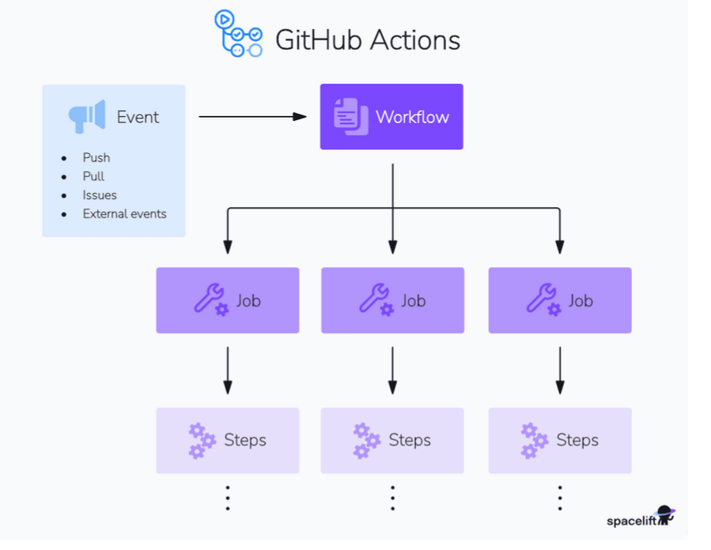
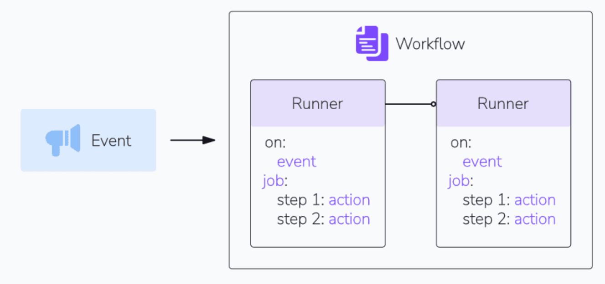

GitHub Actions is a continuous integration and continuous delivery/deployment (CI/CD) platform that automates your software development workflows

allows you to build, test, and deploy software source code directly from your ==GitHub repository== by ==creating custom workflows or pipelines==.

With various configuration options for triggers **based on commits and merges**

uses yaml files
executed when triggered by events like code pushes, pull requests, and releases.

- GitHub Actions, a workflow is an automated process defined by a YAML file
- usually placed in the .github/workflows directory of any repository

### GitHub Actions events

- events are specific activities that trigger a workflow run
- trigger point for workflows , helps automate , build and deploy process
- common event of the workflow is push pull_request , schedule and workflow_dispach
- Additionally, you can fine-tune these triggers by specifying further details such as branch names, commit messages, and more.

---
### GitHub Actions runners

Runners in GitHub Actions are virtual machines that execute jobs in a workflow

### GitHub Actions jobs

GA consist of a series of series of steps executed on the same runner. 

job can run either parallely or sequentially, depending on the dependencies defined in workflow

---
### What is the difference between a GitHub action and a workflow?

A GitHub “Action” and “Workflow” are both key components of the GitHub Actions platform. A workflow is an automated process triggered by specific events like push, pull, or schedule, defined in YAML files in the .github/workflows directory. It consists of one or more jobs, each containing steps. Actions are reusable units of code within these workflows, performing individual tasks.

While workflows orchestrate automation, actions provide the building blocks, enabling task reuse across different workflows. Custom actions can be created or used from the GitHub Marketplace, facilitating efficient and consistent task execution in software development processes.

---

