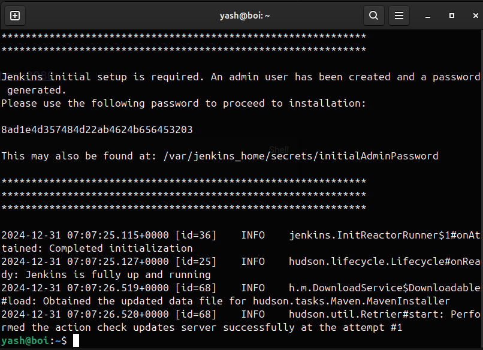

## Setting up jenkins using Docker

```
docker pull jenkins/jenkins:lts
```


Create a network for Jenkins if you plan to connect it with other services (e.g., Docker agents or a database):

```
docker network create jenkins
```

Run the Jenkins container with proper configuration:

```bash
docker run -d \
  --name jenkins \
  --restart=unless-stopped \
  --network jenkins \
  -p 8080:8080 \
  -p 50000:50000 \
  -v jenkins_home:/var/jenkins_home \
  jenkins/jenkins:lts
```


Now Jenkins will fireup on http://localhost:8080

access logs of jenkins for password

```bash
docker logs jenkins
```

copy log password and add to http://localhost:8080



### Configure jenkins

Manage Docker Permissions

If Jenkins needs to run Docker commands, you’ll need to bind the Docker socket and grant permissions:

1. Stop the Jenkins container:

```shell
docker stop jenkins
```

2. Relaunch Jenkins with Docker socket binding:

```shell
docker run -d \
  --name jenkins \
  --restart=unless-stopped \
  --network jenkins \
  -p 8080:8080 \
  -p 50000:50000 \
  -v jenkins_home:/var/jenkins_home \
  -v /var/run/docker.sock:/var/run/docker.sock \
  jenkins/jenkins:lts
```

3. Inside Jenkins, install the **Docker Pipeline** plugin to integrate Docker with your pipelines.

install plugin called docker pipline to seamlely work docker container inside jenkins  