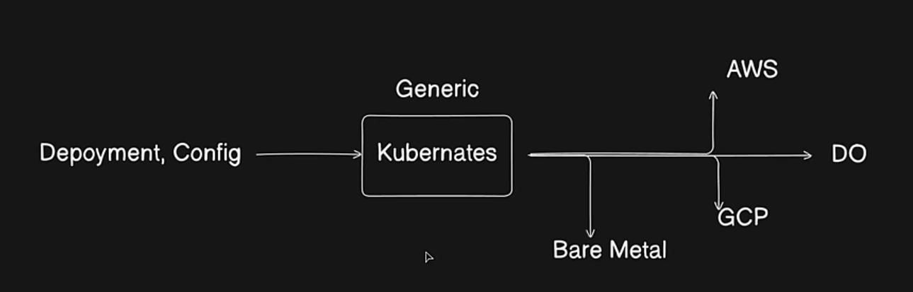

### Kubernetes Architecture 

Video tutorial followed  : https://www.youtube.com/watch?v=a-nWPre5QYI&t=1020s

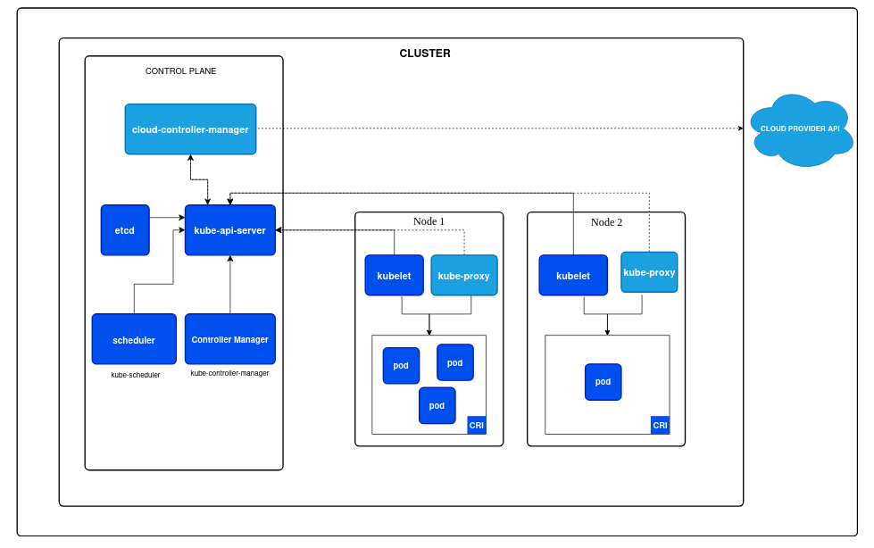

# 1. Deploy a K8s cluster on local Machine.

### Deployed ngnix image inside kubernetes and applied load balancer over it 

#### Tools 
- MiniKube

1. install kubectl with this command : 
```
curl -LO "https://dl.k8s.io/release/$(curl -L -s https://dl.k8s.io/release/stable.txt)/bin/linux/amd64/kubectl"
```

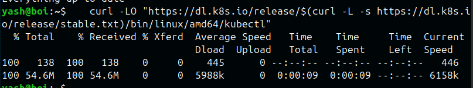

2. make it executable and move to path

```bash
sudo chmod +x kubectl
sudo mv kubectl /usr/local/bin
```

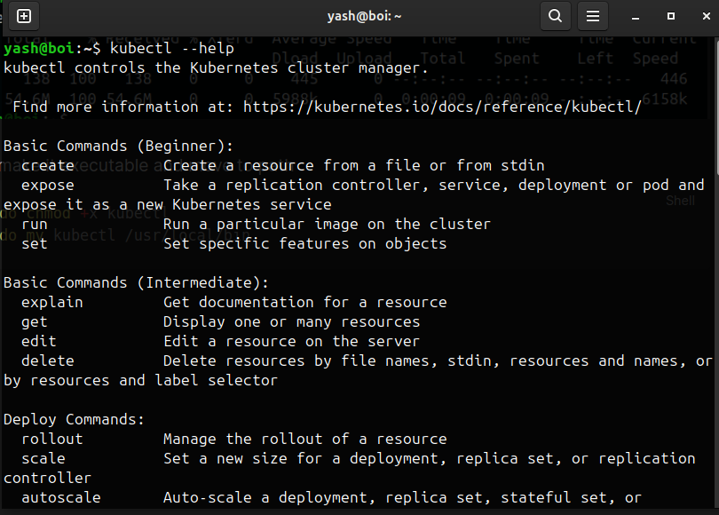

3. Install minikube:

```shell
curl -LO https://github.com/kubernetes/minikube/releases/latest/download/minikube-linux-amd64
sudo install minikube-linux-amd64 /usr/local/bin/minikube && rm minikube-linux-amd64
```

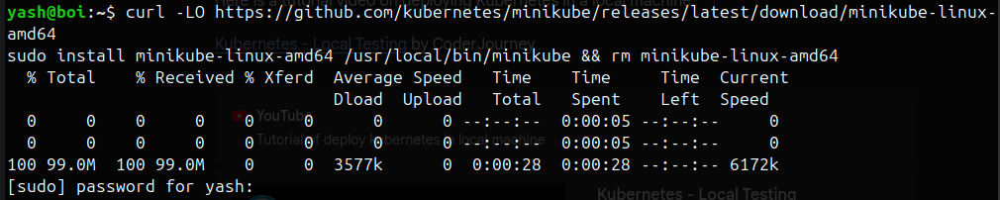


4. Start MiniKube:

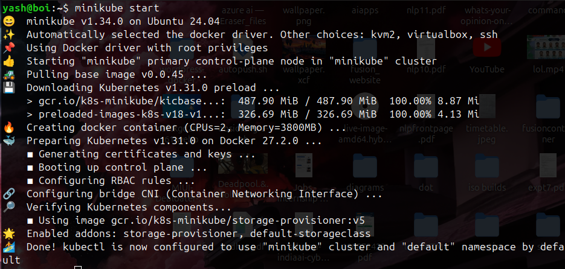

5. run kubectl webserver
```
kubectl create deployment webserver --image=nginx:alpine
```

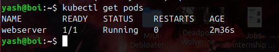

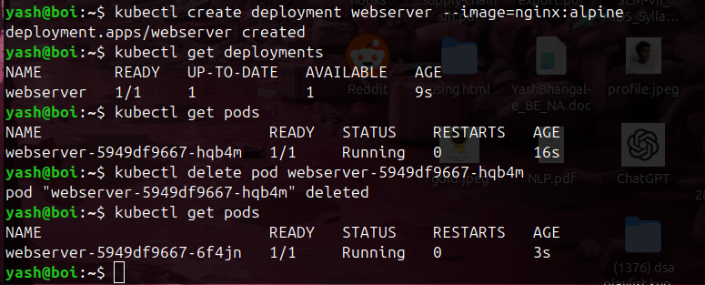

command to  delete pod

```bash
kubectl delete pod webserver
```


expose deployment server

```bash
kubectl expose deployment webserver --type=LoadBalancer --port=80
service/webserver exposed
```

```
kubectl get services
```

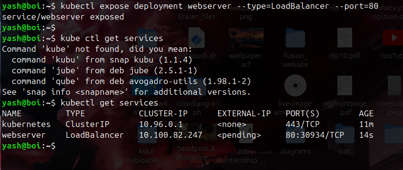

```
minikube service webserver --url
```

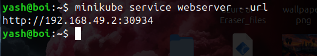

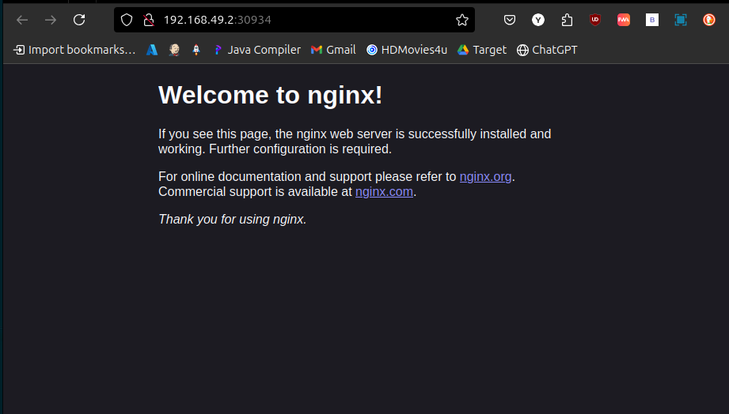


### View minikube dashboard

```bash
minikube dashboard
```

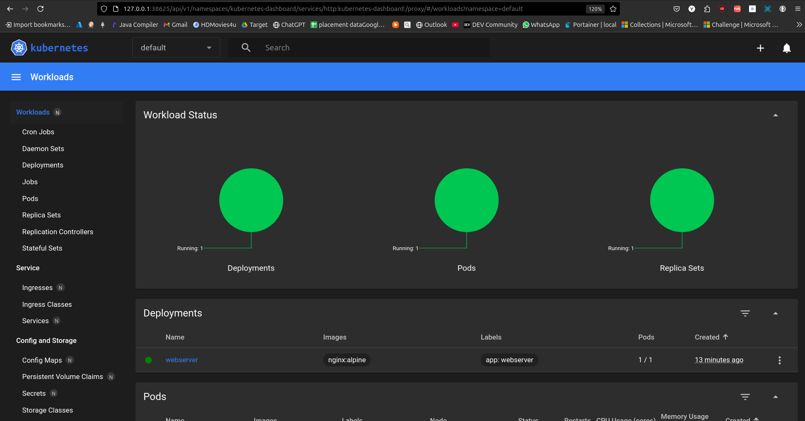


```bash
yash@boi:~$ kubectl get service
NAME         TYPE           CLUSTER-IP      EXTERNAL-IP   PORT(S)        AGE
kubernetes   ClusterIP      10.96.0.1       <none>        443/TCP        26m
webserver    LoadBalancer   10.100.82.247   <pending>     80:30934/TCP   15m
yash@boi:~$ kubectl get service webserver
NAME        TYPE           CLUSTER-IP      EXTERNAL-IP   PORT(S)        AGE
webserver   LoadBalancer   10.100.82.247   <pending>     80:30934/TCP   15m
yash@boi:~$ kubectl delete service webserver
service "webserver" deleted
```

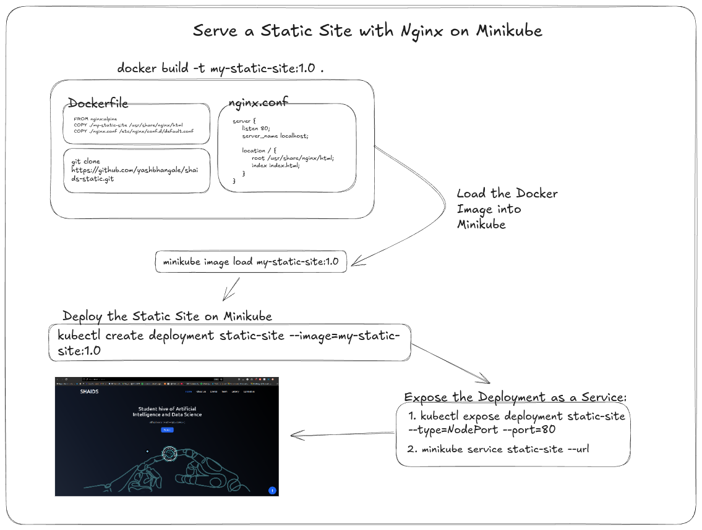