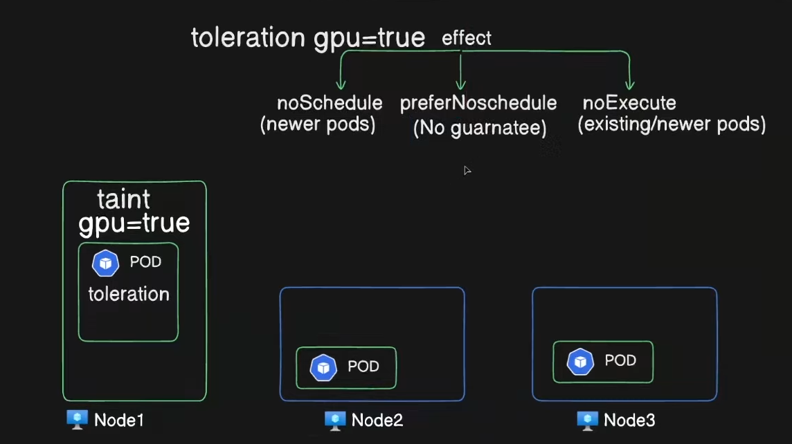

In Kubernetes, **Taints** and **Tolerations** work together to ensure that certain pods are only scheduled on specific nodes, or to prevent pods from being scheduled on unsuitable nodes.

### **Taints**

- **Taints** are applied to **nodes** and indicate that the node is not able to schedule all pods.
- A taint consists of:
    - A **key** (an identifier).
    - A **value** (optional; further specifies the taint).
    - An **effect** (specifies what happens to pods that don’t tolerate the taint).

The three effects a taint can have:

1. `NoSchedule`: Pods that don’t tolerate this taint will **not be scheduled** on this node.
2. `PreferNoSchedule`: The system **tries to avoid** scheduling pods that don’t tolerate the taint on this node, but it’s not guaranteed.
3. `NoExecute`: Pods that don’t tolerate this taint will be **evicted** from the node if they are already running.

#### Example of adding a taint to a node:

```bash
kubectl taint nodes <node-name> key=value:NoSchedule
```

### **Tolerations**

- **Tolerations** are applied to **pods** and allow the pod to be scheduled on nodes with matching taints.
- They specify that the pod can "tolerate" the taint applied to a node, meaning the pod is allowed to be scheduled on the node despite the taint.

A toleration looks like this:

```yaml
tolerations:
- key: "key"
  operator: "Equal"
  value: "value"
  effect: "NoSchedule"
```

### **How they work together:**

- **Nodes** with a taint will **repel** pods that don’t have a matching toleration.
- **Pods** with a toleration can be scheduled on nodes with a corresponding taint.

### **Use Cases:**

- **Dedicated Nodes:** You might want to reserve certain nodes for specific workloads, like GPU nodes or nodes with specific hardware.
- **Evicting Unhealthy Pods:** You can taint a node to evict all pods except those that tolerate the taint, such as for node maintenance.

### Example:

1. Add a taint to a node:

    ```bash
    kubectl taint nodes node1 special=true:NoSchedule
    ```

    Now, no pod can be scheduled on `node1` unless it has a toleration for the `special=true` taint.

2. Apply a toleration to a pod:

    ```yaml
    apiVersion: v1
    kind: Pod
    metadata:
      name: my-pod
    spec:
      containers:
      - name: nginx
        image: nginx
      tolerations:
      - key: "special"
        operator: "Equal"
        value: "true"
        effect: "NoSchedule"
    ```

This pod can now be scheduled on nodes with the `special=true:NoSchedule` taint.

Is there any specific example you'd like to dive into?