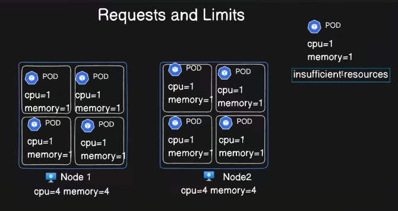

In Kubernetes, requests and limits are mechanisms ==used to manage resource allocation for containers running in a cluster==. They define how much CPU and memory a container is guaranteed or allowed to use.


1. Requests

    Definition: The minimum amount of CPU or memory a container is guaranteed to receive.

    Purpose: Ensures that the container has sufficient resources to function properly, even during times of high demand in the cluster.

    How It Works:
        If a node has enough resources to meet the requests of all scheduled containers, the container will be scheduled.
        Requests are used by the Kubernetes scheduler to make placement decisions (on which node the container should run).
        Requests reserve these resources for the container on the node.


```Example
resources:
  requests:
    memory: "512Mi"  # 512 MiB of memory
    cpu: "0.5"       # 0.5 CPU (half a core)

```


---

### **2. Limits**

- **Definition**: The maximum amount of CPU or memory a container is allowed to use.
    
- **Purpose**: Protects the node from resource starvation caused by containers consuming excessive resources. Limits prevent a single container from monopolizing resources.
    
- **How It Works**:
    
    - If a container tries to exceed its CPU limit, it is throttled (limited in how much CPU it can use).
    - If a container exceeds its memory limit, it is terminated (OOMKilled).
    - Limits are enforced by the kubelet on the node.

```Example
resources:
  limits:
    memory: "1Gi"  # 1 GiB of memory
    cpu: "1"       # 1 CPU (1 core)

```

### **Combined Example**

Below is a container configuration that specifies both requests and limits:


```Example
resources:
  requests:
    memory: "256Mi"
    cpu: "0.25"
  limits:
    memory: "512Mi"
    cpu: "0.5"

```

