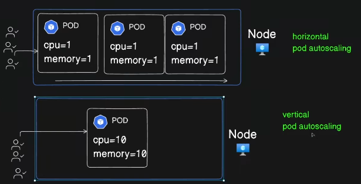
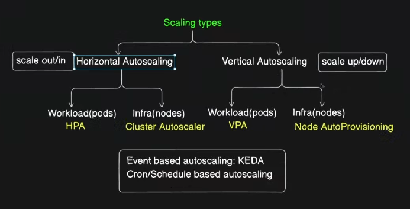

Kubernetes autoscaling is a mechanism that allows your workloads to dynamically adjust resource allocations (such as CPU, memory, or replicas) based on demand, helping you optimize costs, improve performance, and maintain reliability. Kubernetes provides two main types of autoscaling:





## **1. Horizontal Pod Autoscaler (HPA)**

### **Overview**

- **HPA** automatically scales the number of **replicas** (pods) in a deployment, replica set, or stateful set based on observed metrics such as CPU usage, memory usage, or custom metrics.
- It ensures that your application has enough pods running to handle the current load.

### **How It Works**

1. **Metrics Collection**:
    - The HPA controller fetches metrics (e.g., CPU utilization, memory usage) from the Kubernetes Metrics Server.
2. **Scaling Decision**:
    - Based on a target threshold defined in the HPA configuration (e.g., "target CPU utilization of 50%"), it calculates the desired number of replicas.
3. **Update Deployment**:
    - The deployment or replica set is updated to match the desired number of replicas.


```yaml
apiVersion: autoscaling/v2
kind: HorizontalPodAutoscaler
metadata:
  name: example-hpa
spec:
  scaleTargetRef:
    apiVersion: apps/v1
    kind: Deployment
    name: example-deployment
  minReplicas: 2
  maxReplicas: 10
  metrics:
  - type: Resource
    resource:
      name: cpu
      target:
        type: Utilization
        averageUtilization: 50

```

- **minReplicas** and **maxReplicas**: The minimum and maximum number of pods the HPA can scale to.
- **metrics**: Defines the target metric (e.g., CPU usage) and its desired threshold.

### **Use Cases**

- Applications with fluctuating workloads, such as web servers or APIs, where traffic varies throughout the day.

---

## 2. Vertical Pod Autoscaler (VPA)

### **Overview**

- **VPA** adjusts the **resource requests and limits** (CPU and memory) of a pod based on its observed usage. This ensures that each pod gets the optimal resources it needs without overprovisioning.

### **How It Works**

1. **Metrics Analysis**:
    - VPA observes the resource usage of containers over time.
2. **Recommendation**:
    - It suggests new CPU and memory values for requests and limits.
3. **Scaling**:
    - If configured in "auto" mode, VPA will automatically update the pod's resource requests/limits and trigger a pod restart with the updated configuration.

### **Modes**

VPA operates in three modes:

- **Off**: Only gives recommendations but doesn’t take any action.
- **Auto**: Automatically updates resource requests/limits and restarts pods as needed.
- **Initial**: Sets resource requests/limits only at the time of pod creation.

### **Configuration Example**

Here’s an example of VPA for a deployment:

```yaml
apiVersion: autoscaling.k8s.io/v1
kind: VerticalPodAutoscaler
metadata:
  name: example-vpa
spec:
  targetRef:
    apiVersion: apps/v1
    kind: Deployment
    name: example-deployment
  updatePolicy:
    updateMode: "Auto"
```

- **updateMode**: Can be `"Off"`, `"Auto"`, or `"Initial"`.

### **Use Cases**

- Applications with consistent workloads but uncertain resource requirements, such as batch jobs or workloads prone to memory spikes.


## **Key Differences Between HPA and VPA**

|**Feature**|**HPA**|**VPA**|
|---|---|---|
|**Scaling Target**|Number of pods (replicas).|Resource requests/limits (CPU/memory).|
|**Metric Sources**|Metrics Server or custom metrics.|Historical resource usage.|
|**Scaling Type**|Adds/removes pods.|Adjusts pod resource allocation.|
|**Pod Restarts**|Does not restart pods.|May restart pods to apply changes.|
|**Use Case**|Workloads with fluctuating traffic.|Optimizing resource allocation.|

---
## **3. Combining HPA and VPA**

HPA and VPA can work together in certain scenarios. For example:

- Use **HPA** to scale replicas based on traffic.
- Use **VPA** to fine-tune resource allocation for individual pods.

However, care must be taken to avoid conflicts:

- Set the HPA to scale based on external metrics (like traffic) and allow VPA to manage resource requests/limits independently