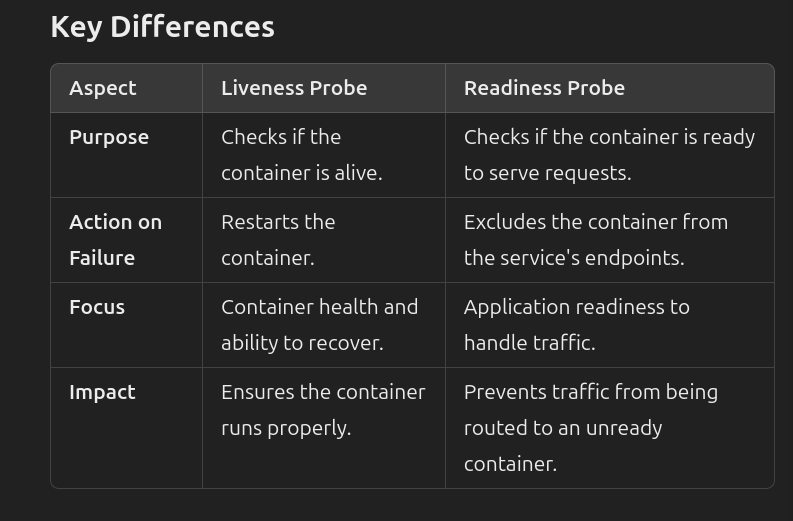

In Kubernetes, **health probes** are mechanisms that allow the kubelet to determine the health of a container. 

There are two main types of probes: **Liveness** and **Readiness** probes

These ensure your application runs smoothly and reliably

---
## 1. Liveness Probe

- **Purpose**: Determines if the container is still running. If the liveness probe fails, Kubernetes restarts the container.
    
- **Use Case**:    
    - When the application gets stuck (e.g., deadlocks) and needs to be restarted.
    - Ensures the application is always in a functioning state.

- **Behavior**:
    - If the liveness probe fails, Kubernetes **kills** the container and restarts it, following the container's restart policy.

```yaml
livenessProbe:
	httpGet:
		path: /healthz
		port: 8080
	initialDelaySeconds: 3
	periodSeconds: 10
```


- **HTTP GET** checks if the `/healthz` endpoint responds.
- Restarts the container if the check fails.
---

## 2. Readiness Probe

**Purpose**: Determines if the container is ready to serve requests. If the readiness probe fails, the container is removed from the service's endpoint, meaning traffic will not be sent to it.

**Use Case**:

- When the application needs time to initialize or become fully ready to process traffic.
- Ensures only healthy instances handle incoming requests.

**Behavior**:

- If the readiness probe fails, the container remains running but is temporarily removed from the load balancer.

```yaml
readinessProbe:
  httpGet:
    path: /readiness
    port: 8080
  initialDelaySeconds: 5
  periodSeconds: 10
```

- HTTP GET checks if the `/readiness` endpoint is available.
- Marks the pod as ready when the endpoint responds successfully.



---

## **3. Startup Probe**

A third type of probe introduced in Kubernetes v1.16:

- **Purpose**: Specifically designed to handle slow-starting applications. Used to check whether the application has started successfully.

- **Behavior**:
	- Once the startup probe succeeds, both liveness and readiness probes take over.

- **Use Case**:
	- If your application takes a long time to initialize and liveness probes restart the container prematurely.

```yaml
startupProbe:
  httpGet:
    path: /startup
    port: 8080
  initialDelaySeconds: 30
  periodSeconds: 10
```
