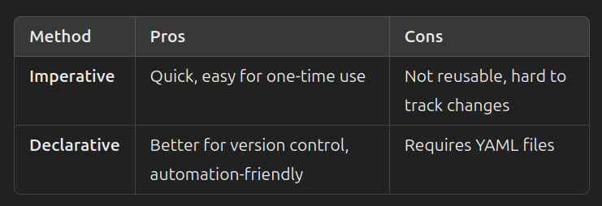

 In **Kubernetes (K8s)**, **ConfigMaps** and **Secrets** are used to manage configuration data separately from application code. This makes applications more flexible, portable, and secure.


1. **ConfigMaps**

    **Purpose**: Store non-sensitive configuration data as key-value pairs.
    **Use Case**: Application settings, environment variables, or configuration files.
    **Why Use It?**
        Decouples configuration from application code.
        Allows changes to configurations without redeploying the application.
        Supports different configurations for different environments (e.g., dev, staging, prod).
        Can be mounted as a volume or injected as environment variables.

Example Usage

```yaml
apiVersion: v1
kind: ConfigMap
metadata:
  name: my-config
data:
  DATABASE_URL: "mysql://db-service:3306"
  LOG_LEVEL: "debug"
```


 **2. Secrets**

- **Purpose**: Store **sensitive** information, such as passwords, API keys, and TLS certificates.
- **Use Case**: Credentials, database passwords, SSH keys, OAuth tokens.
- **Why Use It?**
    - Encodes data in **Base64** to prevent accidental exposure.
    - Can be mounted as a file or injected as environment variables.
    - Provides more security than ConfigMaps (can be restricted via RBAC).
    - Supports Kubernetes secret management tools like HashiCorp Vault or AWS Secrets Manager.

### **Example Usage**

```yaml
apiVersion: v1
kind: Secret
metadata:
  name: my-secret
type: Opaque
data:
  DB_PASSWORD: c2VjcmV0MTIz  # (Base64 encoded "secret123")
```

In Kubernetes, ConfigMaps can be created using both imperative and declarative methods.

---
### **Imperative method:**

This method is used when you want to quickly create a ConfigMap from the command line.

#### Create ConfigMap from Literal Values

```bash
kubectl create configmap my-config --from-literal=DATABASE_URL="mysql://db-service:3306" --from-literal=LOG_LEVEL="debug"
```

#### Create ConfigMap from a File

```bash
kubectl create configmap my-config --from-file=config.properties
```

### Declarative Method (YAML)

This method is preferred for **version control** and **automated deployments**.

#### Define a ConfigMap in a YAML File

```yaml
apiVersion: v1
kind: ConfigMap
metadata:
  name: my-config
data:
  DATABASE_URL: "mysql://db-service:3306"
  LOG_LEVEL: "debug"
```

#### Apply the YAML File

```bash
kubectl apply -f my-config.yaml
```

