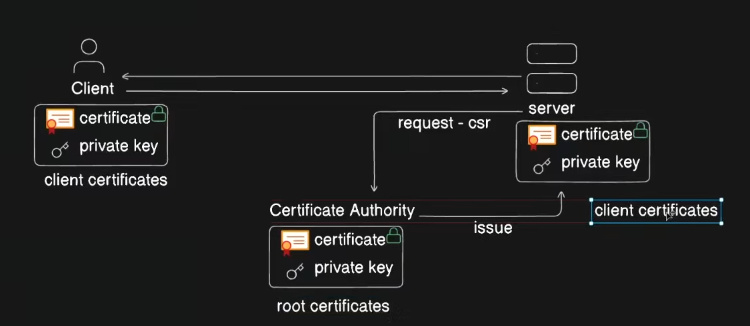
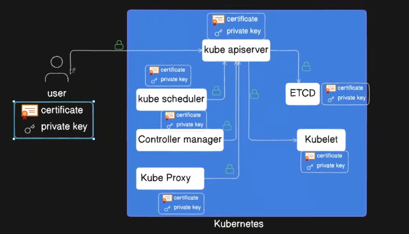
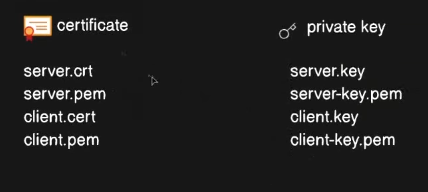

Managing TLS certificates in a Kubernetes cluster is crucial for securing communication between services, ingress traffic, and API access. Below are different ways to manage TLS certificates in Kubernetes.

---

## **1. Using Kubernetes Secrets (Manual Method)**

Kubernetes allows you to create and store TLS certificates as secrets.

### **Steps to Create a TLS Secret**

1. **Generate a TLS Certificate (Self-Signed)**

    ```bash
    openssl req -x509 -nodes -days 365 -newkey rsa:2048 \
      -keyout tls.key -out tls.crt -subj "/CN=mydomain.com/O=mydomain"
    ```

2. **Create a Kubernetes Secret**

    ```bash
    kubectl create secret tls my-tls-secret \
      --cert=tls.crt --key=tls.key
    ```

3. **Use the Secret in an Ingress Resource**

    ```yaml
    apiVersion: networking.k8s.io/v1
    kind: Ingress
    metadata:
      name: my-ingress
      annotations:
        kubernetes.io/ingress.class: "nginx"
    spec:
      tls:
        - hosts:
            - mydomain.com
          secretName: my-tls-secret
      rules:
        - host: mydomain.com
          http:
            paths:
              - path: /
                pathType: Prefix
                backend:
                  service:
                    name: my-service
                    port:
                      number: 80
    ```


---

## **2. Using Cert-Manager (Automated TLS Management)**

[cert-manager](https://cert-manager.io/) is a Kubernetes add-on that automates certificate provisioning and renewal using Let’s Encrypt or other certificate authorities.

### **Steps to Install and Use Cert-Manager**

1. **Install cert-manager (Helm)**

```bash
helm repo add jetstack https://charts.jetstack.io
helm repo update
helm install cert-manager jetstack/cert-manager --namespace cert-manager --create-namespace --set installCRDs=true
```

2. **Create a ClusterIssuer for Let's Encrypt**

```yaml
apiVersion: cert-manager.io/v1 
kind: ClusterIssuer 
metadata: 
	name: letsencrypt-prod
spec: 
	acme: 
		email: your-email@example.com 
		server: https://acme-v02.api.letsencrypt.org/directory
		privateKeySecretRef: 
			name: letsencrypt-prod 
		solvers:
		 - http01:
			 ingress:
			  class: nginx
```


 Apply it using:

```bash
   kubectl apply -f cluster-issuer.yaml
```

3. **Request a Certificate for an Ingress**

    ```yaml
    apiVersion: cert-manager.io/v1
    kind: Certificate
    metadata:
      name: mydomain-tls
    spec:
      secretName: mydomain-tls-secret
      issuerRef:
        name: letsencrypt-prod
        kind: ClusterIssuer
      dnsNames:
        - mydomain.com
    ```

4. **Use the Secret in an Ingress** Update your Ingress resource to use `mydomain-tls-secret` as described in the first section.


---

## **3. Using AWS ACM, Azure Key Vault, or GCP Certificate Manager**

If you're running Kubernetes on a cloud provider, you can use their native certificate management services.

- **AWS:** Use **AWS ACM** with AWS Load Balancer Controller.
- **Azure:** Use **Azure Key Vault** and **AAD Pod Identity**.
- **GCP:** Use **GCP Certificate Manager**.

Example (AWS ACM with Ingress):

```yaml
apiVersion: networking.k8s.io/v1
kind: Ingress
metadata:
  name: my-ingress
  annotations:
    alb.ingress.kubernetes.io/certificate-arn: arn:aws:acm:us-east-1:123456789012:certificate/abc123
spec:
  ingressClassName: alb
  rules:
    - host: mydomain.com
      http:
        paths:
          - path: /
            pathType: Prefix
            backend:
              service:
                name: my-service
                port:
                  number: 80
```

---

## **Which One Should You Use?**

|Method|Pros|Cons|
|---|---|---|
|**Kubernetes Secrets**|Simple, works anywhere|Manual renewal required|
|**cert-manager**|Fully automated, supports Let's Encrypt|Needs extra components|
|**Cloud Providers (AWS, Azure, GCP)**|Best integration, managed by provider|Vendor lock-in|

