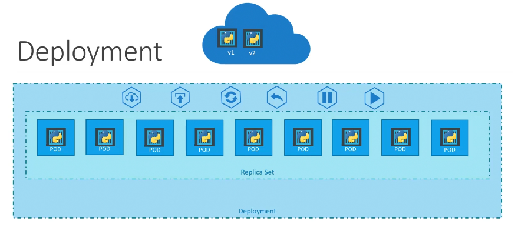
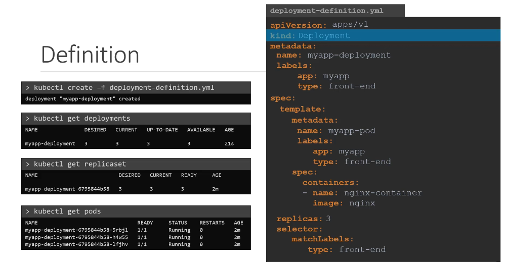
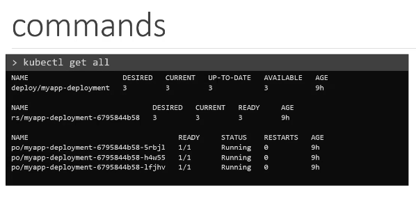

### Planning phase 
- app architecture
- scalabality needs 
- resources
---
### Setup k8s cluster

- managed kube cluster
	- aks
	- GCP
	- EKS
- Self hosted
	- kubeadm
	- minikube

---
### Containerize Application
- Dockerfile
- Dockerimage
- image build and push

---
### K8s Deployment Configurations

- Deployment Yaml : Define configuration of pods and replicas inside app
- Service Yaml : Service which allows network traffic route
- ConfigMaps/secrets: Stores Configuration and sensitive info Securely

