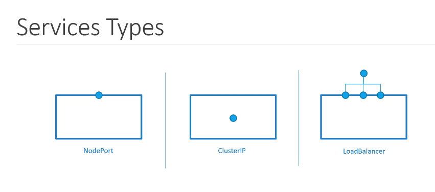
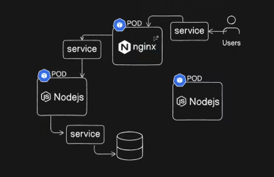
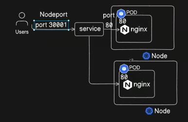
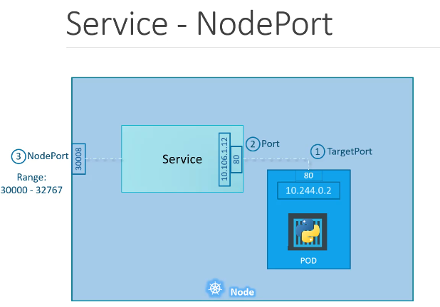
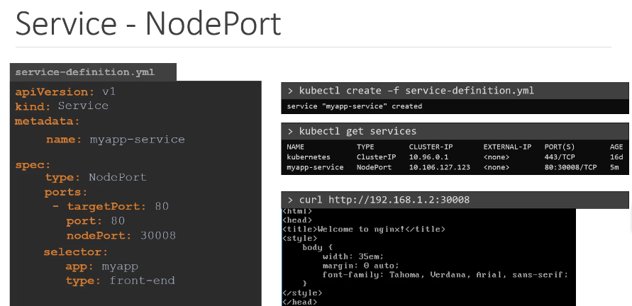
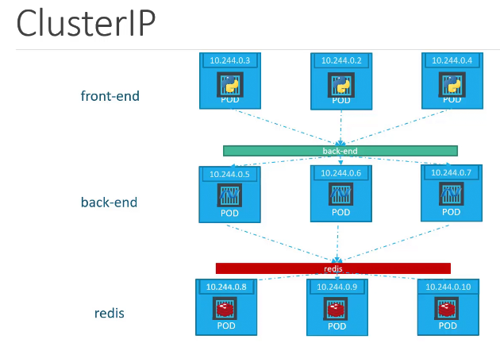
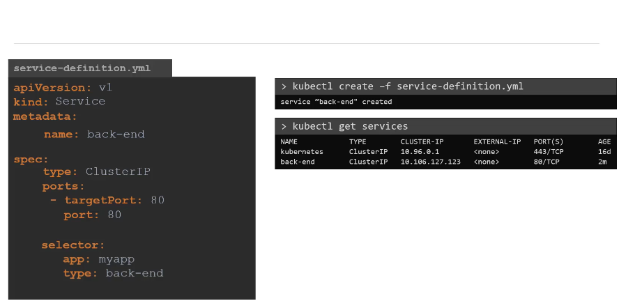

Kubernetes Services provide a stable network endpoint to access a group of Pods. They enable communication between different components of an application (e.g., frontend and backend) and can expose Pods to the outside world. Common types include:

1. **ClusterIP**: Default; exposes the service within the cluster.
2. **NodePort**: Exposes the service on a static port on each node.
3. **LoadBalancer**: Integrates with cloud provider load balancers to expose the service externally.

