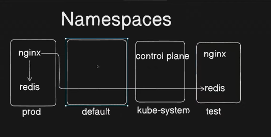
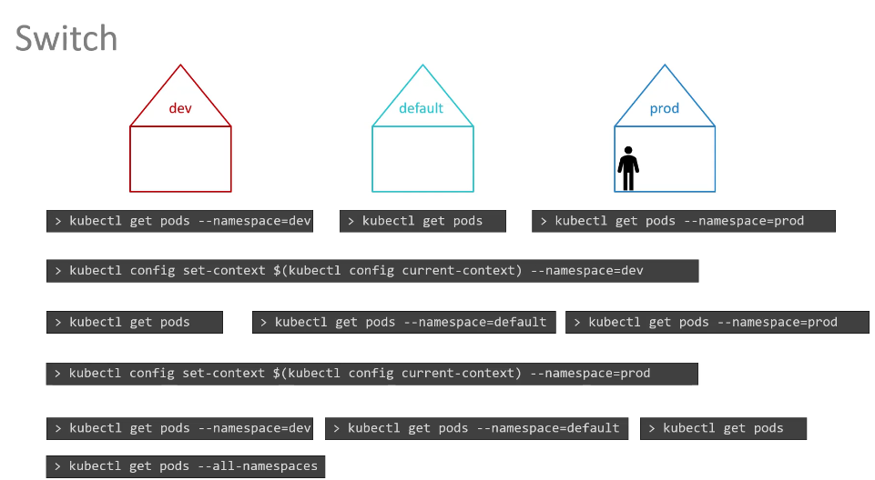

**Namespaces** are a way to logically divide and isolate resources within a cluster

They help in organizing and managing different environments (like dev, staging, prod) or teams within a single cluster. Each namespace can have its own set of resources, such as pods, services, and config maps, and they allow better control over resource allocation and access control.

Key points:

- Isolate resources between environments or teams.
- Default namespace is used if none is specified.
- Useful for managing access and quotas.







Namespaces in Kubernetes **logically isolate resources** within a cluster. They allow you to create multiple environments (e.g., dev, test, prod) in the same cluster while keeping resources separate.

---

##### **2️⃣ Key Features**

✔ **Multi-tenancy**: Different teams can share the same cluster without conflicts.  
✔ **Resource Quotas**: Limit CPU, memory, and object counts per namespace.  
✔ **Scoped Access Control**: Use RBAC (Role-Based Access Control) to restrict permissions per namespace.  
✔ **Network Policies**: Control communication between namespaces.

---

##### **3️⃣ Default Namespaces**

Kubernetes comes with some pre-created namespaces:

| **Namespace**     | **Description**                                                     |
| ----------------- | ------------------------------------------------------------------- |
| `default`         | Default namespace for resources if no other namespace is specified. |
| `kube-system`     | Critical system components (e.g., API server, scheduler).           |
| `kube-public`     | Public resources, readable by all users.                            |
| `kube-node-lease` | Heartbeat data for node health monitoring.                          |

---

##### **4️⃣ Commands for Managing Namespaces**

🔹 **List all namespaces:**
```bash
kubectl get namespaces
```
🔹 **Create a namespace:**
```bash
kubectl create namespace my-namespace
```
🔹 **Apply a namespace from YAML:**
```bash
kubectl apply -f namespace.yaml
```

✅ **Example YAML:**
```yaml
apiVersion: v1
kind: Namespace
metadata:
  name: my-namespace
```

🔹 **Use a specific namespace for a command:**
```bash
kubectl get pods -n my-namespace
```
🔹 **Set default namespace for `kubectl`:**
```bash
kubectl config set-context --current --namespace=my-namespace
```
🔹 **Delete a namespace:**
```bash
kubectl delete namespace my-namespace
```
---

##### **5️⃣ Best Practices**

✅ **Use namespaces to separate environments** (e.g., `dev`, `staging`, `prod`).  
✅ **Apply resource quotas** to prevent excessive resource consumption.  
✅ **Use RBAC** to restrict user access per namespace.  
✅ **Monitor namespace usage** with `kubectl describe namespace <name>`

---

💡 **Real-World Example**  
🔹 **Deploy an app in a namespace**

```yaml
apiVersion: apps/v1
kind: Deployment
metadata:
  name: webapp
  namespace: dev
spec:
  replicas: 2
  selector:
    matchLabels:
      app: webapp
  template:
    metadata:
      labels:
        app: webapp
    spec:
      containers:
        - name: nginx
          image: nginx
```

---
