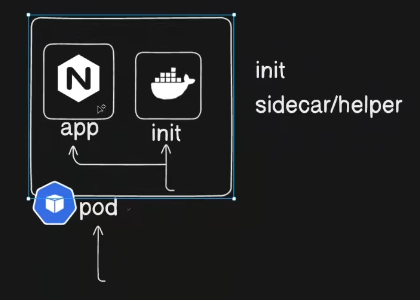

A **Kubernetes multi-container pod** is a single Pod that contains multiple containers, which work together to achieve a common goal. These containers share the same network namespace, IP address, and storage volumes, enabling them to communicate easily and share data.

### Common Use Cases:

1. **Sidecar Pattern**: A helper container (e.g., logging, proxy) that enhances the main application.
2. **Adapter Pattern**: A container that translates or formats data for the main application.
3. **Ambassador Pattern**: A container that acts as a proxy between the main app and external services.

### Key Features:

- **Shared Network**: Containers communicate via `localhost`.
- **Shared Storage**: Use shared volumes for data exchange between containers.
- **Tightly Coupled Services**: All containers in a Pod are managed as a single unit.

For example, a Pod might have:

- **App Container**: Runs the main app.
- **Logging Container**: Collects logs from the app and sends them to an external system.

This architecture simplifies deployment and operation of closely related containers.