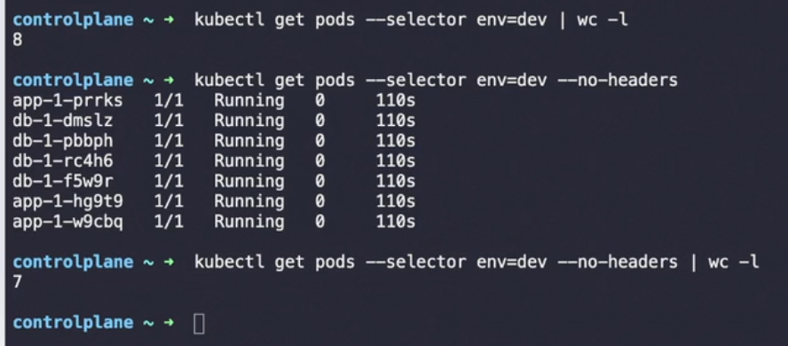

In Kubernetes, **labels** and **selectors** are fundamental for organizing, grouping, and managing resources like pods, nodes, and services. They help manage large, complex systems by enabling the selection and filtering of resources based on key-value pairs.

### 1. **Labels**:

- **Definition**: Key-value pairs attached to resources (pods, nodes, etc.) that help in identification, grouping, and filtering.
- **Purpose**: Organize, classify, and manage objects (e.g., assigning environments like `prod`, `dev`, etc.).
- **Syntax**:
    
    ```yaml
    metadata:
      labels:
        app: nginx
        environment: production
        tier: frontend
    ```
    
- **Use Case**: Used by services, deployments, and selectors to target specific pods or nodes.

### 2. **Selectors**:

- **Definition**: Used to filter or select objects based on labels. Selectors help resources (like services, deployments) find and manage pods based on labels.
- **Types of Selectors**:
    - **Equality-Based**: Matches resources with specific labels.
    - **Set-Based**: Matches resources with labels that are part of a set (e.g., IN, NOTIN).

### 3. **Types of Label Selectors**:

#### a. **Equality-Based Selectors**:

- **Syntax**: `key = value` or `key != value`
- **Example**:
    
    ```yaml
    selector:
      matchLabels:
        app: nginx
    ```
    
- **Use Case**: Matches resources with a specific key-value pair (e.g., all pods with `app: nginx`).

#### b. **Set-Based Selectors**:

- **Syntax**: `IN`, `NOTIN`, `EXISTS`, `DOESNOTEXIST`
- **Example**:
    
    ```yaml
    selector:
      matchExpressions:
      - key: environment
        operator: In
        values: ["production", "staging"]
    ```
    
- **Use Case**: Matches resources whose label values are part of a set (e.g., all pods with `environment` in `["production", "staging"]`).

### 4. **Real-World Use Case**:

- **Services**: Services use selectors to identify the set of pods to route traffic to.
    
    ```yaml
    apiVersion: v1
    kind: Service
    metadata:
      name: nginx-service
    spec:
      selector:
        app: nginx
      ports:
      - protocol: TCP
        port: 80
        targetPort: 80
    ```
    
- **Deployments**: Deployments use label selectors to decide which pods to manage and update.
- **Affinity Rules**: Labels can be used to ensure that certain workloads (pods) are scheduled on specific nodes or node groups.

### 5. **Best Practices**:

- Use meaningful labels like `app`, `environment`, `tier` to make resources easy to manage.
- Use **set-based selectors** for more flexibility when filtering resources.
- Keep label keys consistent across your entire cluster for simplicity and better organization.

### 6. **Key Points for CKA**:

- Understand how **selectors** work in **Deployments**, **Services**, and **DaemonSets**.
- Practice **label-based service discovery** using services and pods.
- Be familiar with using **label selectors** for filtering resources (e.g., `kubectl get pods --selector app=nginx`).

#### Tip:

- Use `kubectl get pods --show-labels` to view all labels applied to pods.
- Label your resources during creation using `kubectl create` or `kubectl label` for existing resources.

Would you like an example of how to create resources with labels or selectors, or dive into more advanced topics like **affinity/anti-affinity**?

Use wordcount and no header in exams 👇


