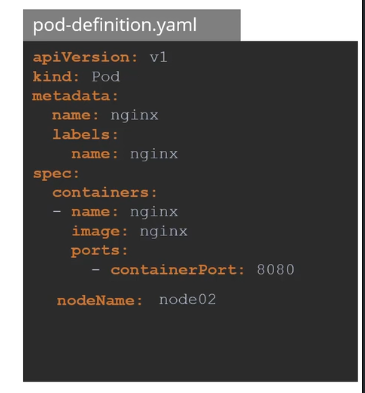
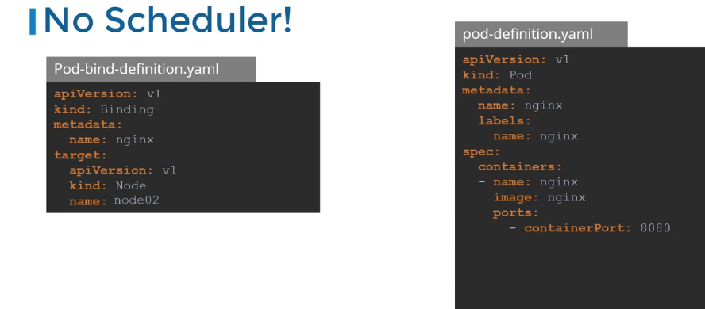

## Use of binding schedular




In Kubernetes (K8s), ==**schedulers** are responsible for assigning pods to the most appropriate nodes in the cluster==. The default scheduler is built-in, but you can also implement custom schedulers, including a **manual scheduler**. Here's an overview of both:

### 1. **Manual Scheduler**:

- **Definition**: As the name suggests, the user manually selects a node for the pod to run on.
- **How**: Specify the node name in the pod spec (`nodeName` field).
- **Use Case**: Useful in testing or small setups where you want full control over node selection.
- **YAML Example**:
    
    ```yaml
    apiVersion: v1
    kind: Pod
    metadata:
      name: manual-pod
    spec:
      containers:
      - name: nginx
        image: nginx
      nodeName: worker-node1
    ```
    
- **Drawback**: Doesn't scale well in large clusters, prone to human error.

### 2. **Default Scheduler**:

- **Definition**: The built-in Kubernetes scheduler that automatically assigns pods to nodes based on resource requests and other constraints (e.g., CPU, memory).
- **How**: Automatically selects nodes based on available resources and other policies.
- **Use Case**: Most common, handles most scheduling requirements in production.
- **Factors Considered**:
    - Resource requests and limits (CPU, memory).
    - Node availability.
    - Taints and tolerations.
    - Affinity and anti-affinity rules.
    - Node selectors.

### 3. **Custom Scheduler**:

- **Definition**: Custom schedulers allow you to create specialized scheduling logic using your algorithms.
- **How**: You define custom logic to assign pods to nodes (often using a custom controller).
- **Use Case**: Needed in very specific use cases where default logic doesn't suffice (e.g., custom resource optimization).
- **Example**: Scheduling for GPUs or specific latency-sensitive workloads.

### 4. **Multiple Schedulers**:

- **Definition**: You can deploy and configure multiple schedulers in the same cluster.
- **How**: Pods can use the `schedulerName` field to specify which scheduler to use.
- **Use Case**: Useful if different teams or workloads require different scheduling strategies.
- **YAML Example**:
    
    ```yaml
    apiVersion: v1
    kind: Pod
    metadata:
      name: custom-scheduler-pod
    spec:
      schedulerName: my-custom-scheduler
      containers:
      - name: nginx
        image: nginx
    ```
    

### Key Points for CKA:

- Understand how the **default scheduler** works and the factors affecting it.
- Practice using **manual scheduling** and **node selectors**.
- Be familiar with how to implement **custom schedulers** using `schedulerName`.

### Real-world Use Cases:

- Default scheduler handles most cases, scaling across multiple nodes.
- Custom schedulers are used for specific needs (e.g., workload balancing, latency-sensitive apps).

#### Tips:

- Use **node taints and tolerations** to control pod placement effectively.
- Use **node affinity/anti-affinity** to manage pod distribution across nodes.
- Avoid manual scheduling in large environments to minimize human errors.

Let me know if you'd like more detail on any of these!

