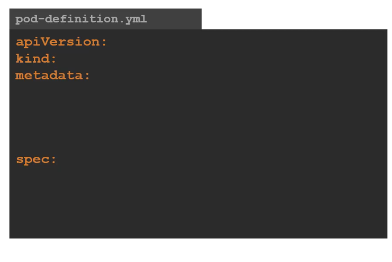

>>pod-deployment.yaml

k8s uses yaml as input for creation of obj (pods , nodes ,config etc)

top level or root level properties 👇
(required fields) 👇




#### Example : 👇

```yaml
apiVersion: v1
kind: Pod 
metadata: 
	name: myapp-pod
	labels:
		app: myapp
		type: front-end
spec:
	containers:
		- name: nginx-container
		  image: nginx
```


kubectl get pods

kubectl get pods -o wide


