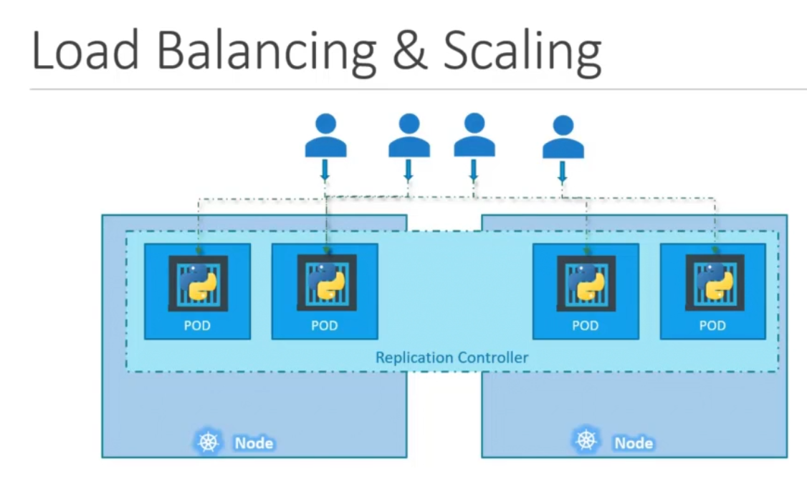
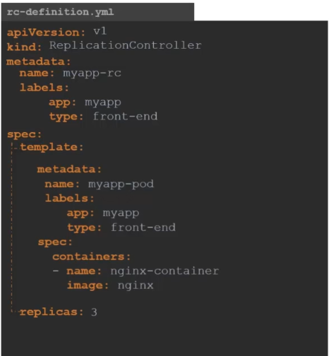
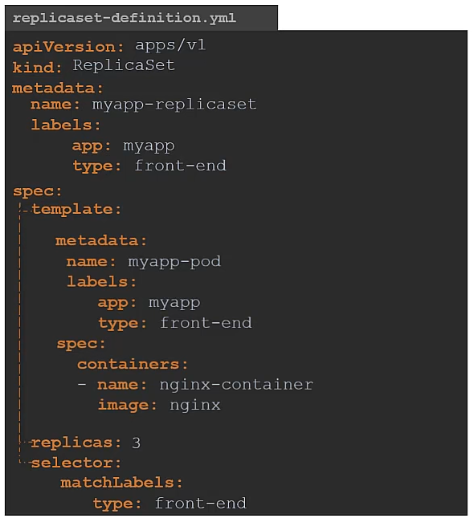
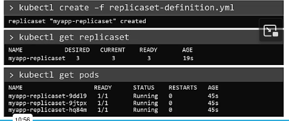
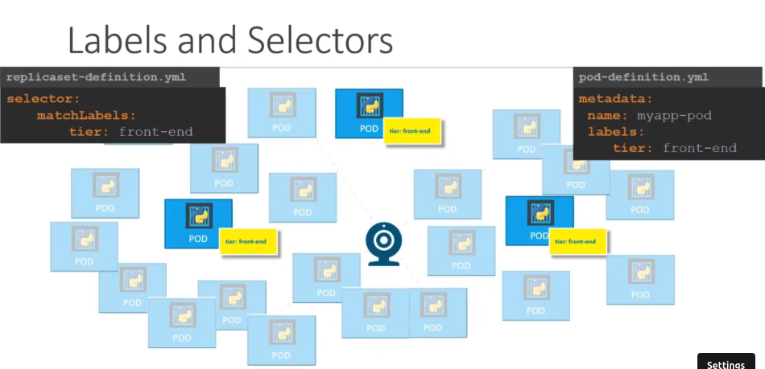
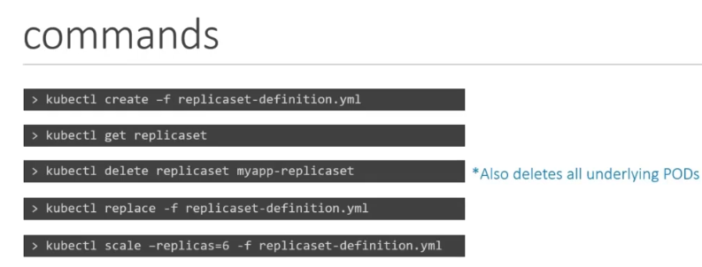

#### **Replication Controller vs ReplicaSet in Kubernetes**

Both **ReplicationController (RC)** and **ReplicaSet (RS)** ensure that a specified number of pod replicas are running at any given time, but **ReplicaSet is the newer and more flexible version of ReplicationController**.

#### **1. Replication Controller (RC)**

🔹 **Purpose**: Ensures a specified number of identical pods are running.  
🔹 **Key Features**:
- Watches running pods and replaces failed ones.
- Uses equality-based selectors (`matchLabels`).
- Legacy feature; replaced by ReplicaSet in modern Kubernetes.

💡 **Use Case**: Basic pod scaling in older Kubernetes versions.




#### **2. ReplicaSet (RS)**

🔹 **Purpose**: Enhanced version of ReplicationController, supporting more flexible pod selection.

🔹 **Key Features**:
- Uses **label selectors** (supports `matchExpressions` along with `matchLabels`).
- Works with **Deployments**, making pod management easier.
- Supports rolling updates when combined with Deployments.

💡 **Use Case**: Used in modern Kubernetes for pod scaling and high availability. Usually **not used directly** **Deployments** manage ReplicaSets internally.








Command to scale replicas 

```bash
kubectl scale --replicas=6 -f replicaset-defination.yml
```



