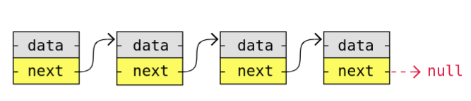
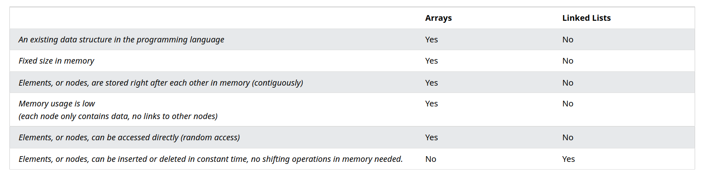
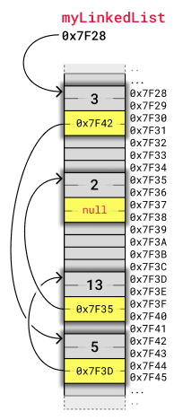
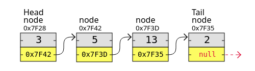
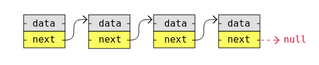
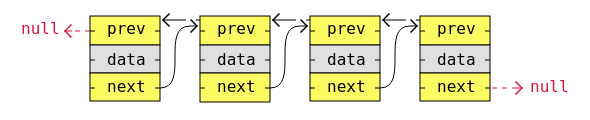
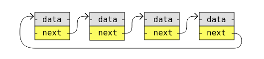
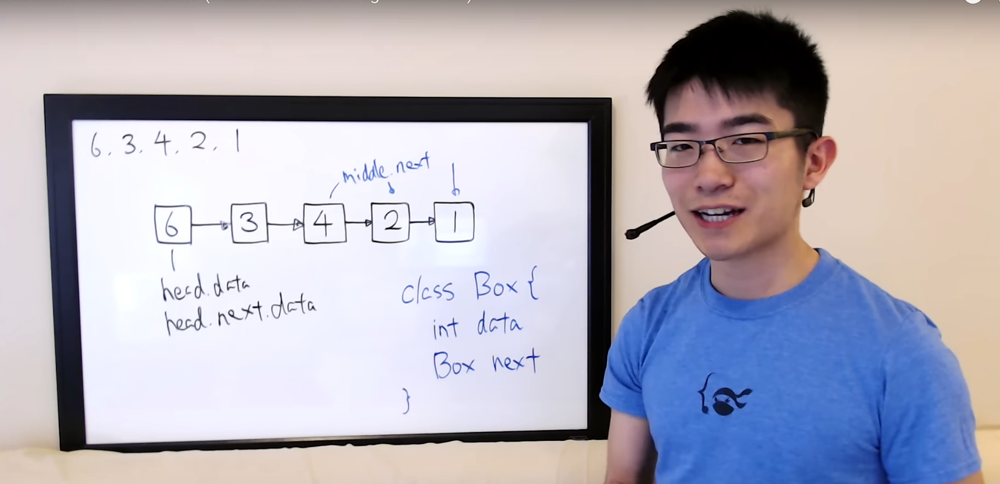
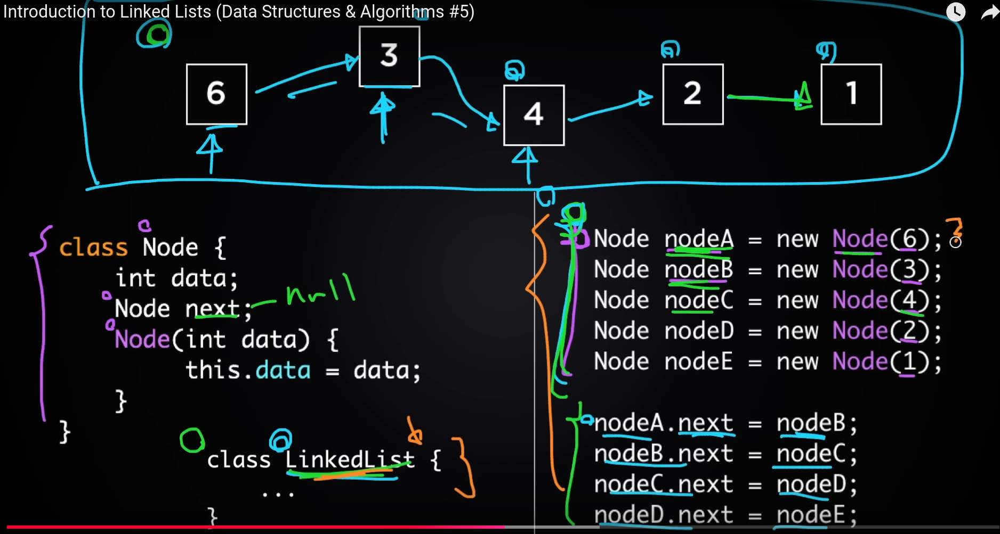
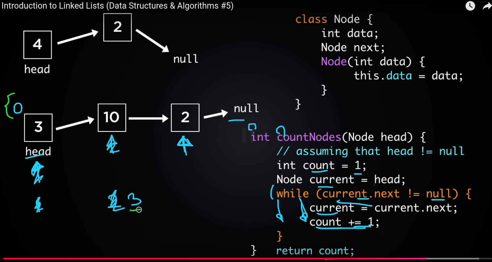

==Linear DS consist of nodes with some sort of data, and a pointer, or link, to the next node.==️
**data**: The value stored in the node 
**Pointer/Link**: a reference to the next node on the sequence 

A big **benefit** with using linked lists is that ==nodes are stored wherever there is free space in memory, the nodes do not have to be stored contiguously right after each other like elements are stored in arrays==. Another nice thing with linked lists is that when adding or removing nodes, the r️️️️️est of the nodes in the list do not have to be shifted.



#### Types
1. **singly linked list**: Each node points to the next node
2. **Doubly Linked List**: Each node points to both the next and previous nodes.
3. **Circular Linked List**: The last node points back to the first node.

#### Basic Operations in Linked Lists

1. **Insertion**:
    - At the beginning.
    - At the end.
    - At a specific position.
2. **Deletion**:
    - From the beginning.
    - From the end.
    - From a specific position.
3. **Traversal**:
    - Printing all elements.
    - Counting nodes.
4. **Search**:
    - Finding a specific value.
5. **Reverse the Linked List**.

#### Linked list vs Array




In memory, an **array** is stored in [[contiguous memory locations]], where elements are accessed via direct indexing, making it faster for random access but requiring a fixed size. In contrast, a **linked list** stores nodes in ==non-contiguous memory==, connected by pointers, allowing ==dynamic resizing== but with ==slower access due to sequential traversal.==


The image below shows ==how a linked list can be stored in memory==. The linked list has four nodes with values 3, 5, 13 and 2, and each node has a pointer to the next node in the list.






> Unlike with arrays, the nodes in a linked list are not placed right after each other in memory. This means that when inserting or removing a node, shifting of other nodes is not necessary, so that is a good thing.


### Types of linked list

1. singly linked lists
2. Doubly linked lists
3. Circular linked list

A **singly linked list** is the ==simplest kind of linked lists==. It takes up ==less space in memory because each node has only one address to the next nod==e, like in the image below.


A **doubly linked list** has nodes with ==addresses to both the previous and the next node==, like in the image below, and therefore ==takes up more memory==. But doubly linked lists are ==good if you want to be able to move both up and down in the list.==



**circular linked list** is like a singly or doubly linked list with the first node, the "head", and the last node, the "tail", connected.

Circular linked lists are good for lists you need to cycle through continuously.




### Java code for Linked lists

[[Single linked list]]


what is linked list 

Here is a concise summary of what a Linked List is:

*A linked list is a data structure consisting of nodes, each containing a value and a reference (or link) to the next node in the sequence. This allows for efficient insertion and deletion of elements at any position in the list, making it suitable for applications that require frequent updates. The order of elements in a linked list can be sorted or unsorted, and it is commonly used in algorithms such as stacks and queues, as well as in databases to manage data storage and retrieval.*









# Code for linked list

```java
class Node {
    int data;       // Node ka data
    Node next;      // Agli node ka reference

    Node(int data) { // Constructor to initialize the node
        this.data = data;
        this.next = null;
    }
}
```

# Singly linked list operations in java

```java
class LinkedList {
    // Head node of the Linked List
    private Node head;

    // Node class
    class Node {
        int data;
        Node next;

        Node(int data) { // Constructor
            this.data = data;
            this.next = null;
        }
    }

    // Insert a new node at the end
    public void insertAtEnd(int data) {
        Node newNode = new Node(data);
        if (head == null) { // If list is empty
            head = newNode;
            return;
        }

        Node temp = head; // Start from head
        while (temp.next != null) { // Traverse to the last node
            temp = temp.next;
        }
        temp.next = newNode; // Point the last node to new node
    }

    // Insert at the beginning
    public void insertAtBeginning(int data) {
        Node newNode = new Node(data);
        newNode.next = head; // New node points to current head
        head = newNode;      // New node becomes the head
    }

    // Delete a node by value
    public void deleteByValue(int value) {
        if (head == null) { // Empty list
            System.out.println("List is empty");
            return;
        }

        // If the head node itself holds the value
        if (head.data == value) {
            head = head.next; // Shift head to the next node
            return;
        }

        Node temp = head;
        while (temp.next != null && temp.next.data != value) {
            temp = temp.next; // Traverse until value is found
        }

        if (temp.next == null) {
            System.out.println("Value not found in the list");
            return;
        }

        temp.next = temp.next.next; // Skip the node to be deleted
    }

    // Display the Linked List
    public void display() {
        if (head == null) {
            System.out.println("List is empty");
            return;
        }

        Node temp = head; // Start from head
        while (temp != null) {
            System.out.print(temp.data + " -> ");
            temp = temp.next;
        }
        System.out.println("null");
    }

    public static void main(String[] args) {
        LinkedList list = new LinkedList();

        // Insert nodes
        list.insertAtEnd(10);
        list.insertAtEnd(20);
        list.insertAtEnd(30);

        // Display list
        list.display(); // Output: 10 -> 20 -> 30 -> null

        // Insert at beginning
        list.insertAtBeginning(5);
        list.display(); // Output: 5 -> 10 -> 20 -> 30 -> null

        // Delete a node
        list.deleteByValue(20);
        list.display(); // Output: 5 -> 10 -> 30 -> null
    }
}

```