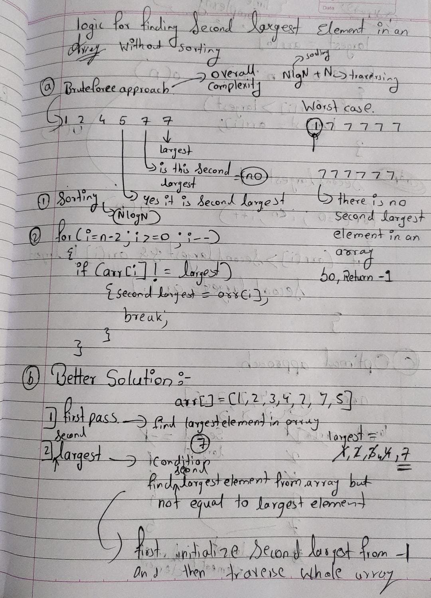
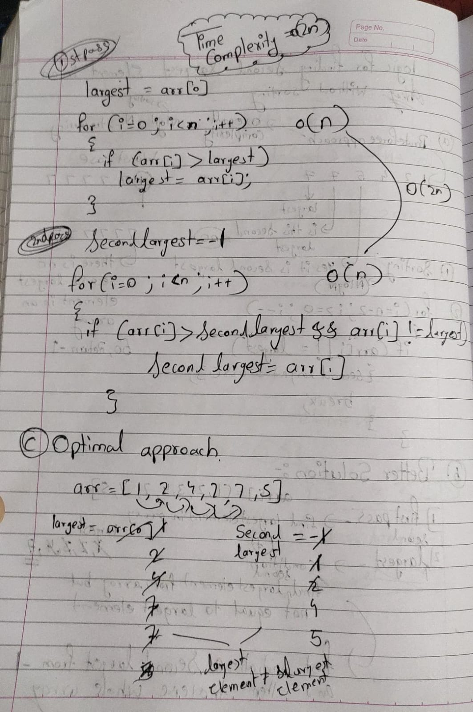
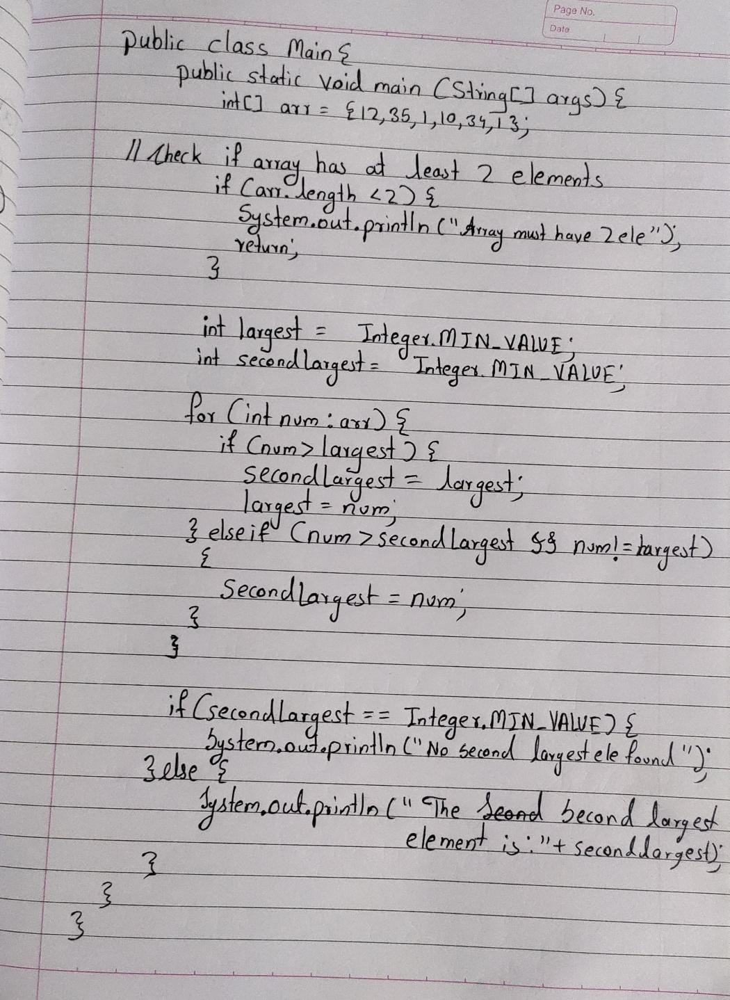
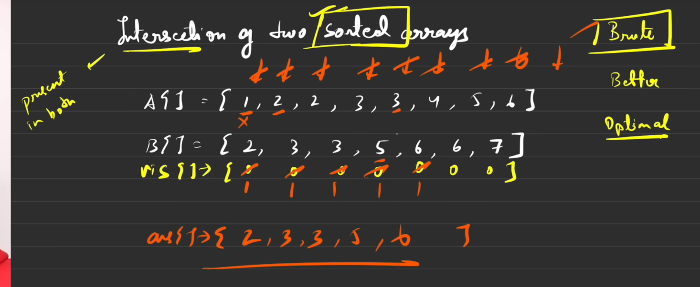
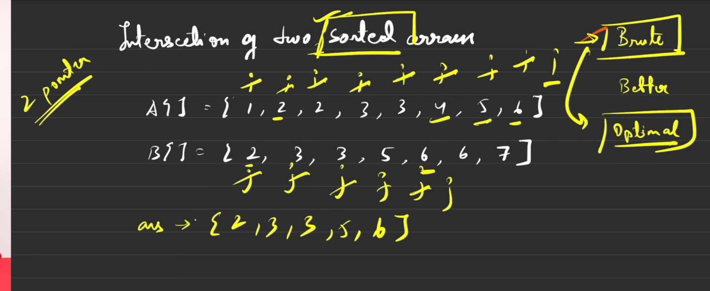
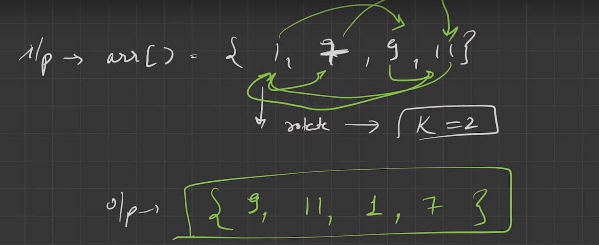
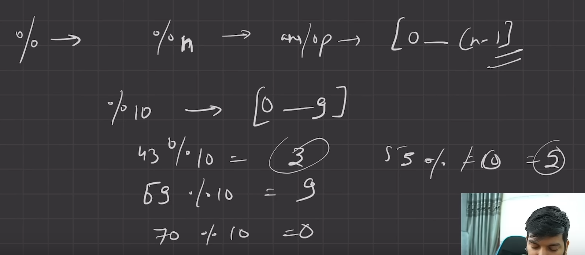
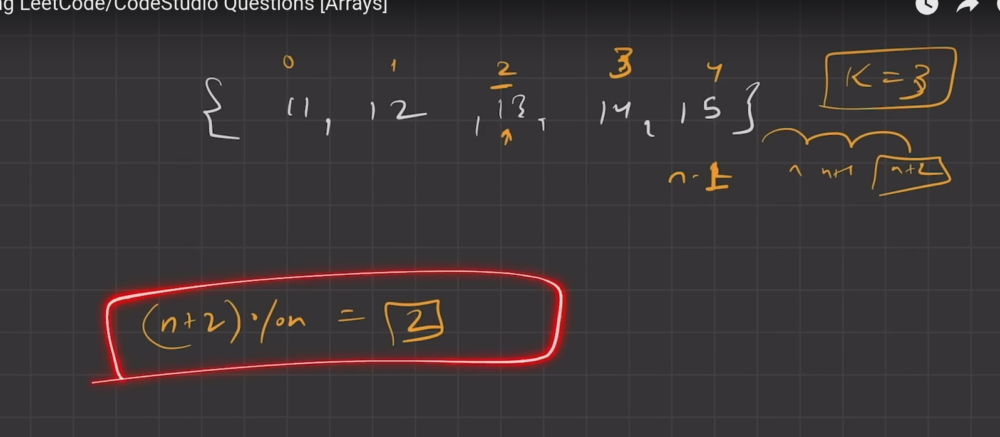

## 1. Find the largest and smallest element in an array

```java
import java.util.Arrays;

class Main {
    public static void main(String[] args) {
        int [] arr = {3,2,1,3,4,5,4};
        Arrays.sort(arr);
        
        int smallest = arr[0];
        int largest = arr[arr.length-1];
        
        System.out.println(smallest);
        System.out.println(largest);
    }
}
```

### more  approach:

```java

class Main {
    public static void main(String[] args) {
        int arr[] = {3,2,1,3,4,5,4};
        int max = arr[0];
        for (int i = 1; i < arr.length; i++) {
            if(arr[i]>max){
               max = arr[i];   
            }
        }
        System.out.println(max);
        
        int min = arr[0];
        for (int i = 1; i < arr.length; i++) {
            if(arr[i]<min){
               min = arr[i];   
            }
        }
        System.out.println(min);
    }
}

```

---

## 2. Reverse an array 


int[] arr = {1,2,3,4,5}
output = 5,4,3,2,1


```java
public class Main{
	public static void main(String[] args){
	int[] arr = {3,2,1,3,4,5};
	int start = 0, end = arr.length - 1;
	while (start < end) {
		int temp = arr[start];
		arr[start] = arr[end];
		arr[end] = temp;
		start ++;
		end --; 
	}
	System.out.println("reversed array"+ java.util.Arrays.toString(arr));
	}
}
```

---
## 3. Check if an Array is Sorted

```java

class Main {
    public static void main(String[] args) {
        int[] arr = {1,2,3,4,5,6,7};
        boolean isSorted = true;
        
        for(int i = 1 ; i < arr.length  ; i++ ){
            if (arr[i] < arr[i - 1]){
                isSorted = false;
            }
        }
        System.out.println("sorted array " + isSorted);
        
     }
}
```

---

## 4. Move all zero to the end

input:array = {0,0,0,23,134,2}
output = {23,134,2,0,0,0}

```java
public class Main {
    public static void main(String[] args) {
        int insertPosition = 0;
        int[] nums = {0,0,0,0,1,3,4};
        for( int i = 0; i < nums.length; i++) {
            if(nums[i] != 0) {
                nums[insertPosition] = nums[i];
                insertPosition++;
            }
        }

        while (insertPosition < nums.length) {
            nums[insertPosition++] = 0;
        }
        System.out.println(java.util.Arrays.toString(nums));
    }
}
```

## 5. **Find the Second Largest Element**





---
## 6. **Find the Intersection of Two Arrays**

brute force method 



optimal solution




```java
public class Main {
	public static ArrayList<Integer> intersectionOfArrays(int[] A, int[] B){
	ArrayList<Integer> ans = new ArrayList<>();
	int i = 0; j = 0;
	while (i< A.length && j < B.length) {
		if(A[i] < B[j]) {
			i++;
		} else if (B[j]< A[i]) {
			j++;
		} else {
			ans.add(A[i]);
			i++;
			j++;
		}
	}
	return ans;
	}
	public static void main(String args[])
	{
		int A[] = {1,2,3,3,4,5,6,7};
		int B[] = {3,3,4,4,5,8};

		ArrayList<Integer> ans = intersectionOfArrays(A,B);
		for( int i = 0; i <ans.size(); i++) {
			System.out.print(ans.get(i)+" ");
		}
	}
}
```

---
## 7. **Rotate an Array**






final formula = arr[(i + k) % n ] = arr [ i ]

```java
class Solution {
    public void rotate(int[] nums, int k) {
        // Step 1: Create a temporary array
        int[] temp = new int[nums.length];
        
        // Step 2: Place rotated elements into the temporary array
        for (int i = 0; i < nums.length; i++) {
            temp[(i + k) % nums.length] = nums[i];
        }

        // Step 3: Copy temp array back into the original nums array
        for (int i = 0; i < nums.length; i++) {
            nums[i] = temp[i];
        }
    }
}
```

---

