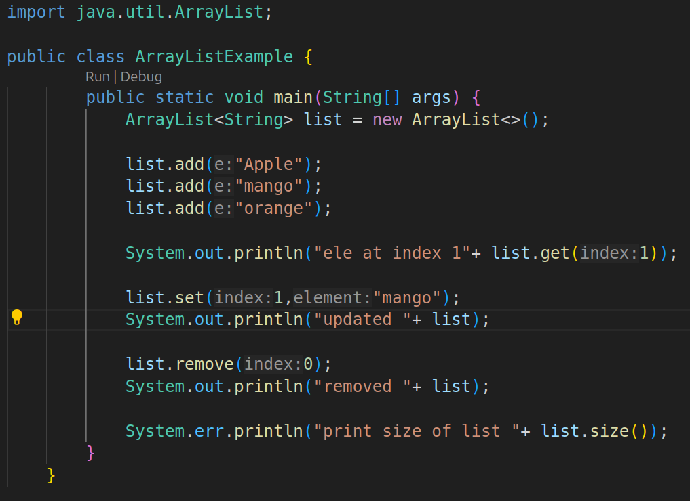
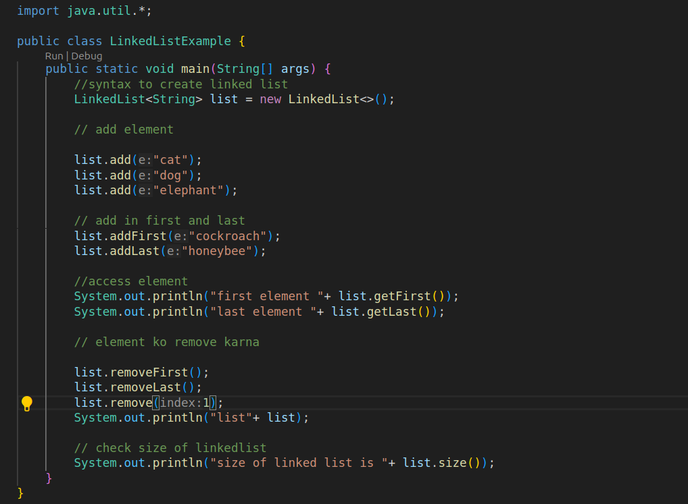

Here’s a short and clear tabular comparison of **ArrayList** and **LinkedList** in English:

|Feature|ArrayList|LinkedList|
|---|---|---|
|**Storage Mechanism**|Uses a dynamic array internally.|Uses a doubly linked list internally.|
|**Access Time**|Fast for random access (`O(1)` for `get`).|Slow for random access (`O(n)` for `get`).|
|**Insertion**|Slow for inserting in the middle (`O(n)`).|Fast for inserting anywhere (`O(1)`).|
|**Deletion**|Slow for deleting in the middle (`O(n)`).|Fast for deleting anywhere (`O(1)`).|
|**Memory Usage**|Less memory as it stores only data.|More memory as it stores node pointers too.|
|**Iterating**|Faster with `for` loop.|Slower, requires traversal of nodes.|
|**Use Case**|Best for read-heavy operations.|Best for insert/delete-heavy operations.|
|**Resizable**|Automatically resizes when full.|Dynamically grows with new nodes.|

## Code for arraylist:

## code for linkedlist

