why we need arrays

- array is collection of datatypes 
- Arrays are a type of static data structure because their size is predefined and unchangeable.
- Array indices start from 0.
- Arrays ==store elements of the same data type==, e.g., all integers, all strings, etc.

**Advantages in Java:**

- Simple to use for storing fixed-size collections of data.
- Provides a direct way to manage memory.

syntax
datatype[] variable_name = ==new== datatype[size];


here ==new== is a keyword used to create an object


ed : int[] numbers = new int[5];

int[] rnos = new int[5];
or
int[] rnos2 = {12,23,21,34,43};

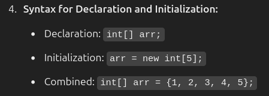

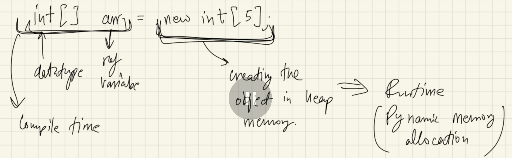

here new is a keyword used to create an object

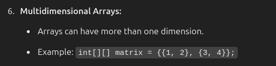

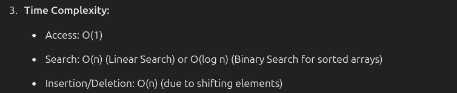

> In java their is no concept of pointers 

array objects are in heap

> all objects in java is stored in heap

heap object are not continous (memory are one by one allocated)

array objects  in java may not be continuous (it depends on jvm)


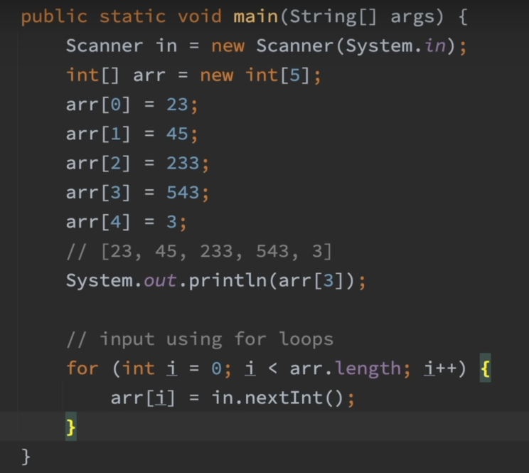


### passing through function

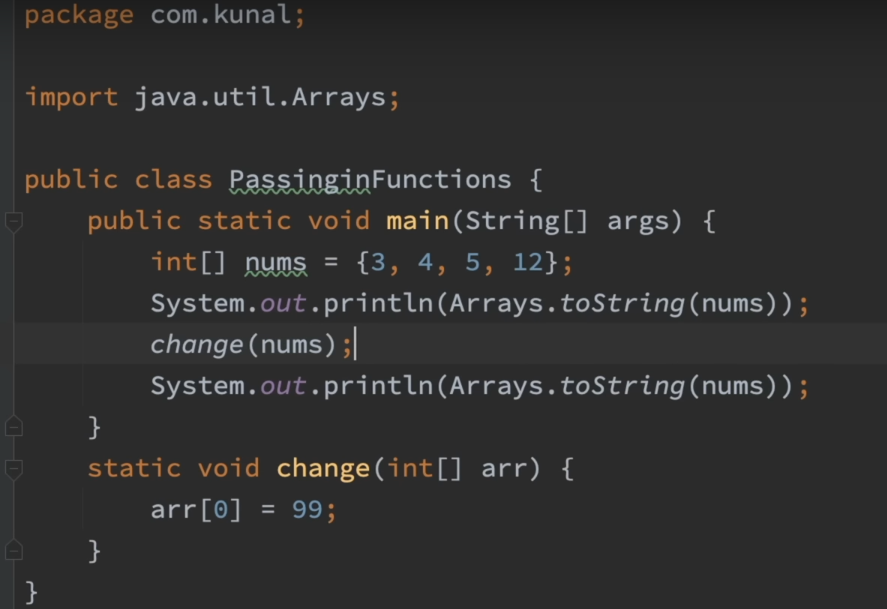
 
strings are immutable and arrays are mutable in java (here mutable means we can change object) 

### Multidimensional array

 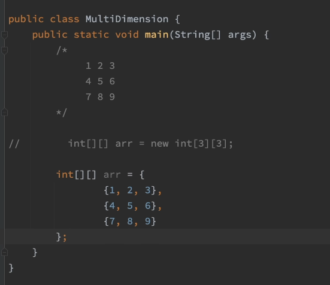

multidimensional arrays are array of arrays 


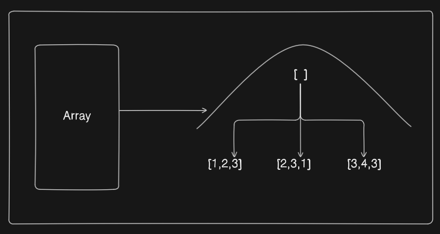

arr[] -----> [4,5,6]

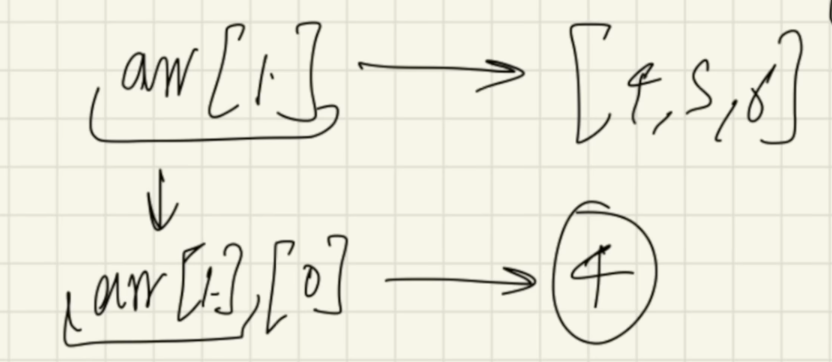


individual size of an array can vary as well , bcoz  each array itself is a different object 


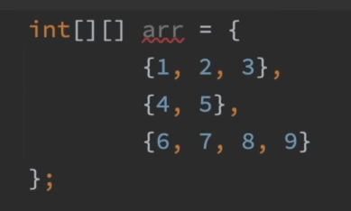 

input of multidimensional array

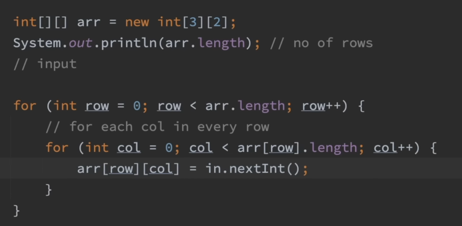


input and output of multidimensional array

```java
import java.util.Scanner;

public class MultiDimensionalArray {
    public static void main(String[] args) {
        Scanner scanner = new Scanner(System.in);

        // Input dimensions of the array
        System.out.print("Enter number of rows: ");
        int rows = scanner.nextInt();
        System.out.print("Enter number of columns: ");
        int cols = scanner.nextInt();

        // Declare a 2D array
        int[][] array = new int[rows][cols];

        // Input elements into the array
        System.out.println("Enter the elements of the array:");
        for (int i = 0; i < rows; i++) {
            for (int j = 0; j < cols; j++) {
                System.out.print("Element [" + i + "][" + j + "]: ");
                array[i][j] = scanner.nextInt();
            }
        }

        // Output the 2D array
        System.out.println("\nThe entered 2D array is:");
        for (int i = 0; i < rows; i++) {
            for (int j = 0; j < cols; j++) {
                System.out.print(array[i][j] + " ");
            }
            System.out.println(); // Move to the next line for each row
        }

        scanner.close();
    }
}

```


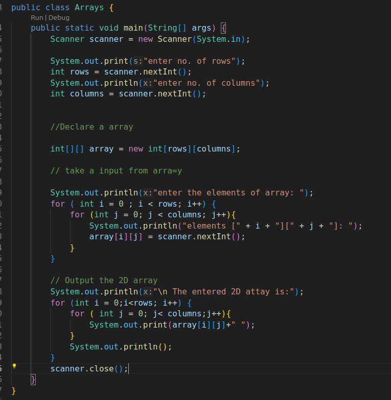

### Array list

when we don't know how much size of the array we want

// syntax

```
ArrayList<Integer> list = new ArrayList<>();
```


An ArrayList in Java is a part of the `java.util` package and provides a resizable array implementation. Unlike arrays, the size of an ArrayList can grow or shrink dynamically.

- Automatically resizes when elements are added or removed.
- No need to define a fixed size at initialization.

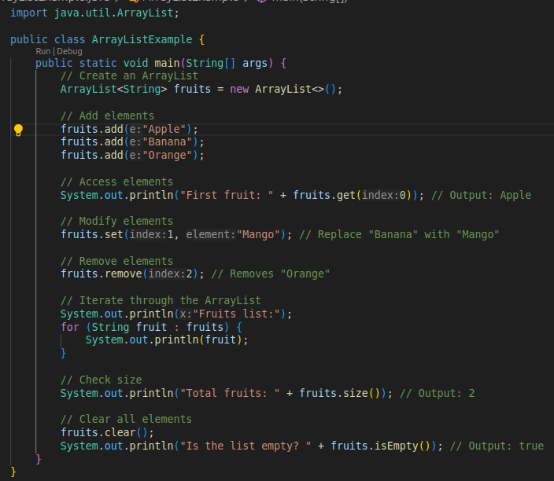


internal working of arraylist

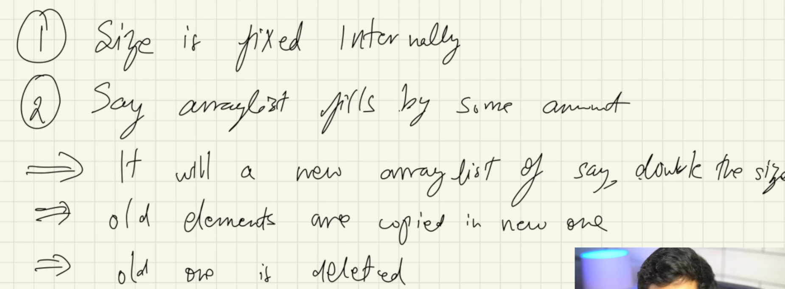


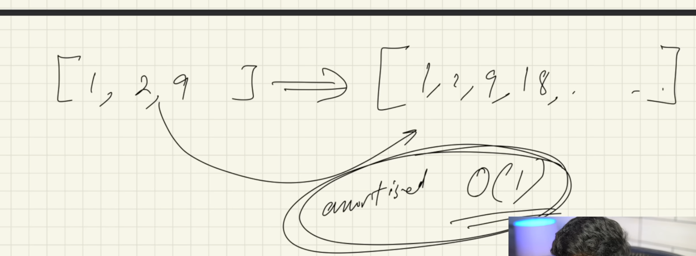


Q1 swap 2 index in an array

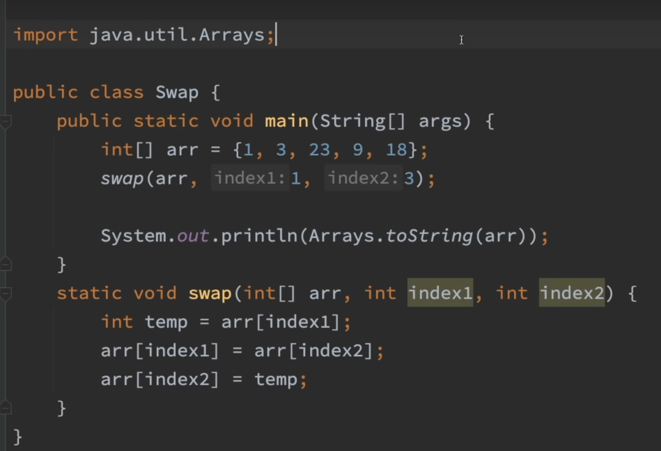


Q2. find max value of array

Q3. reverse of array


null