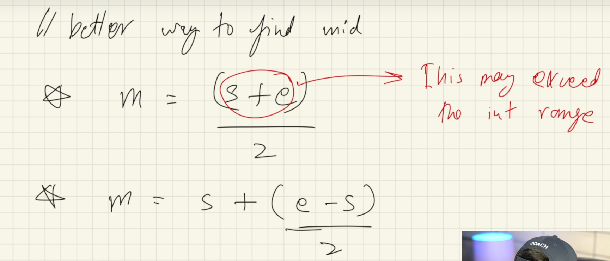
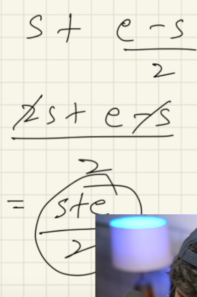
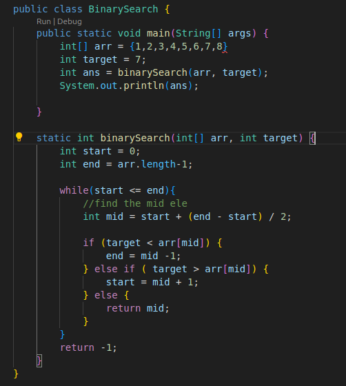
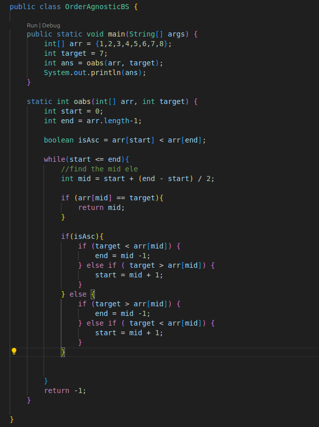

https://youtu.be/f6UU7V3szVw?si=26WxPdb9UAUEqpAx

- Used for sorted arrays
- in ascending or descending order
- It works by repeatedly dividing the search interval in half and comparing the target with the middle element.
---

### Algo

1. find the middle element
2. target ele > mid ele => search in right else search in left
3. if mid ele == target ele => ans

---
### Loops used in binary search

while
	if
		else if 
		 else 

---
### Time Complexity:

- **Best Case**: O(1) (target found at the middle).
- **Worst Case**: O(log⁡n)   (array size halved each step).

----
### Space Complexity:

- O(1) (iterative approach, no extra memory used).

---
> while coding

---
### code for binary search [[hinglish explaination of code]]

### Order agnostic binary search

