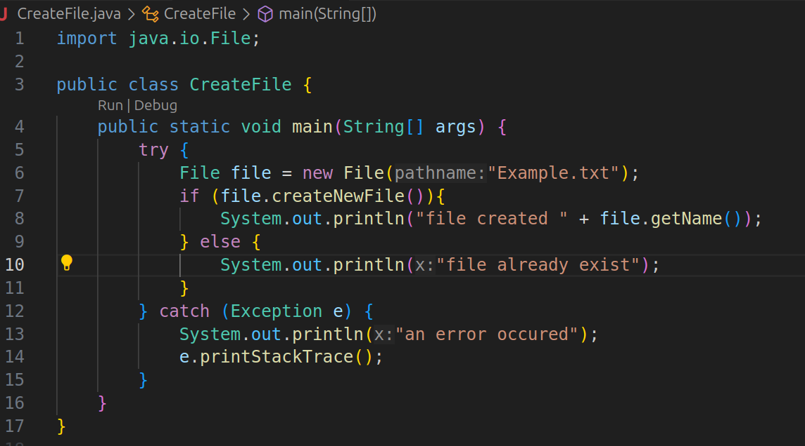
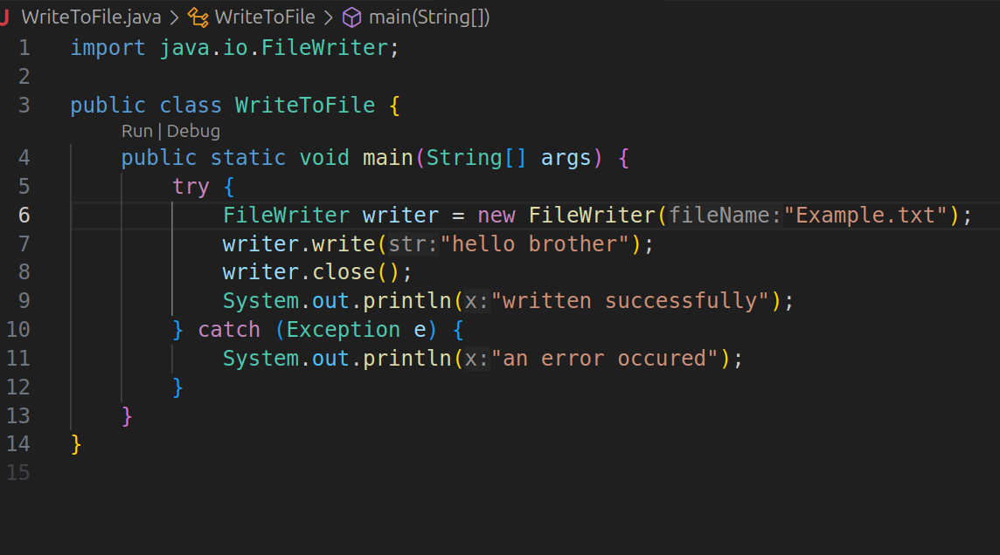
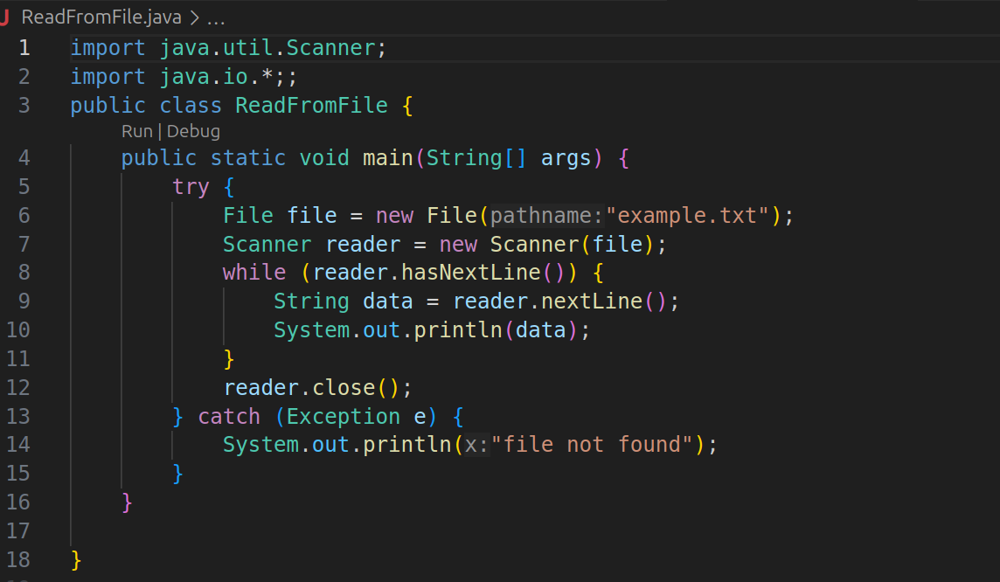
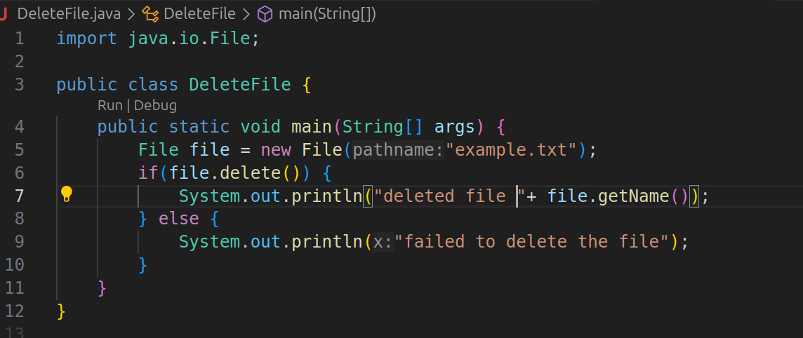

- **File Input**: File se data read karna.
- **File Output**: File mein data write karna.
- File handling ke liye **java.io** aur **java.nio** packages use hote hain.
### **Important Classes for File I/O**

- **File**: File ya directory ka representation.
- **FileReader**: Characters read karne ke liye.
- **BufferedReader**: Efficient character reading ke liye (large data).
- **FileWriter**: Characters write karne ke liye.
- **BufferedWriter**: Efficient writing ke liye.
- **PrintWriter**: Text data write karne ke liye, with better formatting.
- **FileInputStream/FileOutputStream**: Bytes read/write karne ke liye.

## create a file 

# Write in a file 

# Read a file

# Delete a file

