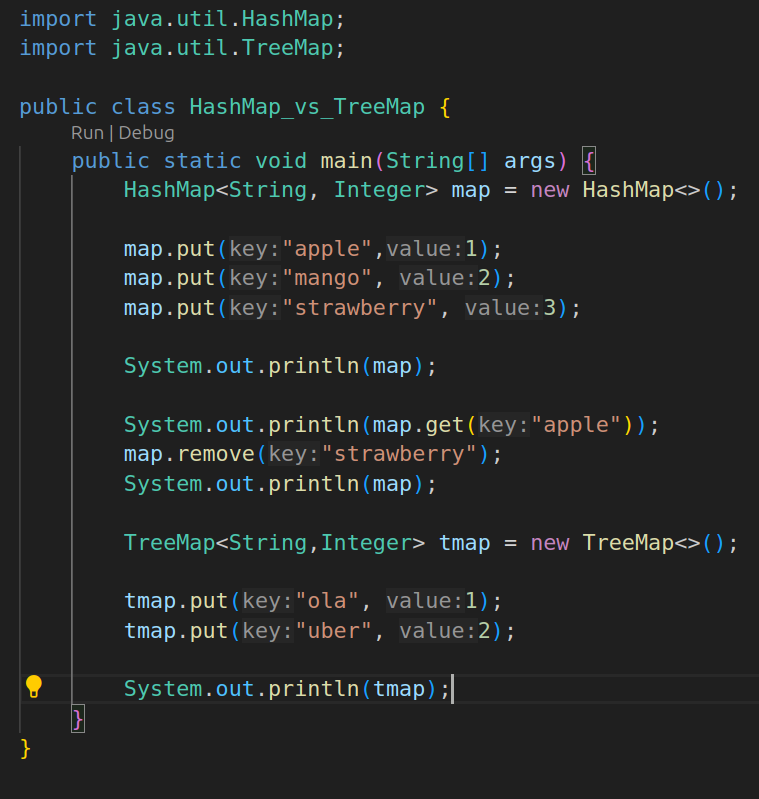
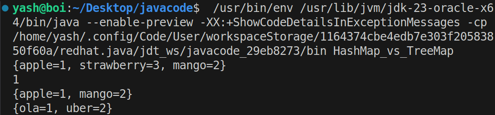

|**Feature**|**HashMap**|**TreeMap**|
|---|---|---|
|**Implementation**|Uses a **hash table** internally.|Uses a **red-black tree** internally.|
|**Ordering**|**No specific order**, elements are stored randomly.|**Sorted order** (natural or custom comparator).|
|**Duplicates**|Allows **only one null key** and multiple null values.|Allows **only one null key** (null values are allowed).|
|**Performance**|Faster for most operations (`O(1)` average for `get()`, `put()`, `remove()`).|Slower (`O(log n)`) for `get()`, `put()`, `remove()` due to tree traversal.|
|**Use Case**|When order of elements is not important, and you need fast access.|When you need elements to be sorted (ascending or custom order).|
|**Iteration Order**|No guaranteed order during iteration.|Iterates in **sorted order**.|
|**Memory Usage**|Less memory overhead due to hash table.|More memory due to the tree structure.|
|**Methods**|Doesn't provide methods for range queries.|Provides methods like `subMap()`, `headMap()`, `tailMap()` for range queries.|

1. **HashMap**:
    - No order guaranteed.
    - Faster (`O(1)` average for `get()`, `put()`, `remove()`).
    - Allows **one null key** and **multiple null values**.
2. **TreeMap**:
    - Always sorted (ascending or custom order).
    - Slower (`O(log n)` for `get()`, `put()`, `remove()`).
    - Allows **one null key** but only **non-null values**.

---

### **When to Use Which?**

- **Use HashMap** when you don’t care about the order of elements, and you want fast access to values by keys.
- **Use TreeMap** when you need elements sorted in ascending order (or custom order using a comparator), and you are okay with slightly slower performance.

