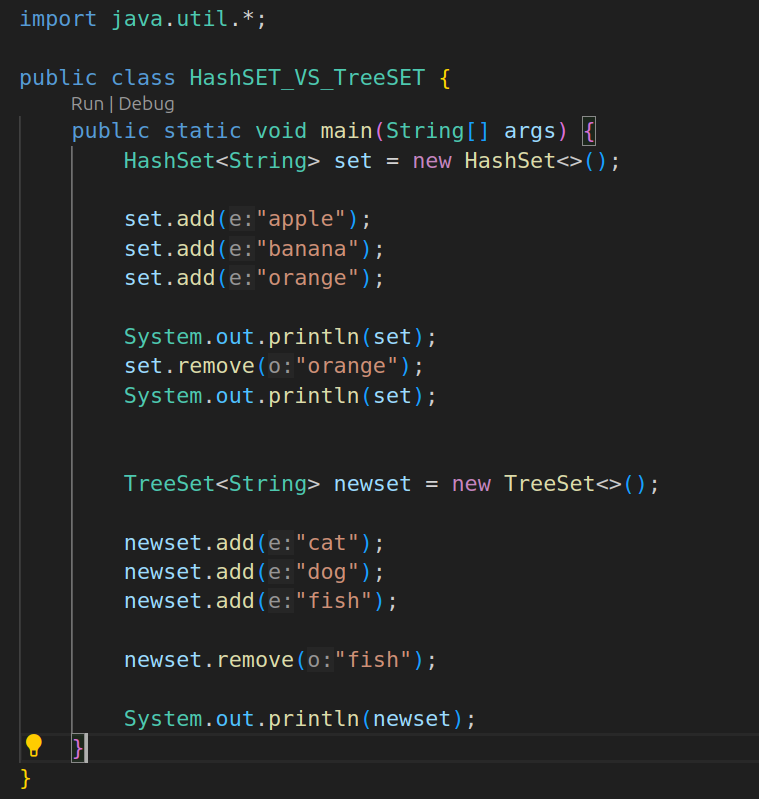
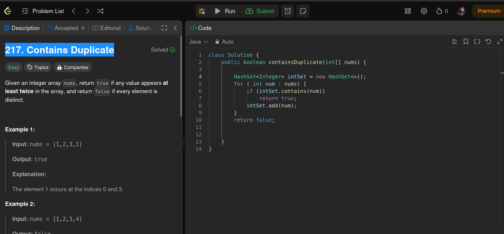
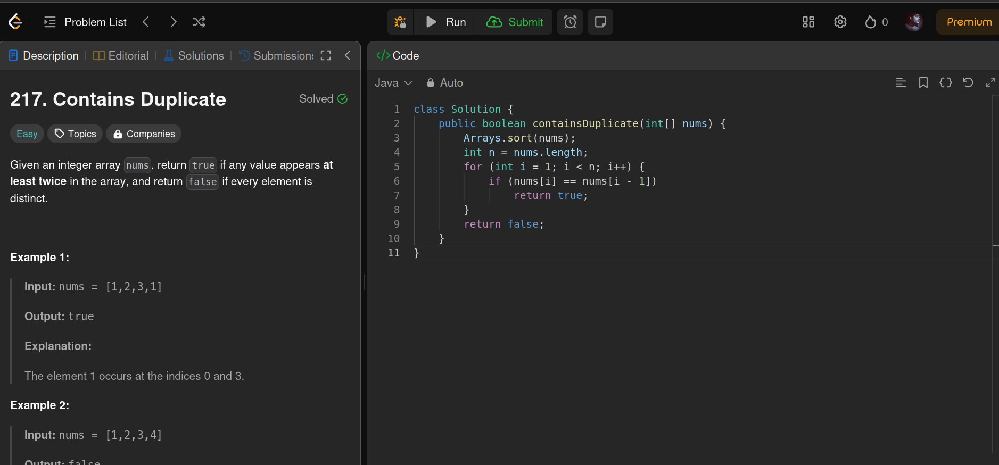

| **Feature**         | **HashSet**                                                                                 | **TreeSet**                                                                          |
| ------------------- | ------------------------------------------------------------------------------------------- | ------------------------------------------------------------------------------------ |
| **Implementation**  | Internally uses a **hash table**.                                                           | Internally uses a **red-black tree**.                                                |
| **Ordering**        | No order; elements are stored randomly.                                                     | Maintains **ascending order** of elements.                                           |
| **Duplicates**      | Does not allow duplicate elements.                                                          | Does not allow duplicate elements.                                                   |
| **Performance**     | Faster for basic operations like `add()`, `remove()`, and `contains()` (`O(1)` on average). | Slower for basic operations (`O(log n)`) due to tree traversal.                      |
| **Null Elements**   | Allows **one null element**.                                                                | Allows **one null element** (but in case of a comparator, it might throw exception). |
| **Use Case**        | When you need fast lookup and no specific order.                                            | When you need elements in sorted order.                                              |
| **Iteration Order** | Iteration order is not predictable.                                                         | Iterates in **natural order** (ascending).                                           |
| **Methods**         | Doesn't have methods to handle sorting.                                                     | Provides methods for range queries, like `headSet()`, `tailSet()`.                   |
| **Memory Usage**    | Less memory overhead as it uses a hash table.                                               | More memory overhead due to the tree structure.                                      |

1. **HashSet**:
    
    - No order of elements.
    - Faster for most operations.
    - Allows **null** element.
2. **TreeSet**:
    
    - Maintains elements in **ascending order**.
    - Slightly slower due to sorting.
    - No **null** if a custom comparator is used.

# leetcode samajhdaar wala approach

# mandabuddhi wala approach 

