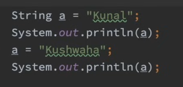
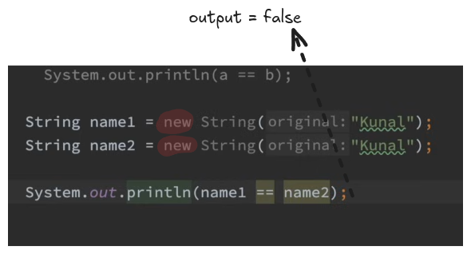

### [[String revision in HINGLISH]]

any thing which start with capital letter is a class


## String pool : separate memory structure inside a heap


make a program more optimise

Strings are immutable we cannot change it we cannot change object





## comparison of string 


## Create diff objects of Same value




# pretty printing in java


output: 453.16f

> '%' is called placeholder

```java
System.out.printf("pie: %.3f", Math.PI);
```
output: 3.142


Here’s a tabular representation of the commonly used **format specifiers** in Java. These are used with methods like `System.out.printf()` or `String.format()` for formatted output:

| **Specifier** | **Description**                 | **Example**                           | **Output**     |
| ------------- | ------------------------------- | ------------------------------------- | -------------- |
| `%d`          | Integer (decimal)               | `System.out.printf("%d", 42);`        | `42`           |
| `%f`          | Floating-point number           | `System.out.printf("%.2f", 3.14);`    | `3.14`         |
| `%e`          | Scientific notation (lowercase) | `System.out.printf("%e", 12345.678);` | `1.234568e+04` |
| `%E`          | Scientific notation (uppercase) | `System.out.printf("%E", 12345.678);` | `1.234568E+04` |
| `%c`          | Character                       | `System.out.printf("%c", 'A');`       | `A`            |
| `%s`          | String                          | `System.out.printf("%s", "Java");`    | `Java`         |
| `%b`          | Boolean                         | `System.out.printf("%b", true);`      | `true`         |
| `%%`          | Literal `%` symbol              | `System.out.printf("%%");`            | `%`            |
| `%o`          | Octal integer                   | `System.out.printf("%o", 10);`        | `12` (octal)   |
| `%x`          | Hexadecimal integer (lowercase) | `System.out.printf("%x", 255);`       | `ff` (hex)     |
| `%X`          | Hexadecimal integer (uppercase) | `System.out.printf("%X", 255);`       | `FF` (hex)     |
| `%t`          | Date/Time specifier (see below) |                                       |                |
| `%n`          | Newline character               | `System.out.printf("Hello%nWorld");`  | Multi-line     |

---

### **Additional Date/Time Specifiers (with `%t`)**

| **Specifier** | **Description**          | **Example**                             | **Output**        |
| ------------- | ------------------------ | --------------------------------------- | ----------------- |
| `%tH`         | Hour (24-hour format)    | `System.out.printf("%tH", new Date());` | `14` (e.g., 2 PM) |
| `%tI`         | Hour (12-hour format)    | `System.out.printf("%tI", new Date());` | `02`              |
| `%tM`         | Minute                   | `System.out.printf("%tM", new Date());` | `30`              |
| `%tS`         | Second                   | `System.out.printf("%tS", new Date());` | `45`              |
| `%tp`         | AM/PM marker (lowercase) | `System.out.printf("%tp", new Date());` | `pm`              |
| `%tB`         | Full month name          | `System.out.printf("%tB", new Date());` | `December`        |
| `%tb`         | Abbreviated month name   | `System.out.printf("%tb", new Date());` | `Dec`             |
| `%tA`         | Full day name            | `System.out.printf("%tA", new Date());` | `Friday`          |
| `%ta`         | Abbreviated day name     | `System.out.printf("%ta", new Date());` | `Fri`             |
| `%tY`         | Year (4-digit)           | `System.out.printf("%tY", new Date());` | `2024`            |
| `%ty`         | Year (last 2 digits)     | `System.out.printf("%ty", new Date());` | `24`              |

---

### **Formatting Options**

You can combine format specifiers with flags for more control:

| **Flag** | **Description**              | **Example**                           | **Output**  |
| -------- | ---------------------------- | ------------------------------------- | ----------- |
| `-`      | Left-align                   | `System.out.printf("%-10d", 123);`    | `123`       |
| `+`      | Print sign for numbers       | `System.out.printf("%+d", 123);`      | `+123`      |
| `0`      | Pad with zeroes              | `System.out.printf("%05d", 123);`     | `00123`     |
| `,`      | Use grouping separator       | `System.out.printf("%,d", 1234567);`  | `1,234,567` |
| `.`      | Precision for floating-point | `System.out.printf("%.2f", 3.14159);` | `3.14`      |

---

### Example Program

```java
import java.util.Date;

public class FormatSpecifierDemo {
    public static void main(String[] args) {
        System.out.printf("Integer: %d%n", 42);
        System.out.printf("Float: %.2f%n", 3.14159);
        System.out.printf("Character: %c%n", 'A');
        System.out.printf("String: %s%n", "Hello");
        System.out.printf("Hexadecimal: %x%n", 255);
        System.out.printf("Current Time: %tT%n", new Date());
    }
}
```


# operators


# String builder (only one obj is made and the changes is done in that obj only)\

we can't name class as StringBuilder as it is already a class


#### Reverse a string use 
string builder reverse ("builder.reverse")


# String Methods


---
# Palindrome of a string

algorithm:
- if str == null || str.length() == 0 
   return true
- i = 0; i = <= str.length()/2 ; i++


																
																