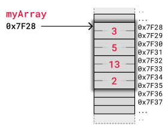
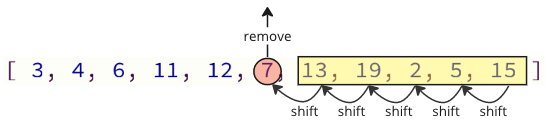

each element is stored right after the previous element

The image below shows how an array of integers myArray = [3,5,13,2] is stored in memory. We use a simple kind of memory here with two bytes for each integer, like in the previous example, just to get the idea.

image below shows how elements are shifted when an array element is removed.

