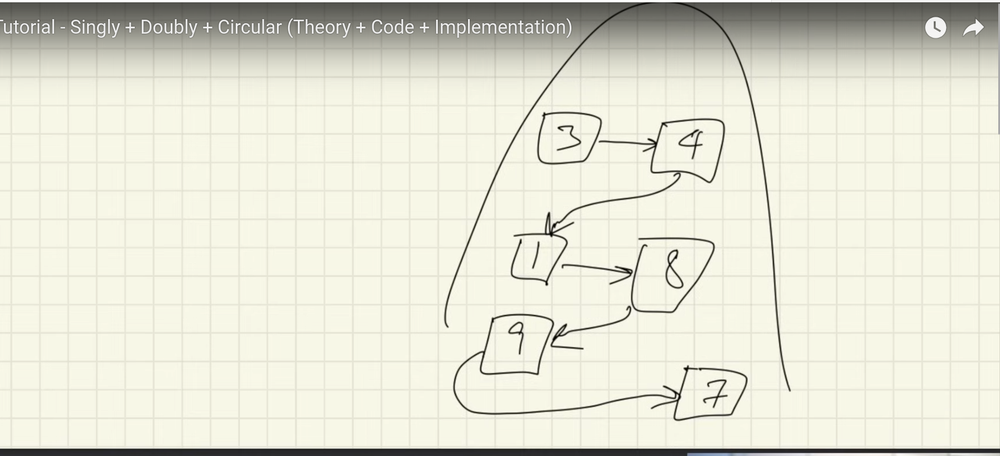

linked list not continous mem alloc tray to break boxes into seperate boxes (array reference)

for every block we put it in random mem

they are connected with arrows pointer 

pointer is reference variable 

how linked list works internally 

node 

single linked list eveery item knows about other item