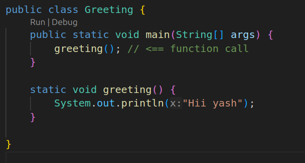
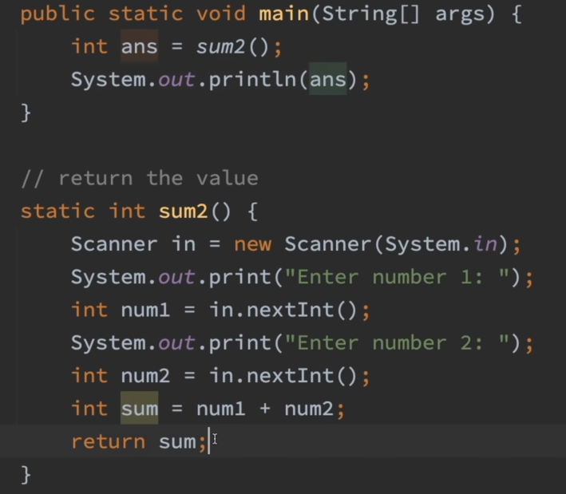
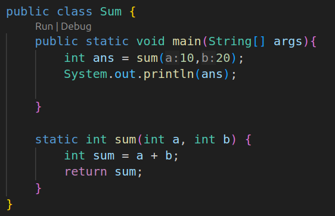
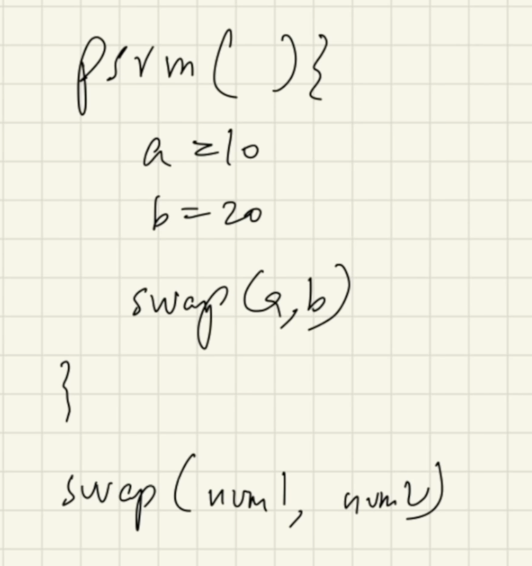
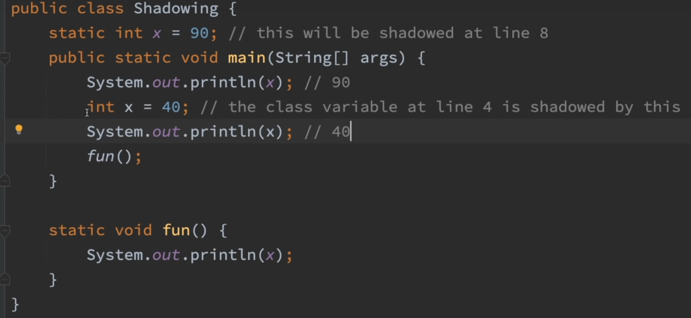
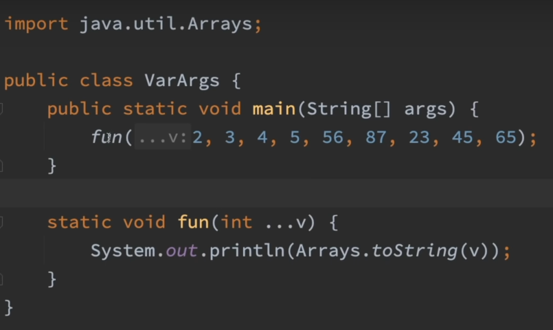
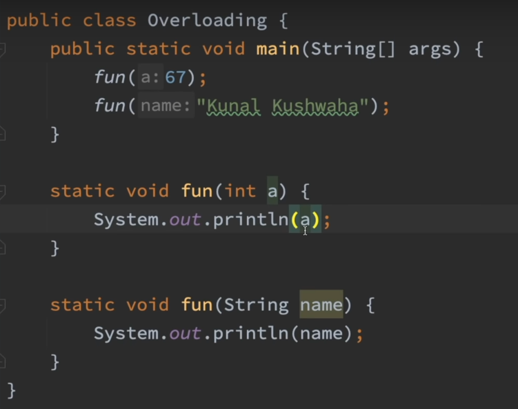

- In java we call functions as method
- function is nothing but the block of code. 


/*
return_type name (arguments) {
	//body
	return statement
}
*/


In coding world the word "dry" means don't repeat yourself



**return** is the value of the function call  




### pass the value of numbers when you are calling the method in main()




no pass-by reference in java only pass-by value

> primitive: int , short,char,byte ....  -----> just passing value
   object and stuff -----> passing value of the reference




### scoping in java

function scope
**if you define any thing in function then you will only access those things inside the function**
**this is also applicable to args**

Scoping in Java refers to the visibility and lifecycle of variables, methods, and classes within different parts of a program. Proper scoping ensures that variables and methods are accessible only where they are needed, reducing potential errors and improving code readability and maintainability.


#### **1. Class Scope**

- **What it is**: Variables and methods declared at the class level.
- **Visibility**: These are accessible throughout the class. Access can be controlled using access modifiers (`public`, `protected`, `private`, or package-private).
- **Example**:

```java
public class Example {
    private int count; // Class scope (accessible throughout the class)

    public void increment() {
        count++; // Accessible here
    }

    public int getCount() {
        return count; // Accessible here too
    }
}

```


#### **2. Block Scope**

- **What it is**: Variables declared within a block (e.g., loops, conditionals).
- **Visibility**: These are only accessible within the block where they are declared.
- **Example**:

```java
public void printEvenNumbers() {
    for (int i = 0; i < 10; i++) { // `i` has block scope
        if (i % 2 == 0) {
            System.out.println(i);
        }
    }
    // System.out.println(i); // Error: `i` is not accessible here
}

```
#### **3. Loop Scope**

- Loop variables are scoped to the loop they are declared in:
```java
for (int i = 0; i < 5; i++) {
    System.out.println(i); // `i` is accessible here
}
// System.out.println(i); // Error: `i` is out of scope

```


anything that is initialize outside the block can be used inside the block, anything that is initialize inside cannot use outside


### Shadowing in java



Shadowing happens when a variable in an inner scope (e.g., a method or block) has the same name as a variable in an outer scope (e.g., a class or enclosing block). The inner variable takes precedence, "hiding" the outer variable.

---

### **Key Points:**
1. **Occurs in Nested Scopes**:
   - Local variables, method parameters, or block variables can shadow instance or class variables.

2. **Accessing Shadowed Variables**:
   - Use `this` to access instance variables.
   - Use the class name to access `static` variables.

3. **Examples**:
   - **Instance Variable Shadowed**:
     ```java
     int x = 10; // Instance variable
     public void setX(int x) { // Parameter shadows instance variable
         this.x = x; // `this.x` refers to the instance variable
     }
     ```
   - **Static Variable Shadowed**:
     ```java
     static int x = 100; // Static variable
     public void displayX() {
         int x = 200; // Local variable shadows static variable
         System.out.println(x); // Local (200)
         System.out.println(Example.x); // Static (100)
     }
     ```

4. **Best Practices**:
   - Avoid reusing variable names unnecessarily.
   - Use explicit qualifiers like `this` or the class name to clarify which variable you’re referencing.


### Variable Arguments 




### Function overloading

occurs at compiletime


 


