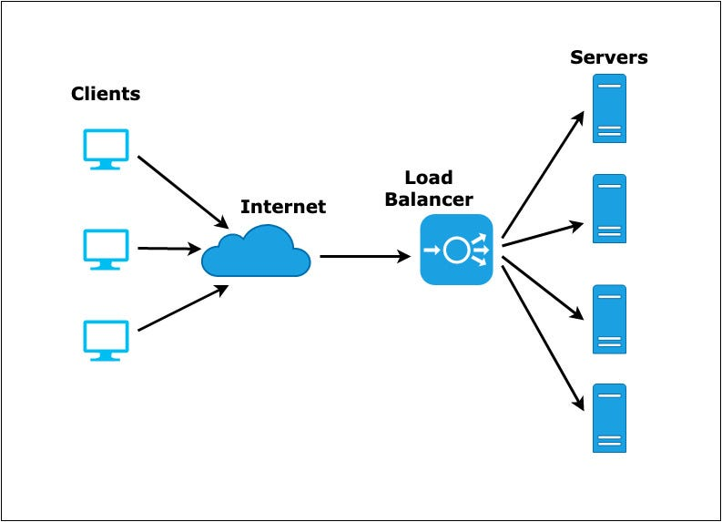
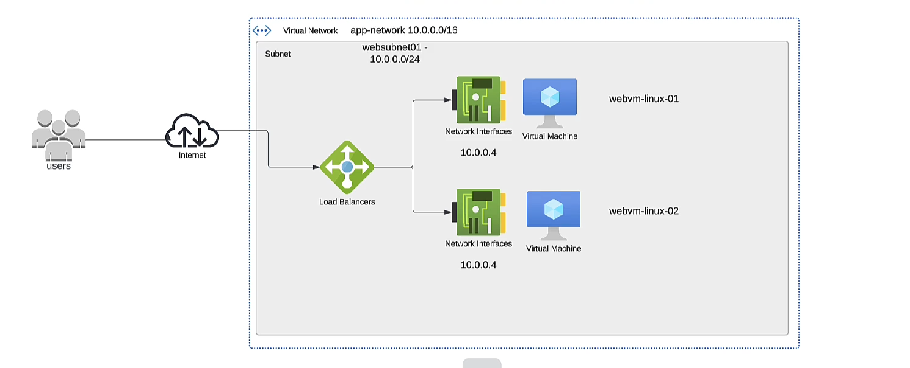
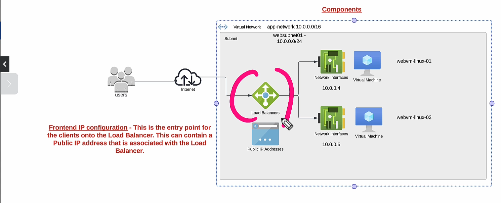
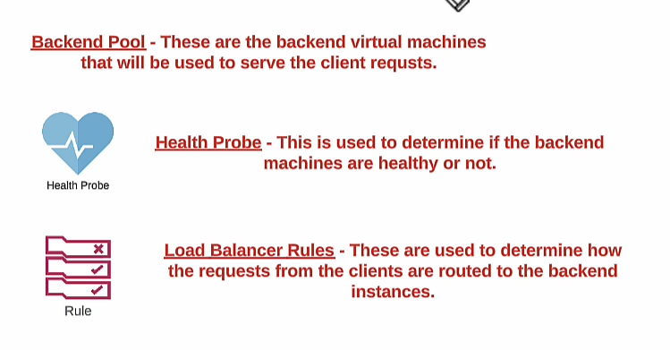
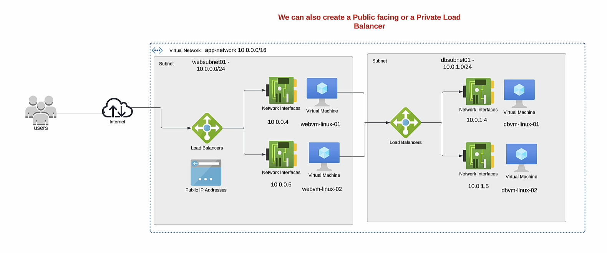
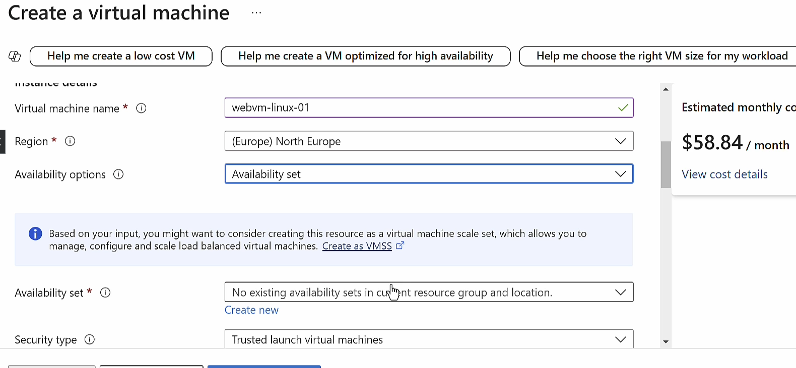
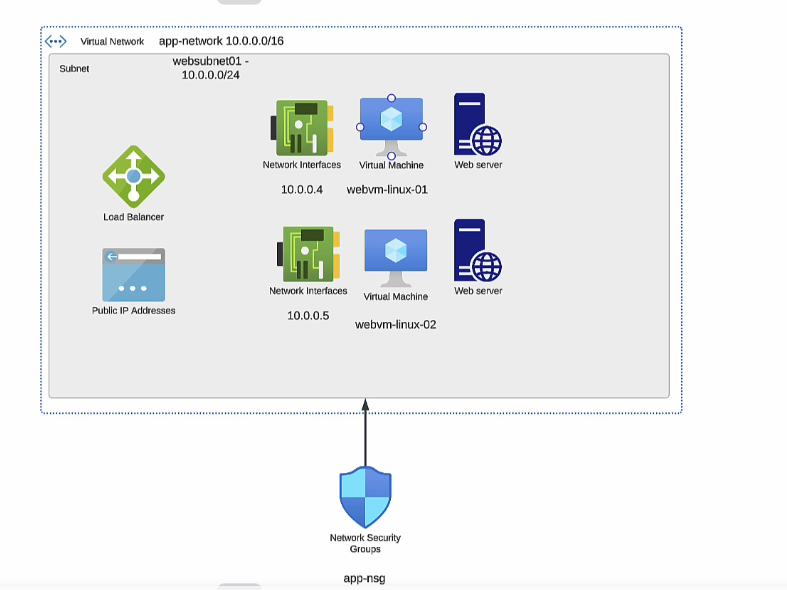
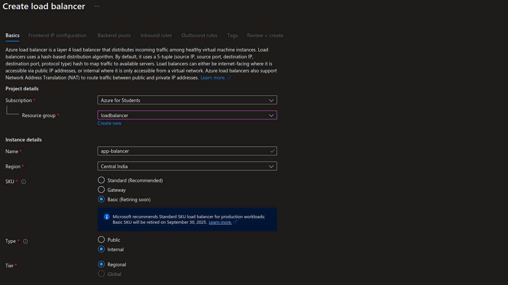

---
used to distribute the incoming network traffic across a set of backend servers

---
#### Azure load balancer

---
- You can have an application hosted on a set of machines.
- You want user traffic to be distributed equally across the machines.
- For this we can make use of the Azure Load Balancer service,
- Here the Azure Load Balancer can distribute traffic across the private IP addresses of the backend machines.
- Load Balancer SKU's - The Basic SKU is going to retire on September 30, 2025
---
In azure we have standard load balancer which have SLA (_Service Level Agreement_) of 99.99% 

---

---

loadbalancer healthy or not (health probe )

---

---

To use  loadbalancer it is necessary to make a machines (vms) in availability set or scale set

---
### Deployment of basic load balancer in azure

---

---

# failed to setup load-balancer bcoz my vms are not on availability set it is on availability zones plz rectify this :(                      {lab 116}

---

> [!NOTE]
> like basic LB we dont need vms in availability set or scale set for standard load  balancer 

