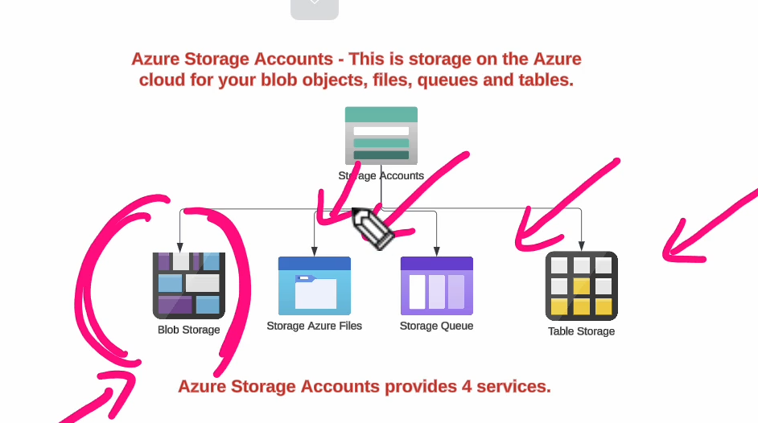
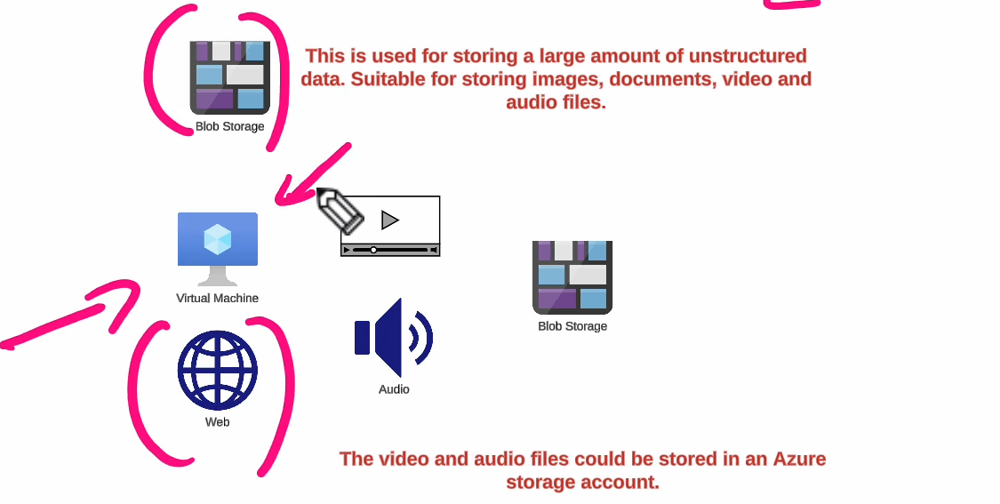
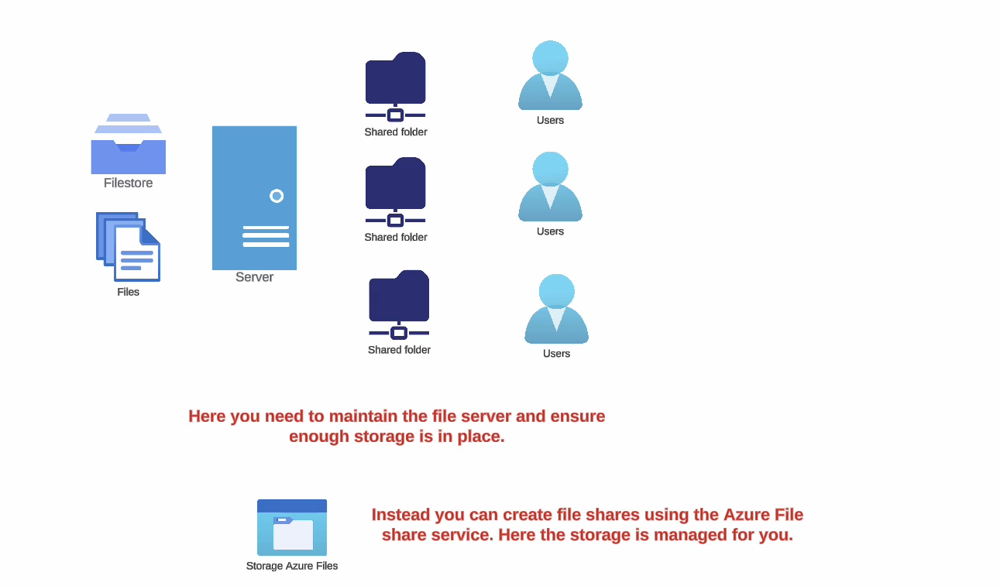
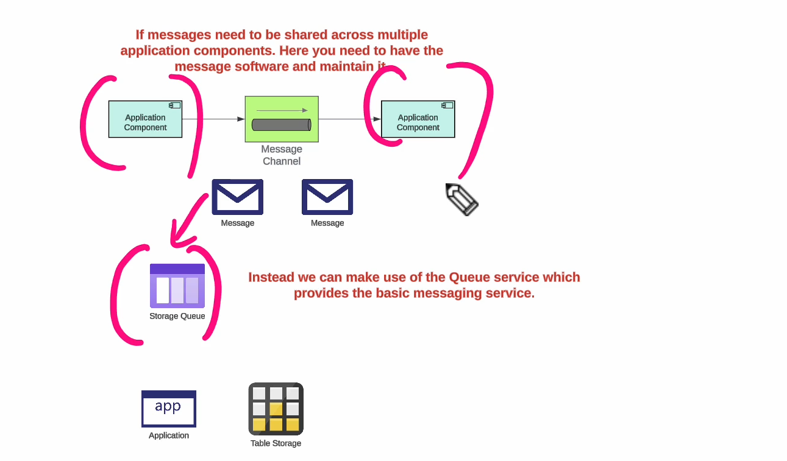
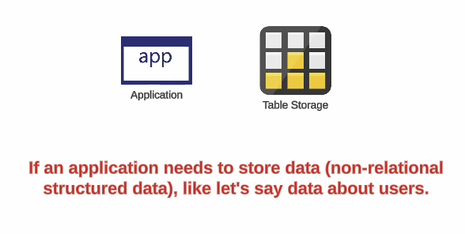

PAn **Azure Storage Account** is a fundamental service in Azure that provides cloud-based storage solutions for data. It supports a variety of storage types, including blobs, files, queues, tables, and disks. Below is an explanation of Azure Storage Accounts, their types, and how to use them.

---

### **Key Features of Azure Storage Accounts**

1. **Highly Available**: Data is stored redundantly for durability, ensuring high availability.
2. **Scalable**: Automatically scales based on your storage needs.
3. **Secure**: Offers encryption, shared access signatures, and identity-based access.
4. **Cost-effective**: Offers pricing tiers based on usage and redundancy options.
5. **Accessible**: Supports REST APIs, SDKs, and CLI for integration.

---



### **Types of Azure Storage Services**

1. **Blob Storage**:
    - Used to store unstructured data like text, images, videos, backups, etc.
    - Types of blobs:
        - **Block Blob**: For large objects like images and videos.
        - **Append Blob**: For append-only operations, like logging.
        - **Page Blob**: For random access, used in Virtual Machine disks.




1. **File Storage (Azure Files)**:
    - Provides fully managed, cloud-based file shares accessible via SMB or NFS protocols.
    - Use cases: File sharing across VMs, on-premises, or cloud.




1. **Queue Storage**:
    - A messaging solution for communication between applications.
    - Useful for decoupling components and processing tasks asynchronously.



1. **Table Storage**:
    - A NoSQL key-value store for semi-structured data.
    - Use cases: Storing logs, metadata, and structured data.




1. **Disk Storage**:
    - Persistent, high-performance block storage for Azure VMs.
    - Types: Managed Disks, Unmanaged Disks.

---

### **Types of Azure Storage Accounts**

1. **General-purpose v2 (GPv2)**:
    - Supports all storage types: blobs, files, queues, and tables.
    - Best for most scenarios.
    - Includes advanced features like lifecycle management and hot/cool/archive access tiers.
2. **General-purpose v1 (GPv1)**:
    - Supports all storage types but lacks advanced features.
    - Lower cost, but less efficient.
3. **Blob Storage Account**:
    - Optimized for blob storage.
    - Supports hot, cool, and archive access tiers.
4. **Premium Storage Accounts**:
    - For scenarios requiring low latency and high throughput.
    - Mainly for VM disks and high-performance applications.

---

### **Redundancy Options in Azure Storage**

Azure Storage provides redundancy options to ensure durability and high availability of data:

1. **Locally Redundant Storage (LRS)**:
    - Stores three copies of data in the same data center.
    - Cheapest option.
2. **Zone-Redundant Storage (ZRS)**:
    - Stores data in multiple availability zones within the same region.
3. **Geo-Redundant Storage (GRS)**:
    - Stores three copies in the primary region and replicates to a secondary region.
4. **Read-Access Geo-Redundant Storage (RA-GRS)**:
    - Provides read access to the secondary region in addition to GRS.

---

### **Access Tiers for Blob Storage**

1. **Hot**:
    - Optimized for data accessed frequently.
    - Higher storage cost but lower access cost.
2. **Cool**:
    - Optimized for data accessed infrequently (e.g., once a month).
    - Lower storage cost but higher access cost.
3. **Archive**:
    - For long-term storage of data rarely accessed.
    - Lowest storage cost but requires rehydration to access.

---

### **How to Create an Azure Storage Account (Using Azure Portal and CLI)**

#### **1. Using Azure Portal**

1. **Navigate to Storage Accounts**:
    - Go to the Azure Portal and search for "Storage Accounts."
2. **Click "Create"**:
    - Click "Create" to create a new storage account.
3. **Configure Basics**:
    - Select a **Resource Group** or create a new one.
    - Specify the **Storage Account Name** (must be unique globally).
    - Choose **Region** and **Performance** (Standard or Premium).
    - Select **Redundancy** (LRS, GRS, etc.).
4. **Review and Create**:
    - Configure additional options like Networking and Advanced settings (if needed).
    - Review and click **Create**.

#### **2. Using Azure CLI**

```bash
az storage account create \
  --name mystorageaccount \
  --resource-group MyResourceGroup \
  --location eastus \
  --sku Standard_LRS \
  --kind StorageV2
```

---

### **How to Use Azure Storage Services**

#### **Blob Storage Example**

1. **Upload a Blob**:
    
    ```bash
    az storage blob upload \
      --account-name mystorageaccount \
      --container-name mycontainer \
      --name myfile.txt \
      --file /path/to/localfile.txt
    ```
    
2. **Download a Blob**:
    
    ```bash
    az storage blob download \
      --account-name mystorageaccount \
      --container-name mycontainer \
      --name myfile.txt \
      --file /path/to/downloadedfile.txt
    ```
    

#### **File Storage Example**

1. **Create a File Share**:
    
    ```bash
    az storage share create \
      --account-name mystorageaccount \
      --name myshare
    ```
    
2. **Mount Azure File Share to a VM**:
    
    - Use SMB or NFS protocols for mounting.

---

### **Best Practices for Using Azure Storage Accounts**

1. **Choose the Right Storage Type**:
    
    - Use Blob for unstructured data, Table for NoSQL, File for shared access, etc.
2. **Use Access Tiers Efficiently**:
    
    - Use **Hot** for frequently accessed data and **Archive** for long-term backups.
3. **Secure Your Data**:
    
    - Use Shared Access Signatures (SAS) for limited access.
    - Enable Azure AD authentication where possible.
4. **Monitor and Optimize Costs**:
    
    - Enable Azure Monitor for storage metrics.
    - Use lifecycle management policies to move data to cheaper tiers automatically.
5. **Enable Redundancy Based on Needs**:
    
    - Use LRS for cost efficiency or GRS for disaster recovery.

---

Azure Storage Accounts are versatile and cater to a wide variety of scenarios, making them a cornerstone of cloud-based applications. Let me know if you'd like to dive deeper into any specific storage type or feature!


