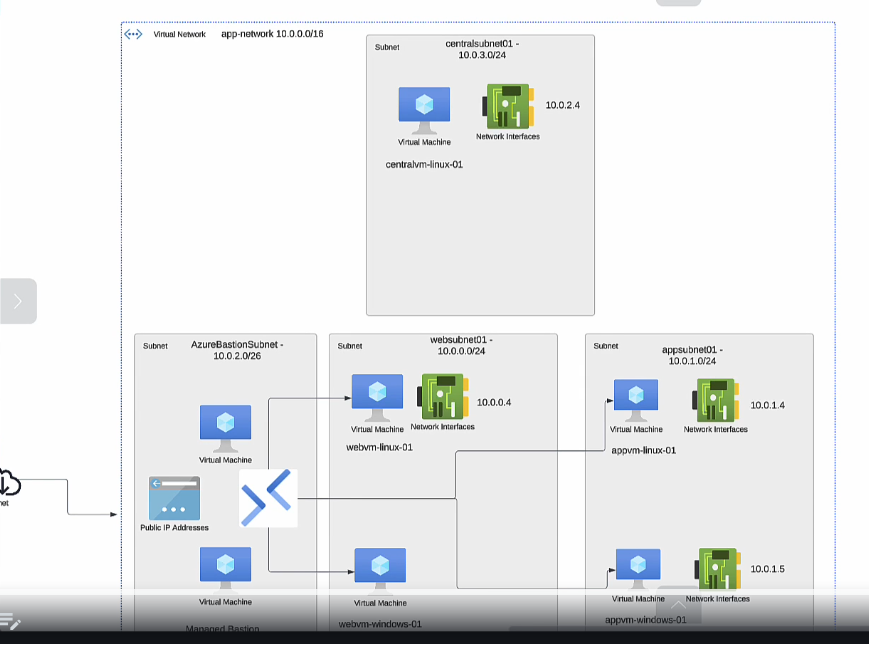

In **Microsoft Azure**, a **User-Defined Route (UDR)** ==allows users to customize how network traffic is routed within their virtual networks.== Azure automatically creates default system routes for traffic, but in some scenarios, you may need more control over the traffic flow. A UDR gives you this control.

### Key Concepts of User-Defined Routing:
1. **Default System Routes**:
   - ==Azure sets up system routes to manage traffic between subnets, virtual networks (VNets), and the internet automatically.==
   - Examples of default routes:
     - Route traffic between subnets within the same VNet.
     - Route traffic from a VNet to the internet via the default gateway.
     - Route traffic to on-premises networks through a connected VPN or ExpressRoute gateway.

2. **Why Use UDR?**
   - To override the default routes.
   - To direct traffic through specific network virtual appliances (NVAs) **Azure Network Virtual Appliance** like firewalls.
   - To implement network security policies or segment the network logically.
   - ==To block certain types of traffic.==

3. **How UDR Works**:
   - **Route Table**: A UDR ==consists of a custom route table==, which is associated with a subnet.
   - **Routes**: Each route in the route table defines:
     - **Address Prefix**: The destination CIDR block.
     - **Next Hop Type**: Where the traffic for the given address prefix should go.

4. **Next Hop Types**:
   - **Virtual Appliance**: Directs traffic to a specific IP address of an NVA like a firewall.
   - **Virtual Network Gateway**: Directs traffic to a VPN or ExpressRoute gateway.
   - **Internet**: Directs traffic to Azure's default internet gateway.
   - **Virtual Network**: Routes traffic to another subnet within the VNet.
   - **None**: Drops the traffic.

5. **Scenarios for UDR**:
   - **Custom Traffic Inspection**: Forcing traffic to pass through an NVA for logging or monitoring.
   - **Specific Routing**: Directing traffic to specific on-premises networks via a particular VPN gateway.
   - **Blocking Traffic**: Preventing traffic from accessing certain IP ranges by setting the next hop as "None."

### Steps to Create a User-Defined Route:
1. **Create a Route Table**:
   - Go to the Azure portal.
   - Navigate to the **Route Tables** service.
   - Click **+ Create**, and define the name, region, and resource group.

2. **Add Routes to the Route Table**:
   - Open the route table you just created.
   - Add routes specifying the destination address prefix and next hop type.

3. **Associate the Route Table with Subnets**:
   - Open the subnet settings in your virtual network.
   - Link the route table to the desired subnet.

### Example:
Imagine you have a VNet with three subnets:
- **Frontend**
- **Backend**
- **GatewaySubnet**

You want all traffic from the **Frontend** subnet to be inspected by a firewall hosted in the **Backend** subnet (with IP 10.0.2.4). To achieve this:
1. Create a UDR for the Frontend subnet.
2. Add a route:
   - **Address Prefix**: `0.0.0.0/0` (all traffic)
   - **Next Hop Type**: Virtual Appliance
   - **Next Hop IP Address**: `10.0.2.4`
3. Associate the route table with the Frontend subnet.

### Limitations:
- UDRs cannot directly route traffic between peered VNets unless explicitly configured.
- Azure services with forced tunneling may not fully respect UDRs.
- System routes (e.g., for Azure platform traffic) cannot be overridden in certain cases.

User-defined routes provide flexibility to control network traffic flows and implement sophisticated architectures for security, performance, and compliance.

### why to use UDR

**User-Defined Routes (UDRs)** in Azure are used when you need **custom control over network traffic flow** within a virtual network (VNet). By default, Azure creates system routes to manage traffic, but UDRs allow you to override these defaults to implement specific requirements. Below are the scenarios where UDRs are beneficial and the reasons for using them.

---

### **When to Use User-Defined Routes**
1. **Custom Traffic Control**:
   - When you want to direct traffic to pass through specific network virtual appliances (NVAs), such as firewalls or proxies.
   - Example: Directing outbound traffic from a subnet to an NVA for inspection or monitoring.

2. **Traffic Blocking**:
   - When you need to block access to specific IP addresses or networks.
   - Example: Dropping traffic to certain destinations by setting the **Next Hop Type** to "None."

3. **Force-Tunneling Traffic**:
   - When you need to force all traffic, including internet-bound traffic, through a specific on-premises gateway or firewall.
   - Example: Routing outbound internet traffic to an on-premises proxy server for compliance or monitoring.

4. **Custom On-Premises Routing**:
   - When you have multiple on-premises networks connected to Azure via VPN or ExpressRoute, and you need specific routing between these networks.
   - Example: Routing traffic for specific on-premises subnets via specific gateways.

5. **Segmenting Traffic Within VNets**:
   - When you want to control how traffic flows between subnets within a virtual network.
   - Example: Allowing one subnet to communicate only with specific destinations in another subnet.

6. **Overcoming Azure System Route Limitations**:
   - When Azure's default routes are insufficient or restrictive for your architecture.
   - Example: Ensuring that traffic between two peered VNets flows through a central NVA for auditing.

7. **Enabling Traffic Inspection and Monitoring**:
   - When you want to inspect traffic using third-party solutions for security or logging.
   - Example: Sending all east-west traffic between subnets to a third-party firewall.

---

### **Why Use User-Defined Routes**
1. **Enhanced Security**:
   - UDRs help enforce security policies by directing traffic to firewalls, proxies, or other security appliances.
   - Blocking access to unauthorized or harmful IP addresses improves the overall security posture.

2. **Improved Network Control**:
   - Custom routes give you granular control over how traffic flows between resources, subnets, and external networks.

3. **Compliance and Monitoring**:
   - Many organizations require traffic to be monitored or filtered to comply with regulatory requirements. UDRs help enforce such policies.

4. **Optimize Costs and Performance**:
   - By directing traffic through specific routes, you can optimize bandwidth usage and avoid unnecessary latency.

5. **Support for Complex Architectures**:
   - In advanced scenarios, such as hub-and-spoke architectures, UDRs are critical to managing traffic between multiple VNets and external networks.

6. **Flexibility**:
   - UDRs allow you to override Azure's system routes, providing the flexibility to meet unique business or technical requirements.

---

### **Common Scenarios**
1. **Traffic Filtering**:
   - **Scenario**: All outbound internet traffic should be filtered by a firewall hosted in a specific subnet.
   - **Solution**: Use a UDR with the **Next Hop Type** set to "Virtual Appliance" pointing to the firewall.

2. **Hub-and-Spoke Network**:
   - **Scenario**: In a hub-and-spoke network, all spoke VNets should route traffic through the hub for inspection or to access shared services.
   - **Solution**: Apply UDRs to the spoke subnets to direct traffic to the hub's NVA or gateway.

3. **Internet Traffic Control**:
   - **Scenario**: All internet-bound traffic from Azure must pass through on-premises infrastructure.
   - **Solution**: Configure a UDR to route traffic to the on-premises VPN or ExpressRoute gateway.

4. **Cross-Premises Routing**:
   - **Scenario**: Traffic from Azure to different on-premises networks must take different paths.
   - **Solution**: Add UDRs with different next hops for specific on-premises destination CIDRs.

---

### **Benefits**
- **Granular Control**: Tailor traffic routing to meet specific security, performance, or operational requirements.
- **Enhanced Security Posture**: Ensures traffic flows through secure and controlled paths.
- **Scalable Architectures**: Simplifies the implementation of complex network topologies.
- **Improved Visibility**: Enables routing for inspection, logging, and compliance checks.

By using UDRs, organizations can effectively implement network policies, secure their environments, and support diverse architectures.