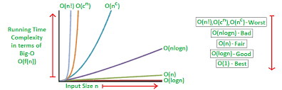

Bhai, **Big O Notation** samajhna ekdum zaruri hai agar tumhe DSA (Data Structures and Algorithms) mein master banna hai. Ye ==algorithm ki performance aur efficiency ko samajhne ka ek standard tareeka hai==. Chal basic aur examples ke saath samajhte hain:

---

### **What is Big O Notation?**

- Big O Notation ek ==mathematical concept hai jo algorithm ke **time complexity** aur **space complexity** ko analyze karta hai.==
- Ye batata hai ki **input size (n)** ke badhne par algorithm ka performance kaise change hoga.

---

### **Why is Big O Important?**

1. **Predict Performance**: Ye help karta hai kisi algorithm ka behavior predict karne mein jab input size kaafi bada ho.
2. **Compare Algorithms**: Algorithms ke efficiency compare karne ke liye use hota hai.
3. **Optimization**: Code ko fast aur memory-efficient banane ke liye.

---

### **Common Big O Notations**

|**Big O**|**Name**|**Example**|**Performance**|
|---|---|---|---|
|**O(1)**|Constant Time|Accessing an array element|Best (Fastest)|
|**O(log n)**|Logarithmic Time|Binary Search|Very Fast|
|**O(n)**|Linear Time|Iterating through an array|Moderate|
|**O(n log n)**|Log-Linear Time|Merge Sort, Quick Sort (Best/Average)|Moderate|
|**O(n²)**|Quadratic Time|Nested loops (e.g., Bubble Sort)|Slow|
|**O(2^n)**|Exponential Time|Recursive Fibonacci|Very Slow|
|**O(n!)**|Factorial Time|Solving Traveling Salesman|Worst (Slowest)|

---

### **Time Complexity Examples**

1. **O(1) - Constant Time**
    
    - Independent of input size.
    
    ```java
    int getFirstElement(int[] arr) {
        return arr[0]; // Sirf ek step
    }
    ```
    
2. **O(log n) - Logarithmic Time**
    
    - Input size half hota jata hai har step par (e.g., Binary Search).
    
    ```java
    int binarySearch(int[] arr, int target) {
        int low = 0, high = arr.length - 1;
        while (low <= high) {
            int mid = low + (high - low) / 2;
            if (arr[mid] == target) return mid;
            else if (arr[mid] < target) low = mid + 1;
            else high = mid - 1;
        }
        return -1;
    }
    ```
    
3. **O(n) - Linear Time**
    
    - Ek loop jo input ke size ke proportional chale.
    
    ```java
    int findMax(int[] arr) {
        int max = arr[0];
        for (int num : arr) {
            if (num > max) max = num;
        }
        return max;
    }
    ```
    
4. **O(n²) - Quadratic Time**
    
    - Nested loops ke case mein.
    
    ```java
    void printPairs(int[] arr) {
        for (int i = 0; i < arr.length; i++) {
            for (int j = i + 1; j < arr.length; j++) {
                System.out.println(arr[i] + ", " + arr[j]);
            }
        }
    }
    ```
    
5. **O(2^n) - Exponential Time**
    
    - Recursive solutions jisme choices kaafi hoti hain (e.g., Fibonacci).
    
    ```java
    int fibonacci(int n) {
        if (n <= 1) return n;
        return fibonacci(n - 1) + fibonacci(n - 2);
    }
    ```
    

---

### **Space Complexity**

- Space complexity algorithm ke ==memory usage ko represent karta== hai.
- **Example:**
    - Iterative algorithms usually **O(1)** hoti hain (constant memory).
    - Recursive algorithms stack space use karte hain.

---

### **Key Points to Remember**

1. **Focus on Growth Rate**: Big O input size ke growth pe zyada focus karta hai, exact runtime par nahi.
2. **Dominant Term Consider Karo**: Sirf sabse bada term count hota hai.
    - Example: `O(n² + n)` => Dominant term `O(n²)` hoga.
3. **Best, Worst, Average Cases**:
    - Best case: Algorithm ka sabse fast scenario.
    - Worst case: Sabse slow scenario (important for Big O).
    - Average case: Typical performance.

---

### **Comparison Example**

|Algorithm|Input Size n=10n = 10|Input Size n=100n = 100|
|---|---|---|
|O(1)|1|1|
|O(log n)|~3|~7|
|O(n)|10|100|
|O(n log n)|~30|~700|
|O(n²)|100|10,000|
|O(2^n)|1,024|Too large|

---

Bhai, agar kisi specific algorithm ya example pe Big O ko samajhna ho, toh bol. Har complexity ko real-world mein relatable bana ke samjha dunga! 😎