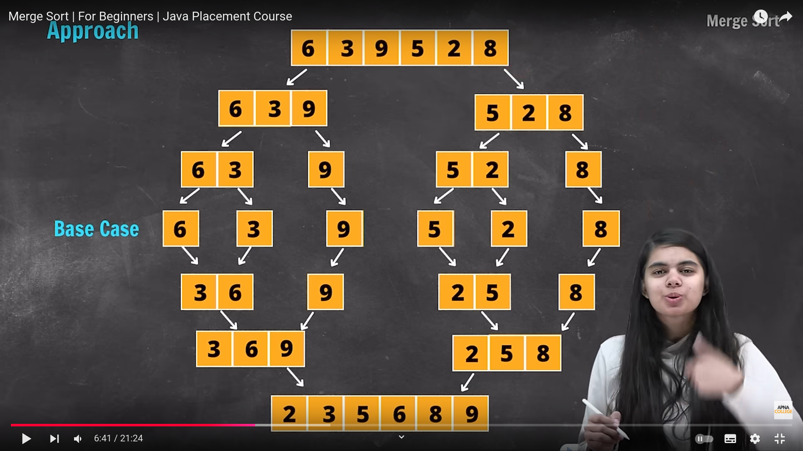

- [x] bubble Sort ✅ 2024-09-22
- [x] selection sort ✅ 2024-09-22
- [x] insertion sort ✅ 2024-09-22


example of sorting : select for lowest to highest and vice-versa amazon 

## Bubble sort 

bhari element ko array k peeche ko push karte hain and hame ascending order ka array ilta hain

- simple comparison-based sorting algorithm
runs loop n - 1  times 


```java
import java.util.Arrays;

public class BubbleSort {

    // Function to implement bubble sort
    public static void bubbleSort(int[] arr) {
        int n = arr.length;
        boolean swapped;  // A flag to detect if any swapping occurred in a pass

        // Loop over the array n-1 times
        for (int i = 0; i < n - 1; i++) {
            swapped = false;

            // Inner loop to compare adjacent elements
            for (int j = 0; j < n - 1 - i; j++) {
                // Swap if the current element is greater than the next
                if (arr[j] > arr[j + 1]) {
                    // Swap elements
                    int temp = arr[j];
                    arr[j] = arr[j + 1];
                    arr[j + 1] = temp;

                    swapped = true;  // Mark that a swap occurred
                }
            }

            // If no elements were swapped in the inner loop, the array is already sorted
            if (!swapped) break;
        }
    }

    public static void main(String[] args) {
        int[] arr = {64, 34, 25, 12, 22, 11, 90};

        System.out.println("Original array: " + Arrays.toString(arr));
        
        // Perform bubble sort
        bubbleSort(arr);

        System.out.println("Sorted array: " + Arrays.toString(arr));
    }
}


```

### Explanation:

- **Outer Loop**: Runs `n-1` times because, after each pass, the largest element is placed at the end of the unsorted section.
- **Inner Loop**: Compares adjacent elements in each pass. For each pair, if the first element is larger than the second, they are swapped.

### How It Works:

- Initially, the largest number "bubbles" to the last position of the array.
- In each subsequent pass, the next largest number is placed in its correct position.
- This process continues until the entire array is sorted.

Bubble sort is easy to implement, but it's inefficient for large datasets compared to more advanced algorithms like QuickSort or MergeSort. It's mostly used for educational purposes to introduce sorting algorithms.


## Selection Sort

simple comparison-based sorting algorithm. It works by repeatedly selecting the smallest (or largest, depending on sorting order) element from the unsorted portion of the array and swapping it with the first unsorted element. The algorithm proceeds until the entire array is sorted.
#### How Selection Sort Works:

1. Find the minimum element from the unsorted part of the array.
2. Swap it with the first element of the unsorted part.
3. Move the boundary of the sorted part one element to the right.
4. Repeat the process until the entire array is sorted.
#### Time Complexity:

- **Worst-case, average-case, and best-case time complexity**: **O(n²)**

```java
public static void main(String args[]){
	int arr[] = {7,8,3,1,2};
	for(int i =0; i<arr.length-1;i++){
		int smallest = i ;
		for(int j=i+1; j<arr.length; i++){
			smallest = j;
		}
	}
	int temp = arr[smallest];
	arr[smallest] = arr[i];
	arr[i] = temp;
}
```

#### Explanation:

1. **Outer Loop**: Traverses through the entire array. For each iteration, it considers the current element and searches for the smallest element in the remaining unsorted part.
2. **Inner Loop**: Scans through the unsorted part of the array to find the minimum element.
3. **Swapping**: Once the minimum element is found, it is swapped with the first unsorted element.

### How It Works:

- In the first pass, the smallest element is selected from the entire array and swapped with the first element.
- In the second pass, the smallest element from the remaining unsorted part is selected and swapped with the second element, and so on.
- This process continues until the entire array is sorted.
### Key Points:

- Selection sort has a time complexity of **O(n²)** for all cases (worst, average, and best), making it inefficient for large arrays.
- It performs well with small datasets and is easy to implement and understand.
- Unlike bubble sort, selection sort minimizes the number of swaps, making it more efficient in scenarios where writing to memory is expensive. However, it still performs a large number of comparisons.


## Insertion Sort:
**Insertion Sort** is a simple, comparison-based sorting algorithm that builds the final sorted array one element at a time. It works by dividing the array into a "sorted" and "unsorted" section. The sorted section is built from left to right, and each new element is inserted into its correct position in the sorted section.

#### How Insertion Sort Works:

1. Assume the first element is already sorted.
2. Take the next element and compare it with elements in the sorted section, moving it left until it is in the correct position.
3. Repeat for all elements in the unsorted section.
#### Time Complexity:

- **Worst-case and average-case time complexity**: **O(n²)** (when the array is in reverse order).
- **Best-case time complexity**: **O(n)** (when the array is already sorted).

```java
import java.util.Arrays;

public class InsertionSort {

    // Function to implement insertion sort
    public static void insertionSort(int[] arr) {
        int n = arr.length;

        // Start from the second element since the first is "already sorted"
        for (int i = 1; i < n; i++) {
            int key = arr[i];  // Element to be inserted into the sorted part
            int j = i - 1;

            // Move elements that are greater than 'key' one position to the right
            while (j >= 0 && arr[j] > key) {
                arr[j + 1] = arr[j];  // Shift element to the right
                j--;
            }

            // Insert 'key' into its correct position
            arr[j + 1] = key;
        }
    }

    public static void main(String[] args) {
        int[] arr = {12, 11, 13, 5, 6};

        System.out.println("Original array: " + Arrays.toString(arr));

        // Perform insertion sort
        insertionSort(arr);

        System.out.println("Sorted array: " + Arrays.toString(arr));
    }
}
```
#### Explanation:

- **Outer Loop**: Iterates through the array starting from the second element, because the first element is already considered "sorted."
- **Inner Loop**: Compares the current element (key) with elements in the sorted section. If the current element is smaller, it shifts the larger elements to the right.
- **Key**: The key is inserted into the correct position in the sorted section after shifting.


### How It Works:

- In the first pass, the second element is compared to the first. If the second element is smaller, it is inserted before the first element.
- In the next pass, the third element is compared to the elements in the sorted section (first and second elements). It is inserted into its correct position.
- The process continues until all elements are sorted.

### Key Points:

- Insertion Sort is efficient for **small datasets** or **nearly sorted arrays**.
- It has a time complexity of **O(n²)** in the worst and average cases, but **O(n)** in the best case when the array is already sorted.
- It is a **stable sorting algorithm**, meaning it maintains the relative order of elements with equal values.
- It can be more efficient than selection or bubble sort for small or nearly sorted arrays.


# Quick sort

- popular **divide-and-conquer algorithm**

#### **Quick Sort Overview**

- **Idea**: Ek **pivot** element choose karo aur array ko do parts mein divide karo:
    - **Left part**: Jisme saare elements pivot se chhote hon.
    - **Right part**: Jisme saare elements pivot se bade hon.
- Recursively, left aur right parts ko sort karo.

#### **Steps to Perform Quick Sort**

1. **Choose Pivot**: Kisi bhi element ko pivot bana sakte ho (generally first, last, or middle element).
2. **Partition**: Array ko aise divide karo ki:
    - Pivot se chhote elements left mein.
    - Pivot se bade elements right mein.
3. **Recursively Sort**: Partitioned arrays ke dono parts pe quick sort apply karo.
4. **Combine**: Dono sorted parts ko combine karo.

```java
public class QuickSortExample {
    // Quick Sort function
    public static void quickSort(int[] arr, int low, int high) {
        if (low < high) {
            // Partition the array and get pivot index
            int pivotindex = partition(arr, low, high);

            // Recursively sort the left and right parts
            quickSort(arr, low, pivotindex - 1);  // Left part
            quickSort(arr, pivotindex + 1, high); // Right part
        }
    }

    // Partition function
    public static int partition(int[] arr, int low, int high) {
        int pivot = arr[high]; // Choose the last element as pivot
        int i = low - 1; // Index for smaller element

        for (int j = low; j < high; j++) {
            // If current element is smaller than or equal to pivot
            if (arr[j] <= pivot) {
                i++;
                // Swap arr[i] and arr[j]
                int temp = arr[i];
                arr[i] = arr[j];
                arr[j] = temp;
            }
        }

        // Swap pivot to its correct position
        int temp = arr[i + 1];
        arr[i + 1] = arr[high];
        arr[high] = temp;

        return i + 1; // Return pivot index
    }

    // Main method
    public static void main(String[] args) {
        int[] arr = {10, 7, 8, 9, 1, 5};
        int n = arr.length;

        quickSort(arr, 0, n - 1);

        System.out.println("Sorted array:");
        for (int num : arr) {
            System.out.print(num + " ");
        }
    }
}

```


#### **Time Complexity**

1. **Best Case**: O(nlogn)
    - Happens when pivot divides array into two equal parts.
2. **Average Case**: O(nlogn)
    - Random pivots usually lead to balanced splits.
3. **Worst Case**: O(n^2)
    - Happens when pivot is the smallest or largest element every time (unbalanced splits).

# Merge Sort

- divide and conquer algorithm

##### **Steps to Perform Merge Sort**
1. **Divide**: Array ko midpoint pe split karo.
2. **Sort**: Recursively left aur right parts ko sort karo.
3. **Merge**: Do sorted arrays ko merge karke ek sorted array banao.

```java
public class MergeSortExample {
    // Main merge sort function
    public static void mergeSort(int[] arr, int left, int right) {
        if (left < right) {
            // Find the middle point
            int mid = left + (right - left) / 2;
            // Recursively sort the left half
            mergeSort(arr, left, mid);
            // Recursively sort the right half
            mergeSort(arr, mid + 1, right);
            // Merge the sorted halves
            merge(arr, left, mid, right);
        }
    }

    // Merge function to combine two sorted halves
    public static void merge(int[] arr, int left, int mid, int right) {
        // Sizes of two subarrays
        int n1 = mid - left + 1;
        int n2 = right - mid;
        // Temporary arrays
        int[] leftArray = new int[n1];
        int[] rightArray = new int[n2];
        // Copy data into temporary arrays
        for (int i = 0; i < n1; i++) {
            leftArray[i] = arr[left + i];
        }
        for (int j = 0; j < n2; j++) {
            rightArray[j] = arr[mid + 1 + j];
        }
        // Merge the temporary arrays back into the original array
        int i = 0, j = 0, k = left;
        while (i < n1 && j < n2) {
            if (leftArray[i] <= rightArray[j]) {
                arr[k] = leftArray[i];
                i++;
            } else {
                arr[k] = rightArray[j];
                j++;
            }
            k++;
        }
        // Copy remaining elements of leftArray, if any
        while (i < n1) {
            arr[k] = leftArray[i];
            i++;
            k++;
        }
        // Copy remaining elements of rightArray, if any
        while (j < n2) {
            arr[k] = rightArray[j];
            j++;
            k++;
        }
    }
    // Main method
    public static void main(String[] args) {
        int[] arr = {12, 11, 13, 5, 6, 7};
        int n = arr.length;
        System.out.println("Original array:");
        for (int num : arr) {
            System.out.print(num + " ");
        }

        mergeSort(arr, 0, n - 1);

        System.out.println("\nSorted array:");
        for (int num : arr) {
            System.out.print(num + " ");
        }
    }
}
```