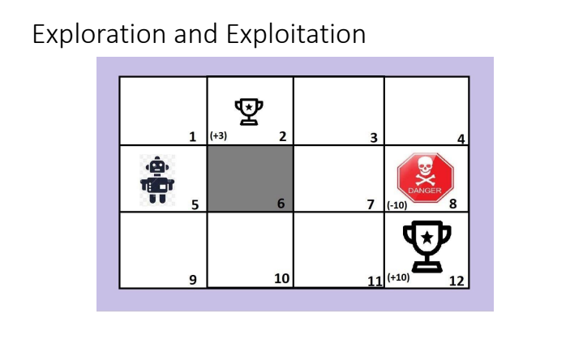
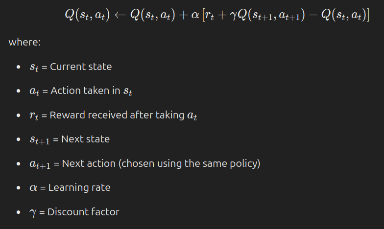

	
## 1. What is RL

**Definition**: RL is a type of Machine Learning where an agent learns by interacting with an environment to maximize rewards.

==a feedback based learning method==
real time decision making
goal directed agent
PP
**Key Components**:

- **Agent**: Learns and makes decisions.
- **Environment**: The world where the agent operates.
- **State (S)**: Current situation of the agent.
- **Action (A)**: Choices available to the agent.
- **Reward (R)**: Feedback from the environment.

**Learning Process**:
- The agent takes an **action** in a **state**.
- The environment provides a **reward** and a **new state**.
- The agent learns to maximize long-term rewards.

**Exploration vs Exploitation**:
- **Exploration**: Trying new actions to discover better rewards.
- **Exploitation**: Choosing known best actions for rewards.

**Popular Algorithms**:
- ==Q-Learning==
- Deep Q-Networks (DQN)
- Policy Gradient Methods
- Proximal Policy Optimization (PPO)

**Applications**:
- Robotics
- Self-driving cars
- Game playing (e.g., AlphaGo, Chess AI)
- Finance & trading

**Features of RL : 1. Trial and error search, 2. Delayed reward**

**Approaches based in RL**
- value based
- policy based (Deterministic and stocastic )
- model based

---

## 2. **Importance of Exploration and Exploitation in Reinforcement Learning**

In RL, an agent must balance two key strategies to learn effectively:

1. **Exploration** (Trying new things)
    - Helps the agent discover better actions.
    - Prevents getting stuck in a suboptimal solution.
    - Example: Trying a new route instead of always taking the familiar one.
2. **Exploitation** (Using known best actions)
    - Maximizes rewards based on past experiences.
    - Focuses on what is already known to work well.
    - Example: Choosing a path that previously led to the best reward.

### **Why is Balancing Important?**

- **Too much exploration** → Wastes time trying bad actions.
- **Too much exploitation** → May miss out on better opportunities.

### **Techniques to Balance Exploration & Exploitation**

- **ε-Greedy Method**: Chooses the best action most of the time but explores randomly with probability ε.
- **Decay Strategies**: Reducing exploration over time as learning improves.
- **Upper Confidence Bound (UCB)**: Selects actions based on uncertainty, giving priority to less tried options.

This balance is crucial for training AI in games, robotics, and real-world decision-making systems! 🚀

---

## **3. Elements of Reinforcement Learning (RL)**

1. **Policy (π)**
    - Defines the agent’s behavior by mapping states to actions.
    - **Types:**
        - **Deterministic Policy**: Always selects the same action for a given state.
        - **Stochastic Policy**: Chooses actions with a probability distribution.
    - Example: A chess AI deciding whether to move a pawn or knight.
    
2. **Reward (R)**
    - Immediate feedback given after an action.
    - Guides the agent toward better behavior.
    - Goal: Maximize cumulative rewards over time.
    - Example: +1 for winning a game, -1 for losing.

3. **Value Function (V & Q Functions)**    
    - Measures the long-term benefit of a state or action.
    - **State Value Function (V)**: Expected future rewards from a given state.
    - **Action Value Function (Q)**: Expected rewards for taking an action in a state.
    - Helps the agent make better decisions.

4. **Model (in Model-Based RL)**
    - Represents how the environment works (transition & reward dynamics).
    - Used for planning and simulating future states.
    - **Model-Free RL**: Learns without a model (e.g., Q-learning).
    - **Model-Based RL**: Uses a model for better decision-making (e.g., AlphaGo).

---
### **4. Types of Reinforcement Learning (RL)**

1. **Model-Free RL** (No knowledge of environment)
    - The agent learns by interacting with the environment without building a model.
    - **Types:**
        - **Value-Based RL**: Learns value functions (e.g., Q-learning).
        - **Policy-Based RL**: Directly learns policies (e.g., Policy Gradient).
    - **Example:** Playing a video game by trial and error.

2. **Model-Based RL** (Has knowledge of environment)    
    - The agent builds a model of the environment and uses it for planning.
    - More sample-efficient but computationally expensive.
    - **Example:** Chess AI simulating future moves before making a decision.

3. **On-Policy RL** (Learns from current policy)    
    - The agent updates its policy based on actions taken from the same policy.
    - **Example:** SARSA (State-Action-Reward-State-Action).

4. **Off-Policy RL** (Learns from different policies)    
    - The agent can learn from past experiences or another agent's data.
    - More flexible and efficient.
    - **Example:** Q-learning, Deep Q-Networks (DQN).

5. **Continuous vs. Discrete RL**    
    - **Discrete RL**: Finite set of actions (e.g., moving left or right in a game).
    - **Continuous RL**: Infinite possible actions (e.g., controlling robot arm angles).

---

### **5. Difference Between Model-Based and Model-Free Reinforcement Learning**

| Feature               | Model-Based RL                                       | Model-Free RL                                        |
| --------------------- | ---------------------------------------------------- | ---------------------------------------------------- |
| **Definition**        | Learns or has a model of the environment.            | Learns without building a model of the environment.  |
| **Learning Approach** | Uses a transition model for planning.                | Learns purely from interactions (trial & error).     |
| **Sample Efficiency** | More sample-efficient, as it predicts future states. | Less sample-efficient, requires more data.           |
| **Computation Cost**  | High (requires planning & model training).           | Lower (focuses only on learning policies or values). |
| **Flexibility**       | Works well when an environment model is available.   | Works in complex environments with unknown dynamics. |
| **Examples**          | AlphaGo, Dyna-Q, Monte Carlo Tree Search (MCTS).     | Q-learning, Deep Q-Networks (DQN), Policy Gradient.  |
| **Use Cases**         | Chess, robotics (where simulation is possible).      | Real-time game playing, stock trading.               |

---

### **6. Difference Between Value-Based and Policy-Based Reinforcement Learning**

| Feature               | Value-Based RL                                      | Policy-Based RL                                                 |
| --------------------- | --------------------------------------------------- | --------------------------------------------------------------- |
| **Definition**        | Learns a value function to estimate future rewards. | Learns a direct mapping from states to actions (policy).        |
| **Learning Approach** | Uses state or action values (V(s) or Q(s, a)).      | Optimizes a policy function without using value functions.      |
| **Exploration**       | Uses ε-greedy or UCB for action selection.          | Uses stochastic policies for exploration.                       |
| **Convergence**       | More stable but may struggle with complex policies. | Can learn complex policies but may converge slowly.             |
| **Action Space**      | Works well with discrete action spaces.             | Works better with continuous action spaces.                     |
| **Examples**          | Q-learning, Deep Q-Networks (DQN).                  | Policy Gradient, REINFORCE, Proximal Policy Optimization (PPO). |
| **Use Cases**         | Gridworld, simple game AI.                          | Robotics, self-driving cars, complex games like Go.             |

---

# [[sarsa and q-learning hinglish]]
## What is SARSA in reinforcement learning?

### SARSA in Reinforcement Learning

SARSA (State-Action-Reward-State-Action) is an **on-policy** reinforcement learning algorithm used to learn the optimal action-value function Q(s,a)Q(s, a). It is a modification of **Q-learning** but follows the policy it is currently learning (instead of always choosing the best action as in Q-learning).

---

### **How SARSA Works**

The SARSA algorithm updates the action-value function using the following update rule:

### **Key Features of SARSA**

1. **On-Policy Learning:**
    
    - Uses the same policy to **select and evaluate** actions.
    - Typically follows an **ε-greedy** strategy to balance exploration and exploitation.
2. **Updates Using the Next Action:**
    
    - Unlike Q-learning (which updates based on the best action in the next state), SARSA updates based on the **actual action chosen**.
3. **More Conservative than Q-learning:**
    
    - Since it follows its current policy, SARSA tends to be safer in **stochastic** environments.

---

### **SARSA vs. Q-learning**

|Feature|SARSA (On-Policy)|Q-learning (Off-Policy)|
|---|---|---|
|Policy Type|On-Policy (uses π)|Off-Policy (uses max Q)|
|Next Action|Chosen by policy|Uses the max Q-value|
|Risk Level|More conservative|More aggressive|
|Performance|Safer in noisy environments|Faster convergence in deterministic settings|

---

### **Example: SARSA in Action**

Imagine an agent navigating a grid world. If it's following an ε-greedy policy:

4. It selects an action ata_t based on the policy.
5. Moves to a new state st+1s_{t+1} and gets a reward rtr_t.
6. Selects a new action at+1a_{t+1} using the same policy.
7. Updates Q(st,at)Q(s_t, a_t) using the SARSA update rule.

---

### **When to Use SARSA?**

- When **safety** is important (e.g., self-driving cars, medical treatments).
- In **stochastic** environments where Q-learning might be too risky.
- When following a specific policy (e.g., a soft policy like ε-greedy).

