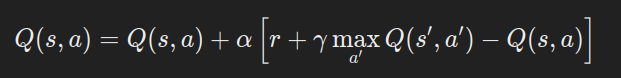
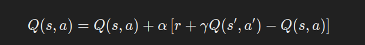

Bhai tension nahi lene ka! SARSA aur Q-Learning dono **Reinforcement Learning (RL)** ke algorithms hain, jo agent ko best policy seekhne me madad karte hain. Dono **Temporal Difference (TD) Learning** ka part hain, lekin ek key difference hai jo game change karta hai.

---

## **1. Q-Learning: Off-Policy Learning**

- **"Best action" choose karta hai** har state ke liye, chahe jo bhi policy follow ho rahi ho.

	

    - Yahaan **max⁡a′Q(s′,a′)\max_{a'} Q(s', a')** ka matlab hai **future state ke best Q-value** ko consider karna.
    - Is wajah se ye **Off-Policy** hai—agent explore kar sakta hai, lekin update hamesha best action ka use karke hota hai.
    - **Exploration aur Exploitation ka balance** rakhta hai, par optimal policy jaldi seekh sakta hai.

**Example:**  
Socho ek robot hai jo maze me sahi raasta dhundh raha hai. Agar wo **Q-Learning** use kare, toh wo har step pe **sabse behtareen action** choose karega, chahe wo us waqt koi aur policy follow kar raha ho.

---

## **2. SARSA: On-Policy Learning**

- **"Jo action policy follow kar rahi hai" usko choose karta hai future update ke liye.**

	

    - Yahaan **Q(s′,a′)Q(s', a')** ka matlab hai **jo action policy abhi follow kar rahi hai**, wahi consider hoga.
    - Is wajah se ye **On-Policy** hai—jo action choose ho raha hai, wahi update me use hoga.

**Example:**  
Wahi robot agar **SARSA** use kare, toh wo apni **current exploration strategy** ke according seekhega, bina hamesha best action ko chase kiye. Agar exploration zyada ho, toh wo explore karta rahega aur slowly seekhega.

---

## **Major Difference: Off-Policy vs. On-Policy**

|Feature|Q-Learning (Off-Policy)|SARSA (On-Policy)|
|---|---|---|
|Update Rule|Future ke **best action** se update hota hai|Future ke **policy-following action** se update hota hai|
|Learning Speed|Fast, jaldi optimal solution seekh sakta hai|Slow, but stable learning|
|Risk|**Agressively explore karega**, kabhi kabhi risky moves lega|**Safe learning**, kyunki jo policy follow ho rahi hai, wahi seekhega|
|Convergence|Kabhi kabhi unstable ho sakta hai|Zyada stable, exploration ka better control|

---

## **Kaun Kab Use Karein?**

✔ **Q-Learning:** Jab risk le sakte ho aur fast learning chahiye (e.g., video games, stock trading).  
✔ **SARSA:** Jab safe aur stable learning chahiye (e.g., real-world robotics, self-driving cars).

---

## **Ek Example Se Clear Karo:**

Socho ek **self-driving car** hai jo **traffic signal cross** kar rahi hai.

- **Q-Learning:** Agar future ka best action pe focus kare, toh wo kabhi **risk le sakti hai** (e.g., signal yellow hai, toh tez bhaag sakti hai).
- **SARSA:** Jo policy follow ho rahi hai usko use karega, toh agar **current policy safe hai**, toh wo ruk jayegi aur dhyan se signal dekhegi.

Maza aaya samajhne me? Koi doubt ho toh bata, aur bhi deep dive kar sakte hain! 😎🔥