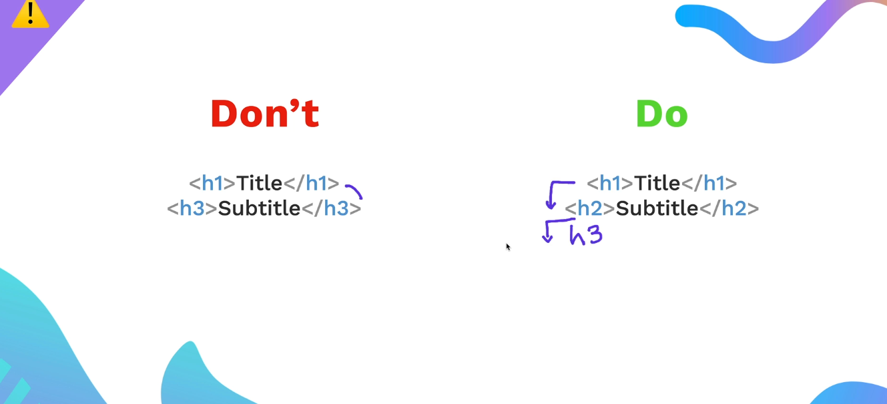

HTML ==(HyperText Markup Language)== is the standard language used to create web pages. It structures the content on the web, such as headings, paragraphs, images, links, and more.\\

# Basic HTML Syntax

```html
<!DOCTYPE html>
<html>
<head>
    <title>My First Page</title>
</head>
<body>
    <h1>Hello, World!</h1>
    <p>This is my first HTML page.</p>
</body>
</html>
```

---
**Key Components:**

- `<!DOCTYPE html>`: Declares the document type.
- `<html>`: The root of the HTML document.
- `<head>`: Contains metadata like the title of the page.
- `<body>`: Contains all the visible content of the page.

---


---



---
## The anchor element


## Image element

```html

```


---
# List of majority tags used in html website

Here’s a **table with HTML tags and their explanations** for easy reference:

|**Tag**|**Description**|
|---|---|
|`<!DOCTYPE html>`|Declares the document type (HTML5).|
|`<html>`|Root element of the HTML document.|
|`<head>`|Contains metadata, styles, and scripts.|
|`<title>`|Sets the title of the page (visible in the browser tab).|
|`<meta>`|Defines metadata like character encoding, description, and keywords.|
|`<link>`|Links external resources like stylesheets.|
|`<style>`|Embeds CSS styles directly in the document.|
|`<script>`|Embeds or links JavaScript.|
|`<body>`|Contains the visible content of the page.|
|`<h1> - <h6>`|Headings from largest (`<h1>`) to smallest (`<h6>`).|
|`<p>`|Defines a paragraph.|
|`<br>`|Inserts a line break.|
|`<hr>`|Inserts a horizontal rule (divider line).|
|`<strong>`|Makes text bold with semantic emphasis.|
|`<b>`|Makes text bold without semantic meaning.|
|`<em>`|Makes text italic with semantic emphasis.|
|`<i>`|Makes text italic without semantic meaning.|
|`<u>`|Underlines text.|
|`<mark>`|Highlights text.|
|`<small>`|Reduces font size.|
|`<del>`|Represents deleted (strikethrough) text.|
|`<ins>`|Represents inserted (underlined) text.|
|`<sup>`|Displays text as superscript.|
|`<sub>`|Displays text as subscript.|
|`<a>`|Creates a hyperlink.|
|``|Embeds an image.|
|`<audio>`|Embeds audio content.|
|`<video>`|Embeds video content.|
|`<source>`|Specifies multiple media sources for `<audio>` or `<video>`.|
|`<track>`|Adds subtitles or captions to `<video>` or `<audio>`.|
|`<ul>`|Creates an unordered (bulleted) list.|
|`<ol>`|Creates an ordered (numbered) list.|
|`<li>`|Represents a list item.|
|`<dl>`|Creates a definition list.|
|`<dt>`|Represents a term in a definition list.|
|`<dd>`|Represents the description/definition of a term.|
|`<table>`|Creates a table.|
|`<tr>`|Defines a table row.|
|`<td>`|Defines a table cell.|
|`<th>`|Defines a table header cell.|
|`<caption>`|Adds a caption to a table.|
|`<col>`|Specifies column properties in a table.|
|`<colgroup>`|Groups multiple `<col>` elements.|
|`<form>`|Defines a form for collecting user input.|
|`<input>`|Accepts user input (text, radio, checkbox, etc.).|
|`<textarea>`|Creates a multi-line text input field.|
|`<button>`|Creates a clickable button.|
|`<label>`|Labels a form element for accessibility.|
|`<fieldset>`|Groups related elements in a form.|
|`<legend>`|Provides a title for a `<fieldset>`.|
|`<select>`|Creates a dropdown menu.|
|`<option>`|Represents an item in a dropdown list.|
|`<datalist>`|Defines a list of predefined options for an input field.|
|`<optgroup>`|Groups related options in a dropdown list.|
|`<header>`|Defines the header of a page or section.|
|`<footer>`|Defines the footer of a page or section.|
|`<section>`|Defines a section of content.|
|`<article>`|Defines independent, self-contained content.|
|`<nav>`|Defines navigation links.|
|`<aside>`|Defines content related to the main content (e.g., a sidebar).|
|`<main>`|Specifies the main content of a document.|
|`<div>`|Creates a block-level container for grouping elements.|
|`<span>`|Creates an inline container for styling or grouping text.|
|`<iframe>`|Embeds another webpage within the current page.|
|`<canvas>`|Used for drawing graphics via JavaScript.|
|`<svg>`|Embeds scalable vector graphics (SVG).|
|`<map>` & `<area>`|Define clickable regions in an image (image map).|
|`<progress>`|Displays progress of a task (e.g., a loading bar).|
|`<meter>`|Represents a value within a specific range (e.g., temperature, scores).|
|`<template>`|Defines reusable HTML fragments.|
|`<details>`|Creates a collapsible section of content.|
|`<summary>`|Provides a summary for a collapsible `<details>` element.|
|`<noscript>`|Displays alternative content if JavaScript is disabled.|

---

# code for html site where we used majority of tags

```html
<!DOCTYPE html>
<html lang="en">
<head>
    <meta charset="UTF-8">
    <meta name="viewport" content="width=device-width, initial-scale=1.0">
    <title>HTML Tags Demo</title>
	<link rel="stylesheet" href="styles.css">
</head>
<body>
    <header>
        <h1>HTML Tags Demonstration</h1>
        <p>Learn the major HTML tags with examples and usage</p>
    </header>

    <section>
        <h2>1. Basic Document Structure</h2>
        <p>The basic structure of an HTML document includes the following tags:</p>
        <div class="example">
            <pre>
<!DOCTYPE html>
<html>
    <head>
        <title>Document Title</title>
    </head>
    <body>
        <!-- Page Content Goes Here -->
    </body>
</html>
            </pre>
        </div>

        <h2>2. Headings</h2>
        <p>Headings are used to structure the content. There are six levels from <code>&lt;h1&gt;</code> to <code>&lt;h6&gt;</code>:</p>
        <div class="example">
            <h1>Heading 1</h1>
            <h2>Heading 2</h2>
            <h3>Heading 3</h3>
            <h4>Heading 4</h4>
            <h5>Heading 5</h5>
            <h6>Heading 6</h6>
        </div>

        <h2>3. Paragraphs and Line Breaks</h2>
        <p>The <code>&lt;p&gt;</code> tag defines a paragraph. Use <code>&lt;br&gt;</code> for line breaks:</p>
        <div class="example">
            <p>This is a paragraph. It has some text to demonstrate how it looks.</p>
            <p>This is another paragraph with a <br> line break in it.</p>
        </div>

        <h2>4. Links</h2>
        <p>The <code>&lt;a&gt;</code> tag creates hyperlinks:</p>
        <div class="example">
            <a href="https://www.google.com" target="_blank">Visit Google</a>
        </div>

        <h2>5. Images</h2>
        <p>The <code>&lt;img&gt;</code> tag embeds an image:</p>
        <div class="example">
            
        </div>

        <h2>6. Lists</h2>
        <p>HTML supports ordered (<code>&lt;ol&gt;</code>) and unordered (<code>&lt;ul&gt;</code>) lists:</p>
        <div class="example">
            <h3>Unordered List</h3>
            <ul>
                <li>Item 1</li>
                <li>Item 2</li>
                <li>Item 3</li>
            </ul>
            <h3>Ordered List</h3>
            <ol>
                <li>First Item</li>
                <li>Second Item</li>
                <li>Third Item</li>
            </ol>
        </div>

        <h2>7. Tables</h2>
        <p>The <code>&lt;table&gt;</code> tag creates a table. Use <code>&lt;tr&gt;</code> for rows, <code>&lt;td&gt;</code> for cells, and <code>&lt;th&gt;</code> for headers:</p>
        <div class="example">
            <table border="1">
                <tr>
                    <th>Name</th>
                    <th>Age</th>
                    <th>City</th>
                </tr>
                <tr>
                    <td>John</td>
                    <td>25</td>
                    <td>New York</td>
                </tr>
                <tr>
                    <td>Jane</td>
                    <td>30</td>
                    <td>London</td>
                </tr>
            </table>
        </div>

        <h2>8. Forms</h2>
        <p>The <code>&lt;form&gt;</code> tag collects user input:</p>
        <div class="example">
            <form>
                <label for="name">Name:</label>
                <input type="text" id="name" name="name">
                <br><br>
                <label for="email">Email:</label>
                <input type="email" id="email" name="email">
                <br><br>
                <button type="submit">Submit</button>
            </form>
        </div>

        <h2>9. Semantic Tags</h2>
        <p>Semantic tags like <code>&lt;header&gt;</code>, <code>&lt;footer&gt;</code>, <code>&lt;article&gt;</code>, and <code>&lt;section&gt;</code> make content meaningful:</p>
        <div class="example">
            <header>Header Section</header>
            <article>
                <h3>Article Title</h3>
                <p>This is an article.</p>
            </article>
            <footer>Footer Section</footer>
        </div>
    </section>

    <footer>
        <p>HTML Tags Demo Website | Created for Learning</p>
    </footer>
</body>
</html>

```


# code for styles.css

```css
        body {
            font-family: Arial, sans-serif;
            line-height: 1.6;
            margin: 0;
            padding: 0;
        }
        header {
            background: #007BFF;
            color: white;
            padding: 10px 20px;
            text-align: center;
        }
        section {
            margin: 20px auto;
            max-width: 900px;
        }
        .example {
            background: #f4f4f4;
            padding: 10px;
            margin: 10px 0;
            border: 1px solid #ddd;
            border-radius: 5px;
        }
        .example pre {
            background: #ddd;
            padding: 10px;
            overflow: auto;
            border-radius: 5px;
        }
        footer {
            background: #333;
            color: white;
            text-align: center;
            padding: 10px 0;
            position: relative;
            bottom: 0;
            width: 100%;
        }
```