# Cascading Style Sheet


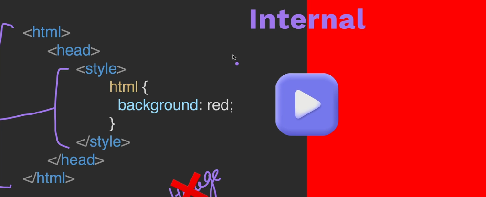

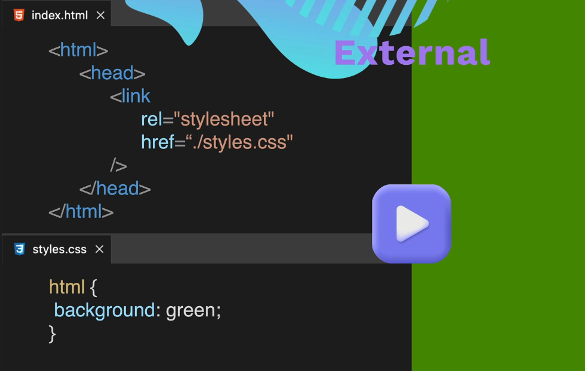


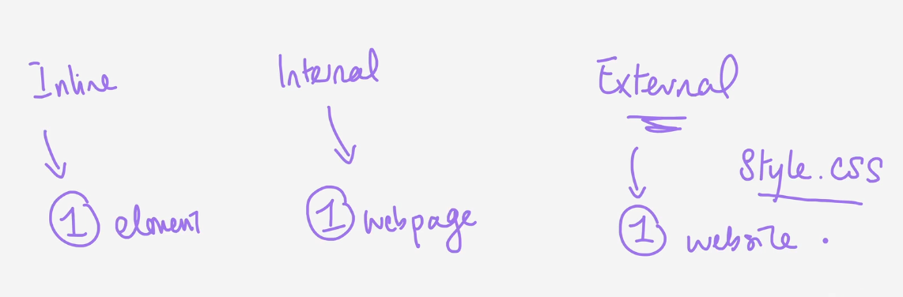

## code to add external css

```html
<link rel="stylesheet" href="./style.css"/>
```

## CSS Selector

element selector

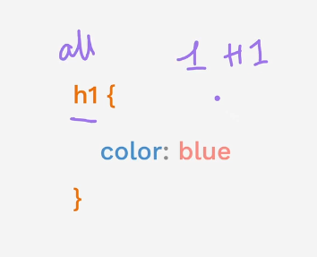


| 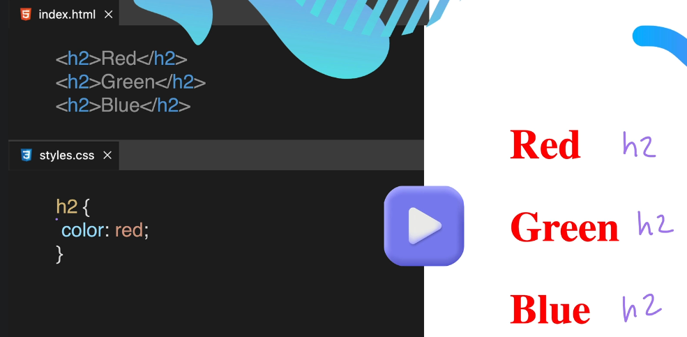 | 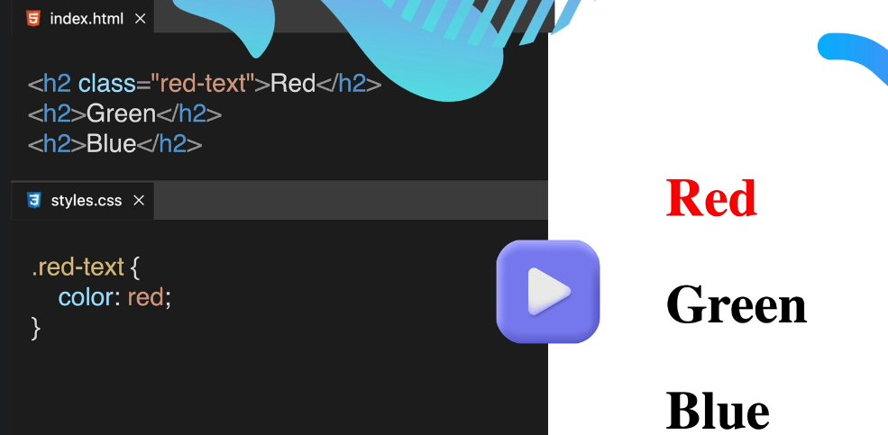 |
| ------------------------------------ | ------------------------------------ |
| 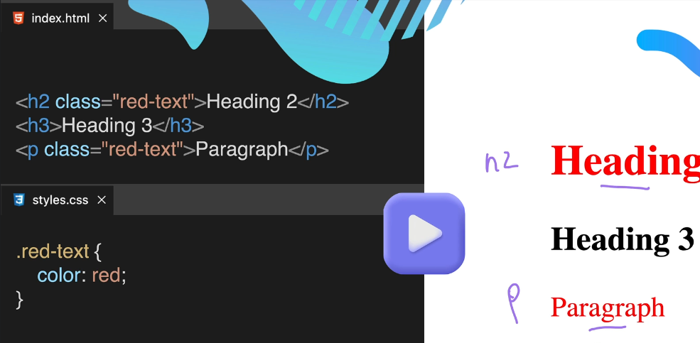 | 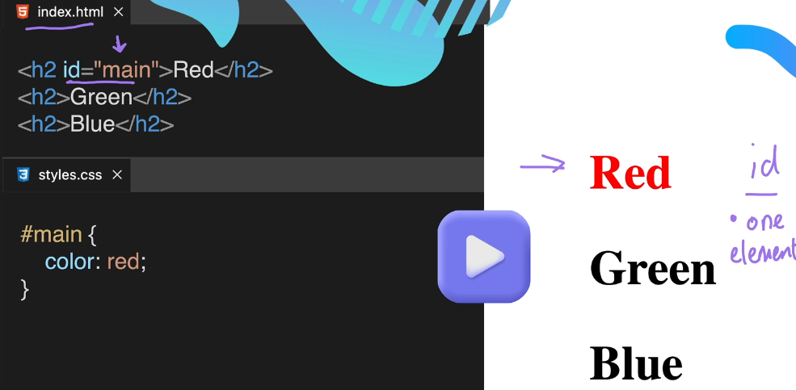 |
| 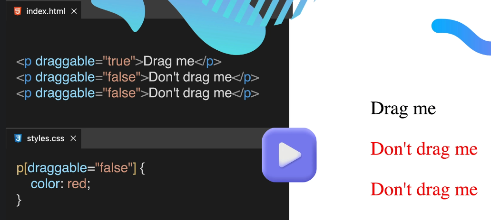 |                                      |


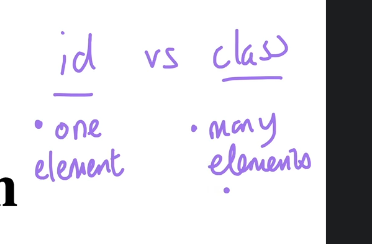

ids are unique only one per element 


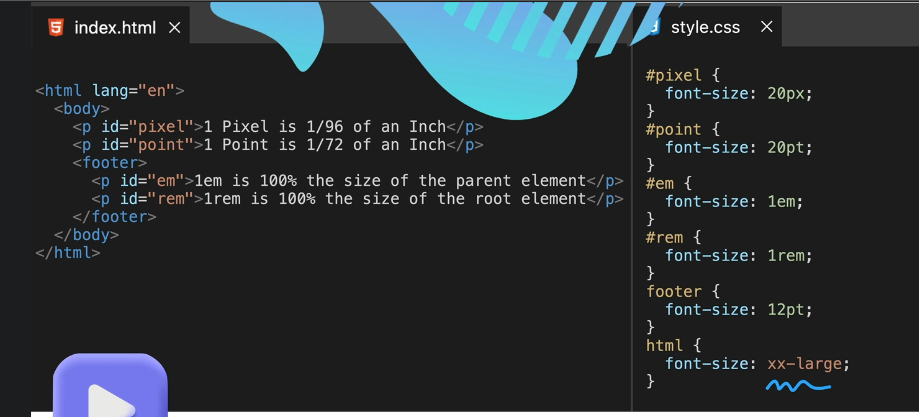


