ECMAScript

```javascript
alert("HEllo")
```

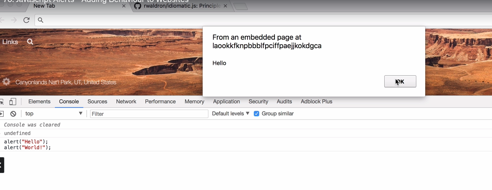

---

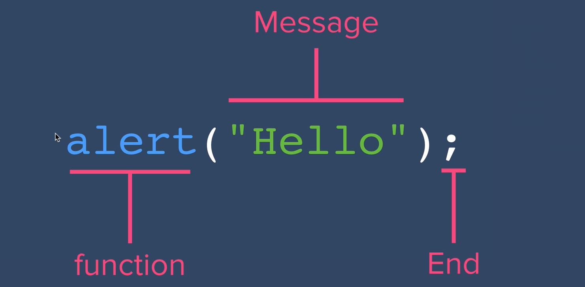

---

Principles of Writing Consistent, Idiomatic JavaScript : https://github.com/rwaldron/idiomatic.js/

---
## datatypes in java script

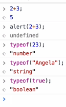

JavaScript has the following data types:

1. **Primitive**:
    - String (`"hello"`)
    - Number (`42`)
    - Boolean (`true`, `false`)
    - Null (`null`)
    - Undefined (`undefined`)
    - Symbol (`Symbol("id")`)
    - BigInt (`123n`)

2. **Non-Primitive**:
    - Object (`{}`, arrays, functions, etc.)

### Primitive vs Non Primitive 

**Primitive**:

- Immutable, stored by value.
- Examples: `String`, `Number`, `Boolean`, `Null`, `Undefined`, `Symbol`, `BigInt`.
- Example:

    ```javascript
    let a = 10;
    let b = a; // Copies value
    b = 20; // Does not affect `a`
    ```


**Non-Primitive**:

- Mutable, stored by reference.
- Examples: `Object`, `Array`, `Function`.
- Example:
    ```javascript
    let obj1 = { name: "John" };
    let obj2 = obj1; // Shares reference
    obj2.name = "Doe"; // Changes affect `obj1`
    ```

---
## Variables


prompt keyword 

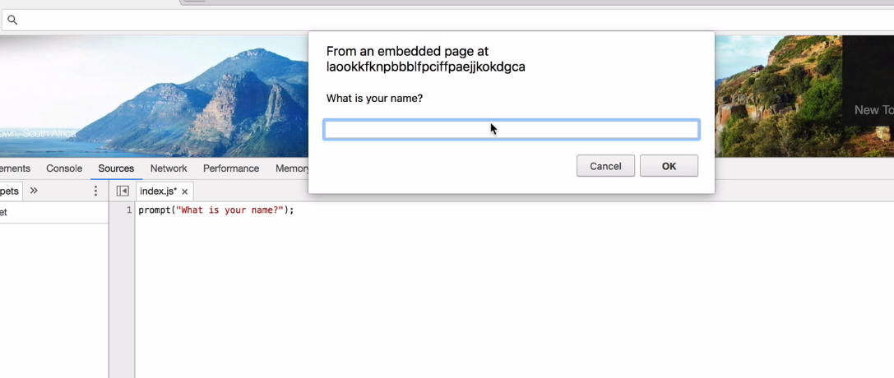

---

In JavaScript, variables are used to store data values. You can declare them using:

Always name variables by camel casing

### 1. **`var`** (Old way):
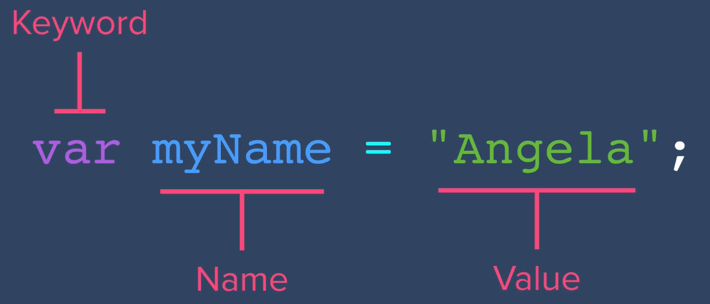

- Function-scoped.
- Can be redeclared and updated.
- Hoisted but **not block-scoped**.
- Example:
    
    ```javascript
    var x = 10;
    var x = 20; // Redeclaration allowed
    ```
    

---

### 2. **`let`** (Modern way):

- Block-scoped.
- Can be updated but **not redeclared** in the same scope.
- Example:
    
    ```javascript
    let y = 10;
    y = 20; // Allowed
    let y = 30; // Error
    ```
    

---

### 3. **`const`** (For constants):

- Block-scoped.
- Cannot be updated or redeclared.
- Example:
    
    ```javascript
    const z = 10;
    z = 20; // Error
    ```
    

---

### Summary:

- Use `let` for variables that change.
- Use `const` for fixed values.
- Avoid `var` unless needed for older code.

---

### Rules for variables

Here are the **basic rules for variables** in JavaScript:

1. **Variable Names**:
    
    - Must start with a letter (`a-z`, `A-Z`), underscore (`_`), or dollar sign (`$`).  
        Example: `_name`, `$value`, `age`.
    - Cannot start with a number.
2. **Case-Sensitive**:
    
    - `name` and `Name` are different.
3. **No Reserved Keywords**:
    
    - Avoid using keywords like `let`, `const`, `if`, etc.  
        Example: `let let = 5; // ❌ Error`
4. **Meaningful Names**:
    
    - Use descriptive names (e.g., `userAge`, not `x`).
5. **Avoid Special Characters**:
    
    - No spaces or symbols except `_` and `$`.  
        Example: `user-name // ❌ Invalid`
6. **Declaration Before Use**:
    
    - Always declare variables before using them.


---

## Strings in Java

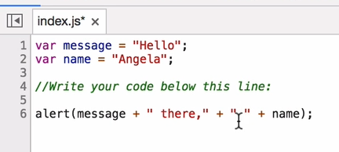

word.length

```
var name = "yash";
name.length;
```

output = 4 

---


#### Exercise tweet count:
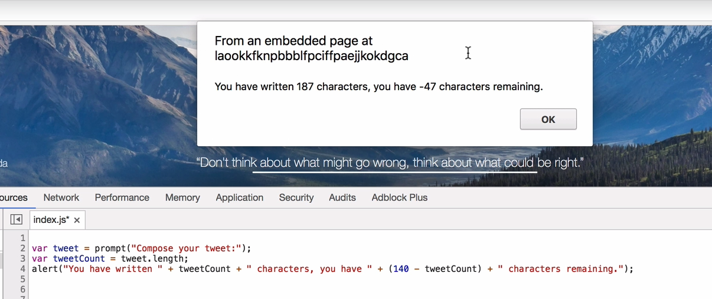

#### String slicing

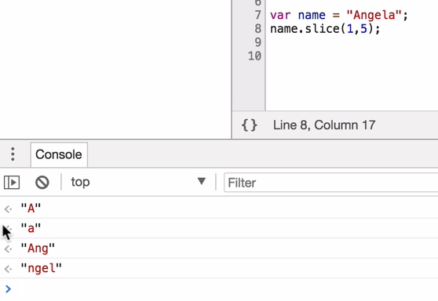

#### Exericse 2 : slice the tweet

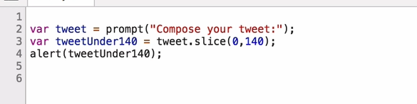

alternative

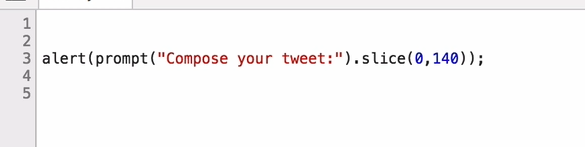

```
var name = "yash";
name = name.toUpperCase();
name = name.toLowerCase();
```


### **1. How to Create Strings**

- Use **single quotes** (`'`), **double quotes** (`"`), or **template literals** (`` ` ``).
    
    ```javascript
    let single = 'Hello';
    let double = "World";
    let template = `Hello, ${double}`; // Template literal
    ```
    

---

### **2. Common String Methods**

- **`length`**: Get string length.
    ```javascript
    let str = "Hello";
    console.log(str.length); // 5
    ```
- **`toUpperCase()` / `toLowerCase()`**: Change case.
    ```javascript
    console.log(str.toUpperCase()); // "HELLO"
    console.log(str.toLowerCase()); // "hello"
    ```
- **`includes()`**: Check if a substring exists.
    ```javascript
    console.log(str.includes("ell")); // true
    ```
- **`slice(start, end)`**: Extract a substring.
    ```javascript
    console.log(str.slice(1, 4)); // "ell"
    ```
- **`replace()`**: Replace part of a string.
    ```javascript
    console.log(str.replace("l", "z")); // "Hezlo"
    ```

---

### **3. Template Literals**

- Use backticks (`` ` ``) to embed variables and expressions.

    ```javascript
    let name = "John";
    console.log(`Hello, ${name}!`); // "Hello, John!"
    ```

---

### **4. Escape Characters**

- Use `\` to escape special characters.

    ```javascript
    let quote = 'I\'m learning JavaScript!';
    console.log(quote); // I'm learning JavaScript!
    ```

---

## Arithmatic operations in js

In JavaScript, arithmetic operations are used to perform mathematical calculations. Here are the basic ones:

### **1. Operators**

|Operator|Description|Example|Result|
|---|---|---|---|
|`+`|Addition|`5 + 3`|`8`|
|`-`|Subtraction|`5 - 3`|`2`|
|`*`|Multiplication|`5 * 3`|`15`|
|`/`|Division|`6 / 3`|`2`|
|`%`|Modulus (Remainder)|`5 % 2`|`1`|
|`**`|Exponentiation (Power)|`2 ** 3`|`8`|

---

### **2. Increment & Decrement**

- **Increment (`++`)**: Increases value by 1.
    
    ```javascript
    let x = 5;
    x++; // x is now 6
    ```
    
- **Decrement (`--`)**: Decreases value by 1.
    
    ```javascript
    let x = 5;
    x--; // x is now 4
    ```
    

---

### **3. Shortcuts for Updating Values**

- **Add and assign**: `x += 3` (same as `x = x + 3`)
- **Subtract and assign**: `x -= 3` (same as `x = x - 3`)
- **Multiply and assign**: `x *= 3`
- **Divide and assign**: `x /= 3`

---

### Example:

```javascript
let a = 10, b = 3;
console.log(a + b);  // 13
console.log(a - b);  // 7
console.log(a * b);  // 30
console.log(a / b);  // 3.33
console.log(a % b);  // 1
```

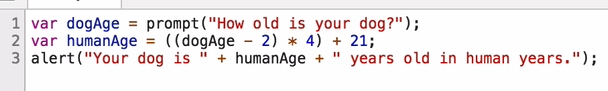

---

## Functions in JavaScript

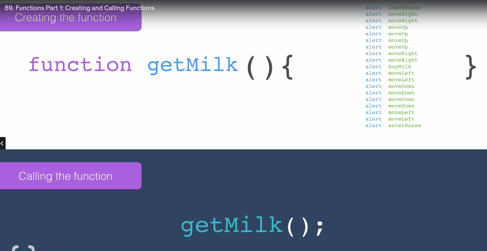

In JavaScript, **functions** are reusable blocks of code that perform a specific task. Here's a quick overview:

---

### **1. Function Declaration**

- Syntax:

    ```javascript
    function functionName(parameters) {
      // code to execute
      return result; // optional
    }
    ```

- Example:

    ```javascript
    function add(a, b) {
      return a + b;
    }
    console.log(add(5, 3)); // 8
    ```


---

### **2. Function Expression**

- Assign a function to a variable.

    ```javascript
    const multiply = function (x, y) {
      return x * y;
    };
    console.log(multiply(4, 5)); // 20
    ```


---

### **3. Arrow Functions (ES6)**

- A concise way to write functions.

    ```javascript
    const subtract = (a, b) => a - b;
    console.log(subtract(10, 4)); // 6
    ```


---

### **4. Default Parameters**

- Set default values for function arguments.

    ```javascript
    function greet(name = "Guest") {
      return `Hello, ${name}!`;
    }
    console.log(greet()); // Hello, Guest!
    console.log(greet("Alice")); // Hello, Alice!
    ```


---

### **5. Anonymous Functions**

- Functions without a name, often used in callbacks.

    ```javascript
    setTimeout(function () {
      console.log("Hello after 2 seconds!");
    }, 2000);
    ```


---

### Example:

```javascript
function sayHello(name) {
  console.log(`Hello, ${name}!`);
}
sayHello("John"); // Hello, John!
```

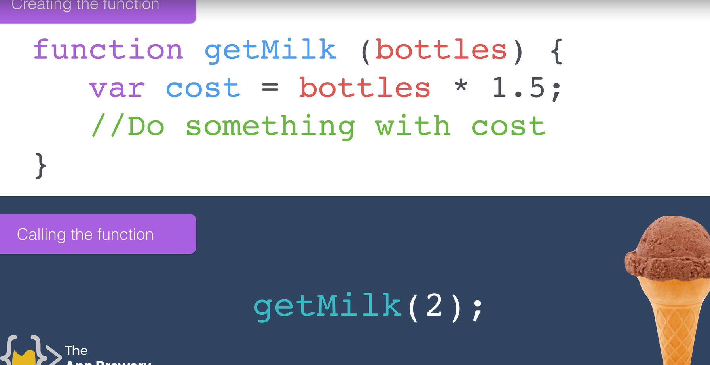
