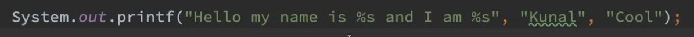
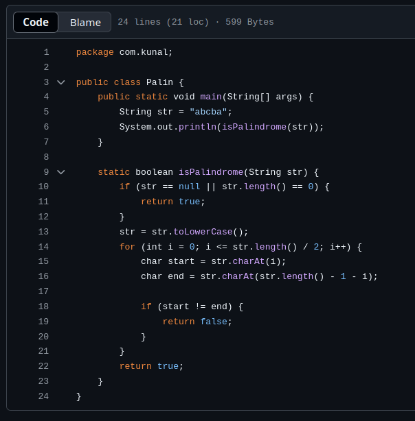

### 1.  program to find the HCF/GCD of 2 numbers without using recursion.

```java
import java.util.Scanner;

public class Solution {
	public static void main(String[] args) {
		Scanner scanner = new Scanner(System.in);
		System.out.print("");
		int a = scanner.nextInt();
		System.out.print("");
		int b = scanner.nextInt();
		
		while (a != b) {
			if(a==0)
			{
				System.out.print(b);
				break;
			}
			if(b == 0)
			{
				System.out.println(a);
			}
			if ( a > b ) {
				a = a - b;
			} else {
				b = b - a; 
			}
		}
		System.out.printla(a);
		scanner.close();
	}
}
```

---
### 2.  Write a program to find the factorial of a number.

Factorial of a number nnn is the product of all positive integers less than or equal to nnn. It is denoted as n!n!n!. For example:

- 5!=5×4×3×2×1=1205! = 5 \times 4 \times 3 \times 2 \times 1 = 1205!=5×4×3×2×1=120
- 0!=10! = 10!=1 (By definition)


**1. Iterative Method (Without Recursion)**

```java
import java.util.Scanner;

public class FactorialIterative {
    public static void main(String[] args) {
        Scanner scanner = new Scanner(System.in);

        // Input number
        System.out.print("Enter a number: ");
        int num = scanner.nextInt();

        // Calculate factorial
        long factorial = 1;
        for (int i = 1; i <= num; i++) {
            factorial *= i; // Multiply each number
        }

        // Display result
        System.out.println("The factorial of " + num + " is: " + factorial);

        scanner.close();
    }
}
```

 **2. Recursive Method**:
Recursion ka use tab hota hai jab ek function apne aapko call karta hai.

```java
import java.util.Scanner;

public class FactorialRecursive {
    public static void main(String[] args) {
        Scanner scanner = new Scanner(System.in);

        // Input number
        System.out.print("Enter a number: ");
        int num = scanner.nextInt();

        // Calculate factorial using recursion
        long factorial = findFactorial(num);

        // Display result
        System.out.println("The factorial of " + num + " is: " + factorial);

        scanner.close();
    }

    // Recursive function to calculate factorial
    public static long findFactorial(int n) {
        if (n == 0 || n == 1) {
            return 1; // Base case
        }
        return n * findFactorial(n - 1); // Recursive case
    }
}
```

---
## 3. Given a string of characters followed by their frequency, compress it into a proper format.

>Input: 
	a3b5c2a2
>Output:
	abc


### **Logic**

1. Traverse the input string character by character.
2. If the current character is a letter:
    - Store it as the current character.
3. If the current character is a digit:
    - Extract the frequency of the previous character.
    - Append the character to the result string once (ignoring its frequency for compression).
4. Continue this process until the entire input string is traversed.

### **Example Walk-through**

#### Input: `a3b5c2a2`

1. Read `a`, frequency = 3 → Add `a` once to the result (`a`).
2. Read `b`, frequency = 5 → Add `b` once to the result (`ab`).
3. Read `c`, frequency = 2 → Add `c` once to the result (`abc`).
4. Read `a`, frequency = 2 → Add `a` once again (`abca`).

Final output: `abc`.

```java
import java.util.Scanner;

public class StringCompression {
    public static void main(String[] args) {
        Scanner scanner = new Scanner(System.in);

        // Input string
        System.out.print("Enter the string: ");
        String input = scanner.nextLine();

        // Result string
        StringBuilder result = new StringBuilder();

        // Process the input string
        for (int i = 0; i < input.length(); i++) {
            char ch = input.charAt(i);

            // If the character is a letter, add it to the result once
            if (Character.isLetter(ch)) {
                result.append(ch);
            }
        }

        // Print the compressed string
        System.out.println("Compressed string: " + result.toString());

        scanner.close();
    }
}
```



# 4. palindrome of a string


