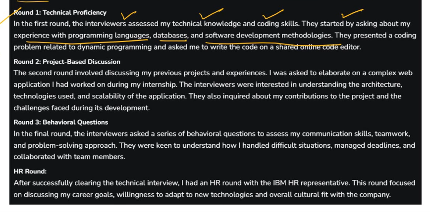

# [[IBM Coding Questions]]

# 1st Step :

 - [x] ibm coding assessment 
programming test (coding test for 2 questions)

# 2nd step:

technical | HR Interview: 

refer: 
https://www.geeksforgeeks.org/ibm-interview-experience-for-software-developer/

test question is on hacker Rank 

# 3rd step:

## Top Coding Questions and Answers 2024

While preparing for the IBM coding assessment round, candidates should familiarize themselves with these common topics. These include:

**Data Structures**

- Arrays
- Linked lists
- Stacks
- Queues
- Trees
- Graphs

**Algorithms**

- Sorting
- Searching
- Dynamic programming
- Backtracking

**Mathematical Problems**

- Basic arithmetic
- Number theory
- Combinatorics

**String Manipulation**

- String parsing
- Substring search
- Regular expressions