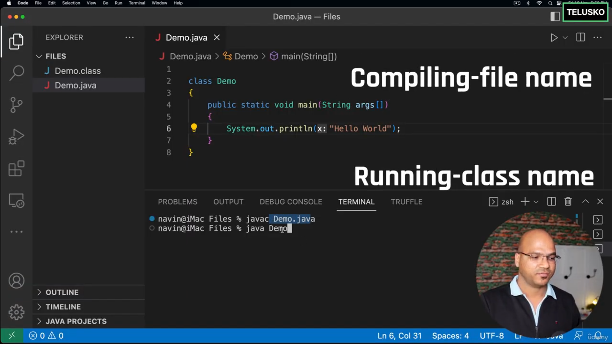

refer this:
# https://drive.google.com/drive/u/0/folders/1rSqEniErpnkADlyJYcF9s1a0ao3GkhPM

# [[java oops in hinglish]]

1. ide vscode
2. jdk (java development kit)
3. java is compiled and interpreted

in java 9  java introduced repel i.e jshell

## Enhance for loop

### ternary operator

Switch

# [[java oops in hinglish]]

## String

